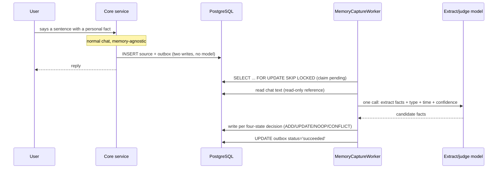
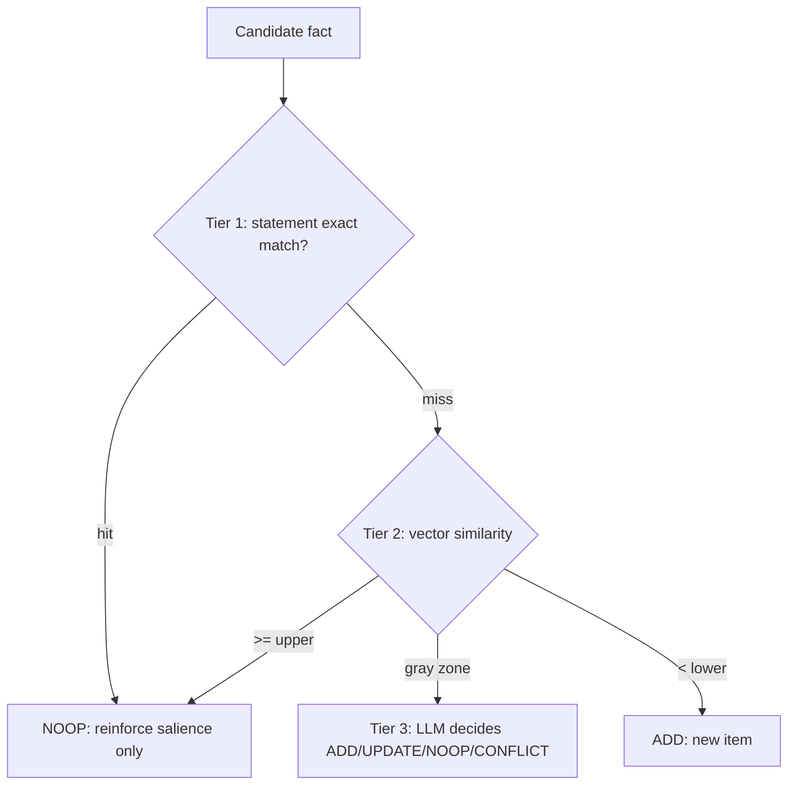

The easiest mistake when adding long-term memory to an agent is mixing the **write path** with the **chat path**. The user says "I don't take sugar in my coffee", and the system calls a large model right then to distill that into a memory before returning a reply.

The cost: every reply waits for one more model round-trip. The user made a casual remark about a preference, and now pays seconds of latency for the system's private note-taking.

This post is about how we decoupled the memory write path from chat entirely: online, we only write the source and an outbox row; extraction runs in an async worker. Along the way we hit a Serverless trap — timers never actually fire in production — and solved it with a dual-channel trigger. I'll also cover the four-state write decision and why bitemporal "mark invalid" beats "delete".

## Write path and read path are two different things

Split the concepts first. An agent's memory system has two independent paths:

- **Write path**: distill what the user says into long-term memories ("no sugar in coffee", "mom's birthday is March 5") and store them.
- **Read path**: on the next turn, retrieve relevant memories and inject them into the prompt.

The read path has to happen during the conversation — retrieval is part of answering. But the **write path can and should move out of the conversation**. Whether the system remembers "no sugar" now or a few seconds later in the background makes zero difference to the user. The only difference is latency.

So the first hard rule: **the online path does exactly two database writes and calls no model**. That's a *structural guarantee* that conversation latency never grows with memory, not a performance optimization — optimizations can be compromised; a structural guarantee can't be slowed down even if you try.

## The outbox: online writes the source, extraction runs async

Here's the write path. When the user says something with a personal fact in it, the online flow does exactly two things:

1. Insert a source row into `memory_sources` (`source_type='chat'`, with `chat_message_id`)
2. Insert a pending task into `memory_capture_outbox` (`status='pending'`, with `idempotency_key`)

Then the reply returns normally. No model call, no extraction, no embedding.

The actual extraction runs in a background worker consuming the outbox:

The outbox pattern makes idempotency and retry free:

- **Idempotency**: `idempotency_key` is a unique index. Duplicate sources get rejected by the database, so even if the worker re-consumes a task, nothing gets extracted twice.
- **Retry**: on failure, set `status='failed'`, `attempt_count+1`, and exponential backoff into `next_attempt_at`. When retries run out, mark `dead` with `last_error_code` and alert. **A failure writes no memory_items** — better to remember nothing than to remember wrong.

## The Serverless trap: timers never fire

Here's a deceptively deep problem: who triggers the worker?

We first reached for NestJS's `@nestjs/schedule` timers. But `dida-core` runs on **Vercel Serverless** — a Serverless function is destroyed after execution, there's **no persistent process**, and timers don't fire reliably in production. This is a classic trap when deploying agent backends to Serverless: `@Cron` works fine in local dev, then silently stops running once you ship.

So we switched to a **dual-channel trigger**, both channels sharing one `drain()` implementation:

| Channel | Trigger | Role | Failure impact |
|---------|---------|------|----------------|
| Scheduled | Vercel Cron hits `POST /internal/memory/capture/drain` | guarantees inactive users' memories eventually get extracted | frequency capped by Vercel plan, forming the latency upper bound |
| Fallback | the user's next chat request fires an async drain (non-blocking, per-user cooldown) | active users' memories are extracted before their next turn | a long-absent user won't trigger it, covered by the scheduled channel |

The two channels share `FOR UPDATE SKIP LOCKED` and the `idempotency_key` unique index for concurrency safety — never double-extracting.

The most important decision here: **the fallback channel makes the system insensitive to Cron frequency limits**. Otherwise the user-visible metric of "how soon does memory take effect" gets bound to Vercel's plan — that's deliberate decoupling.

## Four-state decision: a new memory might not be an "add"

Each candidate fact from the extraction model can't just be blindly INSERTed. "No sugar in coffee" might be the first time (ADD), might already exist (NOOP, reinforce), or might contradict an old memory (CONFLICT).

We copied Mem0's four-state model. A candidate walks through three-tier dedup and lands in one of four states:

Three-tier dedup is a "exact → fuzzy → LLM" ladder, cheap to expensive:

1. **Exact match**: normalized statement identical, go NOOP directly, zero model calls.
2. **Vector similarity**: compare candidate embedding against existing memories; ≥ upper threshold reinforces, < lower threshold ADDs, neither calls the LLM.
3. **Gray zone**: only when similarity lands in the middle band do we make one LLM call to decide ADD / UPDATE / NOOP / CONFLICT.

The gray zone is deliberate: too wide and you call the LLM constantly; too narrow and conflicts slip through as dirty data. The `0.92 / 0.75` thresholds aren't guessed — they get calibrated against a gold set. The research source explicitly warned "don't copy third-party benchmark values".

## Bitemporal: why "mark invalid" beats "delete"

Memories expire and get overturned. The user says "no sugar" in March, then "I've started drinking coffee" in August — that memory isn't deleted; it stops being true from August on.

We use bitemporal semantics (copied from Graphiti / Zep):

| Field | Meaning |
|-------|---------|
| `valid_from` | when the belief takes effect ("since March I don't drink coffee" → March)|
| `invalid_at` | when the belief stops holding (written when a new fact supersedes it)|
| `status='superseded'` | expresses "no longer true since when" |

`valid_from` and `occurred_start` (when the event happened) are strictly different: the belief "mom's birthday is March 5" may only have been learned in August — `valid_from` is August, `occurred_start` is NULL.

Retrieval always adds `invalid_at IS NULL`, so invalidated memories automatically drop out of injection — but the **data remains**. The user can browse history and trace when a memory was overturned. Deletion can't do that.

Behind this is a design tension: the candidate list UI needs to show "which sentence was this memory heard from", or the user can't judge it — but the requirement also says "don't store raw message text". The solution is a reference, not a copy: `memory_sources.chat_message_id` weakly references `ai_chat_messages`, and the excerpt is JOINed at read time. The memory module never produces a second plaintext copy.

## Anti-corruption: memory is a reference, not a source of truth

The memory system's most dangerous failure mode is overstepping its authority. We set several anti-corruption constraints, each provable by code or tests:

- **Memory must never become a source of calendar facts**: the system prompt forbids using memory to fill in calendar query results — memory is "user preference", not "schedule data".
- **A failed extraction produces no half-baked memory**: if any step of the four-state decision or the write fails, the whole candidate is dropped and the outbox retries.
- **Tool parameter schemas contain no user-identifier field**: the four memory tools (`search_memory` / `remember_memory` / `correct_memory` / `forget_memory`) bind the authenticated `userId` in a server-side closure. The model can't even express "read someone else's data" because the parameter doesn't exist.

That last one is worth expanding: memory retrieval injects a user's private facts into the prompt. If the model could specify "whose memory to read" through a tool parameter, that's an escalation channel. So `userId` comes only from the server closure — the schema has no such field.

## Summary

The right way to write an agent's memory path is one sentence: **online, write only the source and the outbox; extract async; survive Serverless with a dual channel**.

- Decoupling write from chat is a *structural guarantee* on latency, not an optimization
- The outbox pattern makes idempotency and retry free; failure produces no half-baked memory
- Serverless has no persistent process, timers don't fire — use Cron + request-fallback dual channels
- Four-state decision + three-tier dedup makes "add" not a blind INSERT
- Bitemporal marks invalid instead of deleting, preserving traceability
- Memory is a reference, not a source of truth — anti-corruption constraints block escalation

If your agent is about to get memory, ask one question first: **does your write path call a model during the conversation?** If it does, move it out. Users won't be upset that the system remembers their preference a few seconds later, but they will leave if every reply is a few seconds slower.
