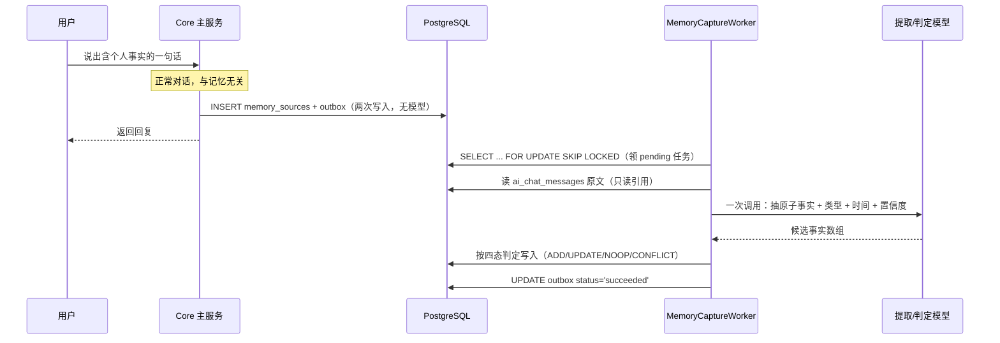
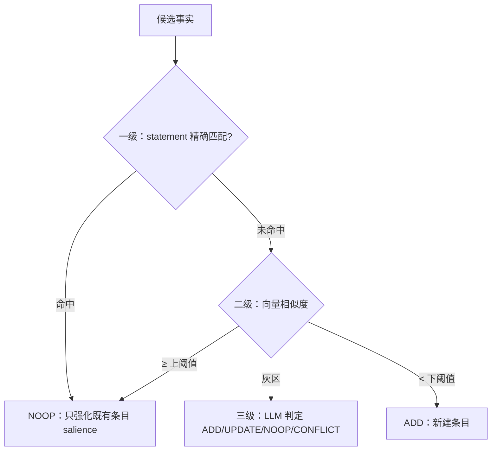

给 Agent 加「长期记忆」，最容易踩的坑是把**写路径**和**对话路径**搅在一起——用户在聊天框里说一句「我咖啡不加糖」，系统当场调一次大模型，把这句提炼成一条记忆，再返回回复。

这么做的代价是：每个回复都要多等一次模型往返。用户只是随口说了句偏好，却要为「系统悄悄记笔记」多付几秒延迟。

这篇文章讲我们怎么把记忆的写路径从对话里彻底解耦：在线只落来源和 outbox，提取交给异步 Worker。这背后踩了一个 Serverless 的坑——定时器在生产上根本不触发——最后用「双通道触发」兜住。顺便讲清楚记忆写入的四态判定和双时态，为什么「标记失效」比「删除」更对。

## 写路径和读路径，是两件事

先把概念分开。Agent 的记忆系统有两条独立的路径：

- **写路径**：把用户说的话，提炼成一条条长期记忆（「咖啡不加糖」「妈妈生日是 3 月 5 号」），存起来。
- **读路径**：下一轮对话时，检索出相关的记忆，注入 prompt，让模型记得这些事实。

读路径本来就要在对话里做——检索是回答的一部分。但**写路径完全可以、也应该移出对话**。用户说「咖啡不加糖」这句话，当场记下来，还是等几秒后台再记，对用户没有任何区别；唯一的区别是延迟。

所以我们定的第一条硬规矩：**在线路径只做两次数据库写入，不调任何模型**。这是「对话延迟不因记忆增加」的**结构保证**，不是性能优化——优化可以打折扣，结构保证是「想慢也慢不了」。

## outbox：在线只落来源，提取异步做

具体的写路径长这样。用户在对话里说了一句含个人事实的话，在线流程只做两件事：

1. 往 `memory_sources` 写一行来源（`source_type='chat'`，带 `chat_message_id`）
2. 往 `memory_capture_outbox` 写一行待处理任务（`status='pending'`，带 `idempotency_key`）

然后正常返回对话。没有模型调用，没有提取，没有向量计算。

真正的提取由后台 Worker 消费 outbox 完成：

outbox 模式的好处是**幂等和重试都免费**：

- **幂等**：`idempotency_key` 是唯一索引，同一个来源重复落库会被数据库挡掉，Worker 就算重复消费也不会提取两遍。
- **重试**：提取失败就 `status='failed'`、`attempt_count+1`、`next_attempt_at` 指数退避；重试耗尽转 `dead`，记 `last_error_code` 告警。**失败不写任何 memory_items**——宁可不记，不可乱记。

## Serverless 的坑：定时器根本不触发

这里有个看起来简单、实际坑很深的问题：Worker 谁来触发？

我们一开始想用 NestJS 的 `@nestjs/schedule` 定时器。但 `dida-core` 跑在 **Vercel Serverless** 上——Serverless 函数冷启动后执行完就销毁，**没有常驻进程**，定时器在生产上不会稳定触发。这是 Serverless 部署 Agent 后端的一个典型陷阱：你本地开发时 `@Cron` 跑得好好的，一上生产就安静地不执行了。

所以换成**双通道触发**，两个通道共用同一个 `drain()` 实现：

| 通道 | 触发者 | 作用 | 失效影响 |
|------|--------|------|----------|
| 定时通道 | Vercel Cron 打 `POST /internal/memory/capture/drain` | 保证不活跃用户的记忆最终也会被提取 | 频率受 Vercel 计划限制，构成时延上界 |
| 兜底通道 | 用户下一次对话请求触发异步 drain（不阻塞响应，每用户冷却期限流） | 活跃用户的记忆在下一轮对话前就提取完了 | 用户长期不来则不触发，由定时通道兜住 |

两个通道靠 `FOR UPDATE SKIP LOCKED` 和 `idempotency_key` 保证并发安全，绝不重复提取。

这个设计里最关键的一个决定是：**兜底通道的存在，让系统对 Cron 频率限制不敏感**。否则「记忆多久生效」这个用户能感知的指标，就被 Vercel 的套餐计划绑死了——这是刻意的解耦。

## 四态判定：一条新记忆，可能根本不是「新增」

提取模型吐出的每条候选事实，不能无脑 INSERT。因为用户说「咖啡不加糖」可能是第一次说（ADD），也可能早就记过（NOOP 强化），也可能和旧记忆矛盾（CONFLICT）。

我们照抄了 Mem0 的四态决策模型，一条候选走完三级去重后，落进四个状态之一：

三级去重是「精确 → 模糊 → LLM」的阶梯，从便宜到贵：

1. **精确匹配**：规范化后的 statement 完全一样，直接 NOOP，零模型调用。
2. **向量相似度**：候选 embedding 和既有记忆比对，相似度 ≥ 上阈值直接强化，< 下阈值直接 ADD，都不用调 LLM。
3. **灰区**：只有相似度落在中间那一段，才调一次 LLM 判定到底是 ADD / UPDATE / NOOP / CONFLICT。

灰区是刻意留出来的：太宽，动不动就调 LLM，贵；太窄，该冲突的没冲突，脏数据。阈值 `0.92 / 0.75` 不是拍脑袋，是要用 goldset 校准的——调研来源明确警告过「不要照搬第三方基准数值」。

## 双时态：为什么「标记失效」比「删除」对

记忆会过期、会被推翻。用户 3 月说「我咖啡不加糖」，8 月说「我最近开始喝咖啡了」——这条记忆不是删掉，而是「从 8 月起不再成立」。

我们用了双时态（照抄 Graphiti / Zep）：

| 字段 | 语义 |
|------|------|
| `valid_from` | 信念有效期起点（「从 3 月起我不喝咖啡」的 valid_from 是 3 月）|
| `invalid_at` | 信念失效时刻（被新事实取代时写入）|
| `status='superseded'` | 表达「何时起不再成立」|

`valid_from` 和 `occurred_start`（事件发生时间）是严格区分的两件事：「妈妈生日是 3 月 5 号」这个信念，可能是我 8 月才知道的——`valid_from` 是 8 月，`occurred_start` 是 NULL。

检索时一律加 `invalid_at IS NULL`，失效的记忆自动退出注入，但**数据还在**——用户可以翻看历史，也可以追溯「这条记忆是什么时候被推翻的」。删除做不到这一点。

这背后还有一个设计张力：待确认的记忆候选，UI 要展示「这条是从哪句话听出来的」，否则用户没法判断对错；但需求又要求「不落原始消息明文」。解法是**只建引用不复制**——`memory_sources.chat_message_id` 弱引用 `ai_chat_messages`，摘录在读取时 JOIN 得到，记忆模块自己不产生第二份明文副本。

## 防腐化：记忆是参考，不是事实来源

记忆系统最容易失控的地方，是它开始「越权」。我们立了几条防腐化约束，每条都能被代码或测试证明：

- **记忆不得成为日历事实来源**：系统提示里「禁止用记忆补写日历查询结果」——记忆是「用户偏好」，不是「日程数据」。
- **提取失败不产生半成品**：四态判定或写入任一环节失败，整条候选不入库，outbox 转重试。
- **工具参数 schema 不含用户标识字段**：四个记忆工具（`search_memory` / `remember_memory` / `correct_memory` / `forget_memory`）在服务端创建时闭包绑定鉴权后的 `userId`，模型连「读别人数据」这个意思都无法表达。

最后一条尤其值得展开：记忆检索会往 prompt 里注入用户私人事实，如果模型能通过工具参数指定「读谁的记忆」，就是一条越权通道。所以 `userId` 只从服务端闭包来，参数 schema 里根本没有这个字段。

## 总结

给 Agent 加长期记忆，写路径的正确姿势是一句话：**在线只落来源和 outbox，提取异步做，Serverless 用双通道兜底**。

- 写路径和对话解耦，是「不拖慢对话」的结构保证，不是性能优化
- outbox 模式让幂等和重试都免费，失败不产生半成品
- Serverless 没有常驻进程，定时器不触发——用 Cron + 请求兜底双通道
- 四态判定 + 三级去重，让「新增」不是无脑 INSERT
- 双时态标记失效而非删除，保留可追溯性
- 记忆是参考，不是事实来源——防腐化约束挡住越权

如果你的 Agent 也想加记忆，先问一个问题：**你的写路径，会在对话里调模型吗？** 如果在，把它移出去。用户不会因为「系统晚几秒记住他的偏好」而不满，但一定会因为「每个回复都慢几秒」而离开。
