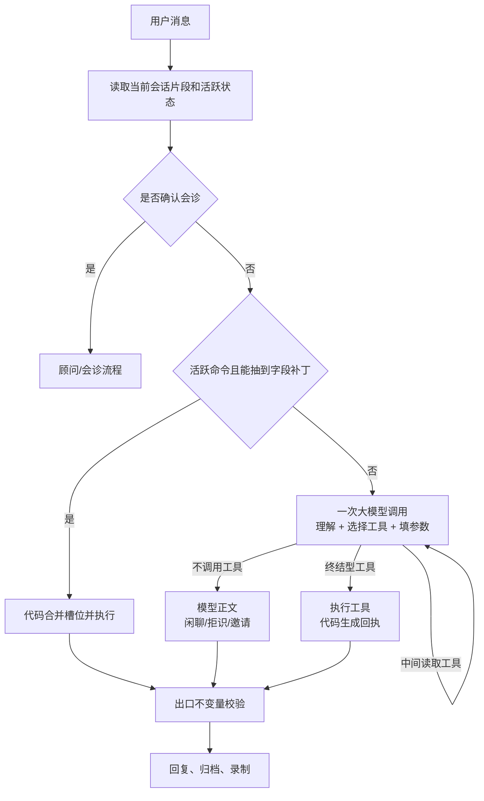

## 0. 文档说明


| 版本 | 日期       | 内容                                         | 原因                                      |
| ---- | ---------- | -------------------------------------------- | ----------------------------------------- |
| v0.1 | 2026-08-24 | 总结意图识别项目的设计、实现、评测与踩坑经验 | 为后续 Agent 项目提供一份可复用的工程方法 |

这篇文档回答一个问题：一个能调用工具、读写用户数据的 Agent，意图识别到底应该怎么做？

结论先说：**意图识别不该只是给一句话贴标签。它是一套控制系统，决定 Agent 要不要调用工具、调用哪个工具、是否允许产生副作用、缺信息时如何续接，以及最后一句话能不能相信。**

本项目从正则分类器出发，经历了“小模型抽槽 + 小模型分类 + 大模型执行”，最后收敛为“一次大模型完成理解与工具选择，代码负责状态、校验和落库”。功能链路已经在预发跑通，但性能目标尚未达到：创建日程热实例 P50 约 14.3 秒，原目标是 2.5 秒。这个结果也提醒我们，减少模型调用次数不等于时延一定按比例下降。

---

## 1. 先定义问题：识别的不是一句话，而是下一步动作

看三句相似的话：


| 用户输入               | Agent 应做什么 | 副作用 |
| ---------------------- | -------------- | ------ |
| 今天有什么安排         | 查询日程       | 只读   |
| 明天下午三点安排开会   | 创建日程       | 写入   |
| 昨天下午开了个会，好累 | 正常聊天       | 无     |

它们都包含时间和“安排/开会”，但执行结果完全不同。传统分类器会把问题描述成：

```text
message -> intent label
```

真正的 Agent 链路应该描述成：

```text
message + 当前状态 + 历史事实
  -> 是否需要工具
  -> 选择哪个工具
  -> 提取哪些参数
  -> 是否满足执行条件
  -> 工具结果如何回复
  -> 是否真的产生了副作用
```

这里有四类信息：

1. **意图**：用户想完成什么，如查询、创建、取消、闲聊。
2. **槽位**：执行需要的参数，如标题、日期、时间。
3. **状态**：当前是否有待补充的命令、上一轮是否发过会诊邀请。
4. **授权与副作用**：本轮是否可以写数据，写入是否真的成功。

意图只是其中一环。只优化分类准确率，无法保证整个 Agent 做对事。

### 1.1 先按失败代价排序

不同误判的代价不一样：

- 把查询判成闲聊：用户多问一次。
- 把闲聊判成查询：回复不自然，但通常无数据损失。
- 把查询判成创建：写入脏数据，用户可能很久以后才发现。
- 没有写入却回复“已创建”：聊天记录与数据库事实冲突。

因此，评测不能只看总体准确率。要单独定义高代价错误，并为它们设置结构性防线。对日程 Agent 来说，最重要的不是“所有意图都猜对”，而是：

```text
不该写的时候不能静默写入；
没有写成功时不能声称成功。
```

---

## 2. 最重要的分工：模型听懂，代码算准并守住

这次项目反复验证了一条边界：

- 输入空间无界的问题交给模型。
- 输入空间有界的问题交给代码。

### 2.1 适合模型的问题

这些问题无法靠有限规则穷举：

- “安排”在当前句子里是名词还是动词？
- 用户是在描述过去，还是发出新指令？
- “我最近太累了，帮我找个时间休息”到底要聊天、推荐空闲还是创建日程？
- 标题应该从自然语言里截取哪一部分？
- 用户说“算了”是在取消当前命令，还是在聊别的事？

正则可以覆盖一些高频说法，但自然语言组合没有上限。规则越补越多，最后会形成第二套脆弱的语言模型。

### 2.2 适合代码的问题

这些问题边界清晰，可以稳定测试：

- `D+1` 是哪一天？
- `W3+1` 是下周三的哪一个日期？
- `WE` 对应本周六和周日。
- 两个时间段是否冲突？
- 创建命令还缺日期还是缺时间？
- 当前用户是否真的新增了一条事件？
- 上一次会诊邀请是否在 30 分钟内？

模型不应该做日历算术、权限判断或数据库事实确认。它只提供表达式和动作选择，代码计算最终结果。

本项目把这条原则概括为：

> 模型负责“听懂”，代码负责“算准、守住”。

---

## 3. 当前实现：识别与工具选择合并成一次模型调用

早期版本把意图识别拆成多层：

```text
正则分类 -> 小模型抽槽 -> 小模型分类 -> 大模型执行
```

问题是这些调用串行发生。预发里一次创建约 5 秒，而且低置信分类经常继续升级到大模型。前置分类器原本为了节约大模型调用，实际却成了固定延迟。

当前 v0.6 取消了热路径里的 L2/L3。Agent 在一次 `qwen3.8-max` 调用里同时完成语言理解、意图判断、槽位提取和工具选择，思考关闭，`tool_choice=auto`。



### 3.1 实际分派顺序

入口是 `PiAgentChatService.streamChat`，顺序不能随意交换：

1. 从服务端归档加载当前会话片段。
2. 用客观状态判断会诊确认。
3. 如果存在活跃日程命令，先尝试字段级澄清快路径。
4. 顾问角色或已确认会诊进入顾问流。
5. 其他消息统一进入主 Agent。
6. 工具执行后由代码生成回执。
7. 回复发出前做出口校验，再归档并记录评测事件。

其中只有“活跃命令 + 字段补丁”是 0 模型往返。其他普通消息都走一次主模型。

### 3.2 为什么 `tool_choice` 保持 `auto`

项目曾考虑过强制工具调用，再增加一个 `respond` 工具承载普通聊天。最后没有采用。

强制工具会带来几个问题：

- 闲聊也要包装成工具调用，语义别扭。
- 正文被塞进 JSON 参数，流式输出更难处理。
- “说话”被伪装成工具，并没有增加真实安全性。

所以工具只在需要时调用：

- 创建、查询、空闲推荐应调用工具。
- 闲聊、拒识、会诊邀请直接输出正文。

代价是协议层无法保证“该调用工具时一定调用”。这部分靠提示、live 评测和出口校验补足。

---

## 4. 工具设计就是意图识别接口设计

当识别和工具选择合并后，工具定义本身就是分类边界。工具名称、描述、参数和返回状态写得不好，模型就会选错动作。

### 4.1 工具按终结语义分两类

终结型工具执行后，本轮不再请求模型生成第二遍：

- `prepare_or_create_schedule`
- `query_schedule_range`
- `suggest_schedule_slots`
- `cancel_schedule_command`

工具结果由代码格式化成最终回复。这样有三个好处：

- 少一次模型往返。
- 回复只引用真实工具结果。
- 创建、冲突、缺槽等文案可以稳定测试。

中间型工具用于补充事实，执行后模型还要继续：

- `search_memory`
- `search_chat_archive`

例如“妈妈生日那天安排聚餐”，模型不能猜日期。它先查记忆，查到日期后再调用创建工具；查不到就追问用户。

### 4.2 工具参数必须封闭且可校验

模型不能直接给最终日期推算结果，而是输出规范符号：


| 符号                   | 含义               |
| ---------------------- | ------------------ |
| `D+n`                  | 今天偏移 n 天      |
| `Wd` / `Wd+k`          | 星期 d，附带周偏移 |
| `WE` / `WE+k`          | 周末，保留两天歧义 |
| `MM-DD` / `YYYY-MM-DD` | 明确日期           |
| `HH:mm`                | 24 小时时间        |

工具 JSON Schema 使用 `pattern` 限制格式，执行入口再跑同一套校验。非法表达式返回 `invalid_expression`，让模型修正，不进入命令层。

这比只在 prompt 里写“请按格式输出”可靠，因为约束同时存在于生成接口和执行接口。

### 4.3 用户隔离不能写在提示词里

所有用户态工具在服务端创建时闭包绑定鉴权后的 `request.userId`。参数 schema 不包含 `userId`、`email` 或其他用户标识。

这意味着模型没有能力表达“读取另一个用户的数据”。安全来自接口结构，而不是一句“禁止读取他人数据”的提示词。

---

## 5. 多轮意图靠状态续接，不靠重新猜

“这个周末修汽车轮毂”缺少具体日期。正确流程不是让模型每轮重新理解全部历史，而是建立一个活跃命令存根：

```text
title = 修汽车轮毂
dateExpression = WE
missing = date
status = pending
expiresAt = ...
```

命令层把 `WE` 解析成周六、周日两个候选，返回 `needs_date`。代码问用户选哪一天。

用户下一轮只说“周六下午三点”。这句话脱离上下文没有完整意图，但请求带着 `activeScheduleCommandId`。代码先抽取日期和时间补丁，合并存根并执行，不再让分类器猜“这是不是创建日程”。

这里的原则是：

> 已经存在的业务状态优先于重新分类。

状态机还必须有明确出口：

- 槽位补齐并创建成功。
- 用户调用 `cancel_schedule_command` 放弃。
- 存根超时。
- 冲突后改选时间。

没有取消出口时，活跃命令会污染后续对话，模型看到“还缺日期”就会不断追问。

---

## 6. 上下文管理本身也是意图识别

旧会话里的“明天”和“要”都可能失效。客户端传来的 history 没有权威时间戳，不能作为状态判断依据。

当前做法是：

1. 服务端按 `threadId + userId` 读取最近归档消息。
2. 使用消息时间戳，以静默间隔切分会话片段。
3. 默认只把当前片段放进 prompt。
4. 更早历史按需通过 `search_chat_archive` 读取。
5. 会诊确认只认上一条助手消息中的固定邀请标记，且默认不超过 30 分钟。

`SESSION_GAP_MINUTES` 默认是 120 分钟。超过间隔的旧消息不再自动参与本轮推理。

这解决了两个常见问题：

- 一个月前的“明天开会”不会污染今天。
- 很久以前发过会诊邀请，用户今天单独说“要”，不会误触发会诊。

上下文不是越多越好。陈旧上下文会改变模型对当前话语的理解，应该从“默认灌入”改为“按需读取”。

---

## 7. 安全设计：入口提示、命令层、出口事实

当前架构把写工具每轮都暴露给主 Agent，因此失去了“只读意图物理上看不到写工具”的隔离。安全门闩后移到执行和出口。

### 7.1 第一层：提示约束

系统提示告诉模型：

- 查询必须调用查询工具。
- 创建必须调用写工具。
- 问句、能力询问和过去式陈述不得创建。
- 只有工具返回 `created` 才能说创建成功。

提示能降低错误，但不能当安全边界。

### 7.2 第二层：命令层校验

写工具被调用后，命令层仍检查：

- 是否有标题。
- 日期和时间是否合法。
- 是否缺槽位。
- 是否与现有日程冲突。
- 是否在续写有效存根。
- 是否满足幂等条件。

只有命令层真正落库，才把 `scheduleWritePersisted` 置为 true。

### 7.3 第三层：出口不变量

回复发出前，系统检查：

```text
如果文本声称“已创建”，这一轮是否真的落库？
```

如果没有落库，整段假回执被替换为诚实答复，并记录 `unverified_create_claim`。

这是本项目最值得复用的安全经验：**不要试图枚举模型会怎么撒谎，要检查它声称的客观事实是否成立。**

### 7.4 仍然存在的安全缝隙

出口校验能拦假创建，却拦不住“该查不查”：

```text
用户：明天有什么安排？
模型未调用查询工具，直接回答：明天没有安排。
```

它没有声称创建成功，因此创建出口校验无法识别。判断一句正文是否在陈述日程事实，本身又是无界语义问题。

当前只能依靠：

- 工具描述与系统提示。
- live 模型评测。
- 线上抽样与错误反馈。
- 后续增加事实引用或查询型出口契约。

这项风险必须明确记录，不能因为离线测试全绿就当作不存在。

---

## 8. 提示词怎么写

Prompt 不是越长越安全。当前采用“静态规则前置，动态上下文后置”的结构。

### 8.1 系统提示保留的内容

- Agent 的职责边界。
- 少量高价值歧义案例。
- 工具纪律。
- 日期符号约定。
- 私有事实必须先读后写。
- 创建成功必须以工具结果为准。
- 会诊邀请的固定标记。

“安排”的名词/动词歧义、过去式、能力询问值得保留，因为它们来自真实故障：

```text
今天有什么安排       -> 查询
明天安排开会         -> 创建
昨天安排了一个会     -> 陈述过去
你能安排日程吗       -> 能力询问
```

### 8.2 细节下沉到工具描述

查询规则写在查询工具，创建参数规则写在创建工具。不要在系统提示和工具描述里维护两份相同说明，否则迟早漂移。

### 8.3 动态内容放进 user prompt

- 当前北京时间。
- 当前会话片段。
- 活跃命令缺少的槽位。
- 用户画像、目标和可读取上下文。

这样系统提示前缀稳定，理论上更容易命中模型服务的上下文缓存。需要注意，本项目预发性能尚未证明缓存实际生效。

---

## 9. 评测：分类准确率远远不够

这次项目建立了四层保障：


| 层              | 证明什么                                             |
| --------------- | ---------------------------------------------------- |
| 单元测试        | 日期解析、槽位合并、格式校验、回执生成等有界逻辑     |
| 离线路由评测    | 分派结构、状态门槛、工具暴露和代码路径不变量         |
| 防漂移测试      | 仿真器与真实`streamChat` 的关键分支是否一致          |
| live / 预发验证 | 真实模型会不会选对工具、是否产生错误副作用、实际时延 |

当前离线数据集有 115 条路由用例，覆盖创建、查询、澄清、会诊、记忆、拒识、提示注入等分组；虚假创建回执另有 14 条检测。

### 9.1 用例写产品期望，不写当前行为

如果当前系统把“这个周末修轮毂”误判成查询，不能为了让测试通过就把期望改成查询。正确做法是：

- 期望仍写创建或 `needs_date`。
- 当前缺陷标成已知问题。
- 缺陷修复后，陈旧的已知问题标记反过来阻塞门禁，强迫清理。

否则测试会变成现状快照，无法推动质量提高。

### 9.2 离线测试的边界要诚实

v0.6 后，离线仿真器不调用真实大模型。它能证明：

- 分派顺序没有意外变化。
- 活跃命令快路径仍要求 commandId。
- 代码不会在某个隐藏分支直接写入。
- 用户标识没有出现在工具参数中。
- 假创建回执会被拦截。

它不能证明模型会选对工具。查询误创建、该查不查、语言理解偏差必须通过 live 测试和预发观察验证。

### 9.3 仿真器最危险的地方是“绿色谎言”

`agent-routing.sim.ts` 是真实分派的复刻，不是复用。真实代码改了，仿真器没改，离线评测仍可能全部通过。

因此仓库设置了强制规则：修改 `streamChat` 的分派顺序、门控条件或槽位优先级时，必须同步仿真器和 drift spec。

---

## 10. 这次项目踩过的坑

### 10.1 正则分类器会变成无底洞

「周日」「周天」「周末」「这个休息日」的说法补不完。正则适合提取封闭格式，不适合承担自然语言意图判断。

保留正则的正确位置是：

- 日期和时间表达式解析。
- 活跃命令的短回复补槽。
- 创建回执事实声明检测。

### 10.2 多层模型不一定更稳，肯定更慢

L2 抽槽、L3 分类、大模型执行串行后，每一层都增加延迟和错误接口。L3 返回结构稍有偏差，又会触发升级。

拆层前要问：下一层是否真的需要上一层的独立结论？如果最终大模型本来就要选择工具，那么额外分类器可能只是重复做了一次决定。

### 10.3 模型配置缺失不能静默降级

项目里 L2 曾因为模型名回退链少一项，直接返回 null。服务没报错，但整层能力悄悄消失。

经验是：

- API key、base URL、model 的回退链必须成组维护。
- 新增模型调用时照抄完整链，不要凭印象挑几项。
- 关键层不可用要告警或明确失败，不能悄悄变笨。

### 10.4 模型输出正确，链路仍可能错误

模型曾把“周六”转成带错误偏移的符号，但命令层根据已有候选把结果落在正确日期。这说明正确性来自整条链，不来自某一层看起来合理。

反过来也一样：每个模块单测都对，接缝仍可能错。必须有链路级用例。

### 10.5 删除两轮模型调用，没有得到 2 秒

v0.6 的功能改造成功了，但预发热实例创建仍约 14 秒，查询约 13.5 秒，闲聊约 11.9 秒。说明原来的性能假设不完整。

可能的耗时需要分段测量，而不是继续猜：

```text
归档/数据库读取
-> Prompt 构造
-> 模型请求排队
-> 模型 TTFT
-> 工具参数生成完成
-> 工具执行
-> SSE 完成
```

还要核实：

- 预发实际模型和 base URL。
- `thinkingLevel: off` 是否被供应商真正识别。
- 上下文缓存是否命中。
- Agent runtime 是否在终结工具后仍发生隐藏生成。
- Vercel 函数冷启动与数据库连接耗时。
- prompt token 数和工具 schema 体积。

所以性能设计必须先有可观测分段，再设优化目标。只数“调用了几次模型”不够。

### 10.6 预发发布必须隔离旁路改动

发布时工作区还存在 calendar-image widget 改动。本次把它单独 stash，意图识别提交后再恢复，避免无关代码跟着预发。

长项目尤其容易发生这种情况。发布候选必须来自干净、可追踪的 commit，并记录 deployment、源码 commit 和回滚点。

---

## 11. 从零实现一个 Agent 意图系统

下面是一套可复用的实施顺序。

### 第一步：列动作，不急着列标签

先列 Agent 能做的动作和副作用：

```text
query_schedule       只读
create_schedule      写入
cancel_command       状态变更
search_memory        只读
remember             写入
chat                 无工具
```

每个动作写清：

- 必填槽位。
- 是否读取用户数据。
- 是否写数据。
- 是否可撤销。
- 成功的客观证据。
- 缺槽、冲突、失败时返回什么状态。

### 第二步：按失败代价设计门闩

为每个写动作定义不变量：

```text
创建成功 <=> 数据库新增事件且归属当前用户
删除成功 <=> 目标存在且删除结果已确认
支付成功 <=> 服务端订单状态成功，不看模型文案
邮件已发送 <=> provider 返回发送成功且记录 messageId
```

模型只能发起动作，不能宣布事实。

### 第三步：设计工具契约

参数尽量结构化、封闭、可校验：

- 用 enum、pattern、required、additionalProperties=false。
- 用户身份由服务端绑定，不交给模型填写。
- 返回值使用明确状态枚举，如 `created`、`needs_date`、`conflict`、`invalid_expression`。
- 区分终结型工具和中间型读取工具。

### 第四步：设计状态机

为多轮任务建立服务端状态：

- commandId
- 已知槽位
- 缺失槽位
- 状态
- expiresAt
- 幂等键
- 取消路径

不要要求模型仅靠聊天历史维护事务状态。

### 第五步：设计上下文边界

- 使用服务端权威历史。
- 消息带时间戳。
- 按会话间隔切片。
- 旧历史按需检索。
- 任何“要/继续/还是那个”之类的短回复，都要绑定一个时限内的客观前置状态。

### 第六步：再写 Prompt

Prompt 只承担模型能做的判断：

- 动作选择。
- 自然语言槽位提取。
- 关键歧义案例。
- 工具纪律。

权限、算术、用户隔离和成功事实不要只写在 prompt。

### 第七步：建立评测矩阵

至少覆盖：

- 明确创建。
- 缺槽创建与连续补槽。
- 查询不得写。
- 过去式陈述不得写。
- 能力询问不得写。
- 闲聊不得写。
- 提示注入。
- 取消和过期。
- 跨会话陈旧上下文。
- 模型未调工具却声称成功。
- 工具参数越权字段。

离线测试守结构，live 测试守模型行为，预发测真实副作用和时延。

### 第八步：最后做性能优化

记录每一段耗时：

```text
archive_ms
prompt_tokens
llm_ttft_ms
llm_tool_complete_ms
tool_execute_ms
response_complete_ms
```

先找主耗时，再决定缩 prompt、换模型、开缓存、改 runtime 或做确定性快路径。

---

## 12. 最后的判断

一个 Agent 的意图识别做得好不好，不该只问“分类准确率是多少”。更应该问：

- 它是否把自然语言理解交给模型，把确定计算留给代码？
- 它是否用服务端状态续接多轮任务？
- 写工具被误调用时，命令层能否安全失败？
- 模型说成功时，系统能否拿出客观证据？
- 旧上下文会不会污染今天的意图？
- 离线绿灯证明了什么，又没有证明什么？
- 每一段时延是否能被单独测量？

如果这些问题有明确答案，意图识别才从“一个分类 prompt”变成了可以长期维护的 Agent 控制系统。

