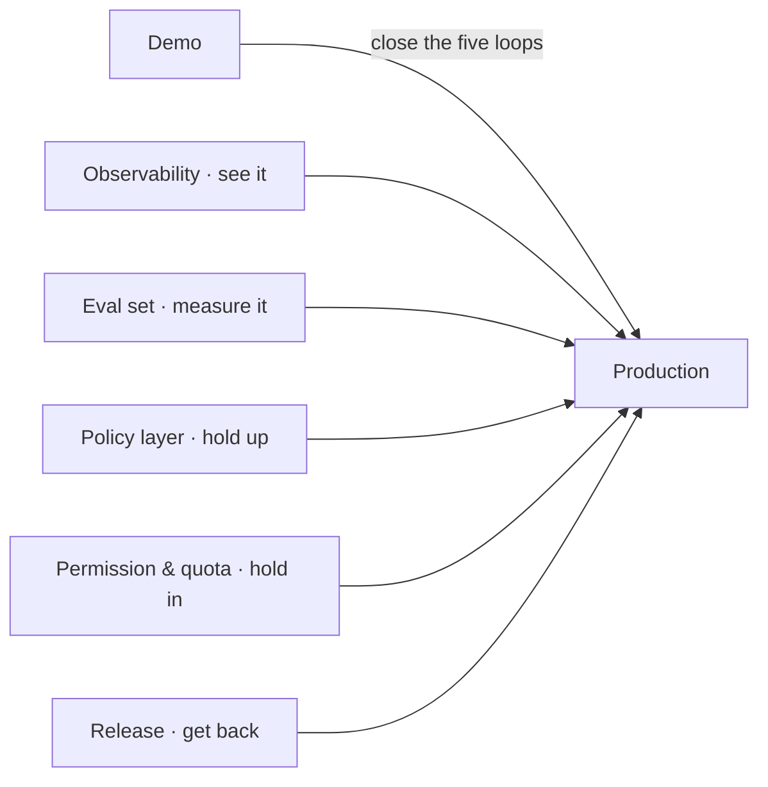

A lot of AI features look great at the demo stage — good model output, fast responses, ready to ship. Then production hits: cost spirals out of control, online errors are hard to locate, a prompt change breaks things, model switches make results unstable.

The gap between demo and production is almost never "model quality". It's **engineering**: can you observe, can you regress, can you control cost, can you hold permissions, can you recover from failure. This post walks through those five things, and the trap each one hides.

## Observability: request path, error codes, latency, cost

When an AI call goes wrong, the first step is always "see it". Observability covers four dimensions:

- **Request path**: which stages a call went through (entry, routing, model, tools), and how long each took
- **Error codes**: what the model's raw error is — don't swallow it at the door
- **Latency**: first-token latency, total latency, the model's share
- **Cost**: token usage and amount per call

The trap: **the boundary between "error" and "normal result" is blurry in AI**. In a traditional backend, non-2xx is an error. In AI, a model "refusing" or "blocked by safety policy" is a normal business result, not a failure. If your observability alerts only on HTTP status codes, you'll mistake "the model refused" for "the service is down" — either missing real failures or drowning in false alarms. Observability must separate "infrastructure error" from "model behavior".

## Evaluation set: fixed-sample regression, avoid "change one thing, break everything"

The scariest thing about AI systems is **having no regression mechanism**. You change a prompt, the model's output changes — maybe better, maybe worse. Without an eval set, you ship on gut feeling and get slapped by user feedback.

An eval set solves two things:

1. **Fixed samples**: a batch of representative inputs + expected outputs; run them on every prompt change to catch regressions
2. **Tiered coverage**: unit tests (parsers, command layer), offline route eval (code structure), live real-model eval (model behavior) — each proving only what it can prove

Here's a real trap I hit: **green false evidence**. Our live eval had "live" in its name but only ran route simulation, never calling a real model — the gate stayed all-green while users kept finding problems. The reason: the evaluator never actually tested model behavior. So eval has to separate "what proves what": offline eval proves only code routing structure; model behavior must be tested with a real model.

## Policy layer: model routing, degradation, circuit breaker, retry

In production, models hang, get rate-limited, or suddenly slow down. The policy layer holds up against these "infrastructure uncertainties":

- **Routing**: pick a model by task type, cost, or latency
- **Degradation**: primary model down, switch to backup
- **Circuit breaker**: a model failing repeatedly gets temporarily isolated
- **Retry**: retry transient failures, but with a cap and backoff

The trap is the **boundary of retry and degradation**. Not every failure should retry — a "refusal" shouldn't, a "timeout" should. Not every failure should degrade — mistaking "refusal" for "model down" burns an extra paid call. Every rule in the policy layer has to separate "business result" from "infrastructure failure".

## Permission and quota: avoid resource abuse

AI costs are metered, so permissions and quotas matter more than in a traditional backend:

- **Permission**: who can call, which models, whether they can hit expensive ones
- **Quota**: call count, spend cap, validity period
- **Audit**: who made each call, and how much it cost

The trap is the **soft/hard distinction of quotas**. The hard gate is "block when over"; the soft warning is "alert when approaching". A hard gate without a soft warning means the user suddenly finds all calls cut off one day; a soft warning without a hard gate means a loop-calling bug burns hundreds overnight. You need both.

## Release process: canary, rollback, alerting

Releasing an AI system is more dangerous than a traditional backend, because model behavior changes aren't a binary right/wrong — they're "slightly better / slightly worse". So the release process has to support **safe experimentation**:

- **Canary**: small traffic first, then ramp up
- **Rollback**: one-click back to the previous version when something breaks
- **Alerting**: auto-alarm when key metrics (error rate, cost, latency) go abnormal

A trap we hit: **treating "verbal launch" as "complete release"**. After a feature passed preprod, we once treated "going live" as a reason to skip code review, test report, and release PR. The service did go live, but the release chain was incomplete — later we added the report, review, production verification, and parked the status at `post-release-reconciled`, not marking it `complete` just because the endpoint returned 200. A release doesn't end at "deployed successfully"; it ends when real production behavior is verified.

## Summary

The real threshold of AI development is engineering. Without engineering, a demo is fast; with engineering, a product grows steadily.

The five things are five "closed loops":

1. Observability — **see it** (separate infrastructure error from model behavior)
2. Evaluation set — **measure it** (don't be fooled by green false evidence)
3. Policy layer — **hold it up** (routing, degradation, breaker, retry)
4. Permission & quota — **hold it in** (a soft and a hard gate)
5. Release process — **get back** (canary, rollback, alerting)

Model quality decides how impressive your demo is; engineering decides how long your product lives. Don't spend all your time tuning prompts — close these five loops first.
