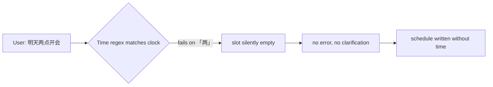

Intent recognition is more than "classifying the intent". After deciding the user wants to create a schedule, you still have to extract the parameters — time, title, and so on. That step is called **slot extraction**, and time is the most critical slot, and the easiest one to get wrong.

Before building a calendar agent, I assumed time parsing was an "algorithm problem" — parse "tomorrow 3pm" into `2026-09-07 15:00` and you're done. After shipping to real users, I learned the hard part of Chinese time parsing isn't "understanding" — it's **disambiguating**: knowing when to write confidently and when to stop and ask.

The most telling case is "7点半" — with no AM/PM prefix, is it 7:30 in the morning or 19:30 at night? The system once silently collapsed it to `07:30`, and the user — who meant the evening — found a wrong schedule quietly added to their calendar.

This post records how I refined the "time slot extraction" in the Anpai.life calendar agent, from regex all the way to ambiguity-aware clarification.

## The hard part isn't understanding, it's ambiguity

Chinese time has two inherent annoyances:

1. **Many ways to write the same number**: "七点半", "7点半", "7:30", and "十九点半" all mean the same thing
2. **Lots of ambiguity**: "7点半" without a prefix could be 7:30 AM or 19:30 PM

The first is a parsing problem, solvable by adding rules. The second is a semantic problem — **guess wrong and you write to the calendar, irreversibly**. So the real design principle is:

> Parsing is for "understanding"; ambiguity must be "asked". Better to ask once more than to write one wrong entry.

## How "两点" (two o'clock) silently vanished

The first pitfall was "两点".

Our time regex initially only matched clock times written in Arabic digits `[0-9]`, while the Chinese-number parser `parseNumber` actually knew the word "两" (two). That mismatch produced the lesson written in a code comment:

> The clock-number character class must stay in sync with what parseNumber supports, or you get a **silent slot loss** — "两点" was dropped exactly this way.

When a user said "明天两点开会" (meeting tomorrow at two), the regex failed to match "两点", the slot was quietly left empty, and the system neither errored nor asked — it just dropped the time. These "silent failures" are far more dangerous than errors: an error makes the user retry, but a silent loss writes bad data directly.

The fix was unglamorous: make the regex's clock-number character class exactly match what `parseNumber` handles — `[0-9一二三四五六七八九十百两]`. Miss one character, and you get one more silent loss.



## "7点半": why 1–7 o'clock must be asked

This is the core pitfall.

"明天 7 点半" — seven thirty in the morning, or seven thirty in the evening? Both are high-frequency times, roughly a coin flip, and guessing wrong means a dirty record.

An early version simply collapsed a prefix-less clock time to the morning, `7点半 → 07:30`. Events the user meant for the evening got recorded as morning, and weren't caught until reconciliation.

The current approach marks "prefix-less 1–7 o'clock" as `ambiguous` and returns two options for the user to choose:

```ts
// Chinese 1–7 o'clock without an AM/PM prefix is a two-way choice; don't collapse it to one time
if (!prefix && hour >= 1 && hour <= 7) {
  return {
    status: 'ambiguous',
    hour, minute,
    morning: '07:30',   // seven thirty AM
    evening: '19:30',   // seven thirty PM
  };
}
```

The user types "7点半", the system replies with a `timeOptions` — "07:30 / 19:30" — and one tap resolves the ambiguity.

## Why 8–11 o'clock can be written safely

So why ask for 1–7 but not 8–11?

It's an implicit rule of Chinese usage:

- **1–7 o'clock**: both morning and evening are high-frequency, so a prefix-less time carries real ambiguity
- **8–11 o'clock**: the morning is the "working hours" usage, while 20:00–23:00 is almost never said as just "8点" — people say "晚上八点" (8 PM). So a prefix-less 8–11 defaults to morning, safely
- **12 o'clock**: defaults to noon

This isn't mysticism; it's a set of **default-value boundaries** ground out from real usage. Draw the boundary wrong and you either annoy users with needless questions or write wrong data.

## Afternoon, evening, noon: the ambiguity of "午"

Prefixed times have their own pitfall, mostly around the character "午":

```ts
if ((prefix is 下午/晚上/傍晚) && hour < 12) hour += 12;  // 下午3点 → 15:00
if (prefix is 中午 && hour < 11) hour += 12;              // boundary of "noon"
```

"下午三点" = `15:00`, "晚上八点" = `20:00` — those are easy. The trouble is "中午" (noon): "中午十二点" is `12:00`, but is "中午一点" 13:00 or 1:00? The code uses a `< 11` threshold: `中午 + hour < 11` adds 12, so "中午十一点" stays 11:00 rather than jumping to 23:00.

These "午"-related boundaries are nearly impossible to get right with regex in one shot; they're all squeezed out by real user phrasing, one case at a time.

## Canonical symbols: separating language from arithmetic

Dates have an even sharper pitfall than times: "下周三" (next Wednesday) — what exact date is it? That involves week-crossing and month-crossing calendar arithmetic, which an LLM computes unreliably.

We ended up with a thin layer of canonical symbols that cleanly splits "language understanding" from "date arithmetic":

```text
D+1       tomorrow      W3+1      next Wednesday
D-1       yesterday     WE        this weekend
2026-09-06  explicit date  15:00  three PM
```

The model handles the unbounded language understanding — "which word in this sentence means which weekday". The code handles the bounded arithmetic — "what exact date is next Wednesday". Whatever language the user speaks, the model normalizes it to these symbols, and the code no longer needs a parser per language.

Expressions like "周末" (weekend) that point at two days are only recognized by the code, which returns both candidates — Saturday and Sunday — and **lets the user pick**, never guessing for them.

## Summary

Looking back, the real difficulty of Chinese time parsing isn't "the parser isn't smart enough" — it's **acknowledging ambiguity exists, and turning an irreversible guess into a reversible clarification**.

- "两点"'s lesson: regex and parser must stay aligned, or a silent slot loss is more dangerous than an error
- "7点半"'s lesson: a prefix-less 1–7 is real ambiguity; asking is cheaper than guessing
- Canonical symbols' lesson: language understanding to the model, date arithmetic to the code

Building intent recognition is polishing slot by slot until each is reliable. Time is just one slot, but it's the one where "wrong" is irreversible — every rule here is backed by a real piece of bad data. **Better to ask once more than to write one wrong entry.**
