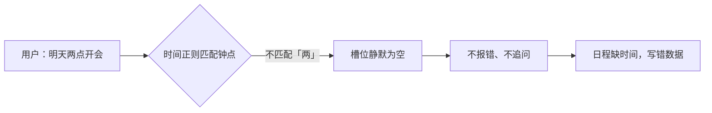
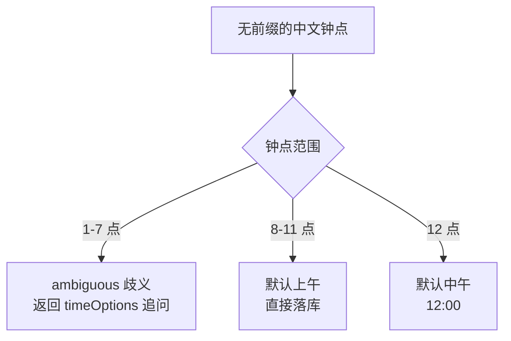

意图识别远不止「分类出意图」。分类出「用户要创建日程」之后，还得把时间、标题这些参数抽出来——这一步叫**槽位抽取**。而时间，是最关键、也最容易翻车的槽位。

做日历 Agent 之前，我以为时间解析是个「算法问题」——把「明天下午三点」解析成 `2026-09-07 15:00` 就完事了。真正上线踩坑后才发现，中文时间解析的难点根本不在「听懂」，而在**歧义消解**：什么时候该放心落库，什么时候必须停下来问用户。

最典型的一个坑是「7点半」——没说是早上还是晚上，系统曾经静默把它收成 `07:30`。用户想约的是晚上七点半，日历里就悄悄多了一条错时间的日程。

这篇文章记录我在 Anpai.life 日历 Agent 里，把「时间槽位抽取」从正则一路打磨到「歧义追问」的完整过程。

## 难点不在听懂，在歧义

中文时间有两个天生的麻烦：

1. **数字写法多**：「七点半」「7点半」「7:30」「十九点半」是同一个意思
2. **歧义多**：「7点半」没前缀时，是早上 7:30 还是晚上 19:30？

前者是解析问题，加规则就能覆盖；后者是语义问题，**猜错了会写错日历，不可逆**。所以真正的设计原则是：

> 解析只管「听懂」，歧义必须「问清楚」。宁可多问一句，不写错一条。

## 「两点」是怎么被静默丢掉的

第一个坑，是「两点」。

我们的时间正则最初只写了阿拉伯数字 `[0-9]` 的钟点，而中文数字解析器 `parseNumber` 其实认识「两」。于是出现了注释里那句血的教训：

> 必须和 parseNumber 支持的写法保持一致，否则会出现「解析器认识但正则匹配不到」的**静默丢槽**——「两点」就是这样被丢掉的。

用户说「明天两点开会」，正则没匹配到「两点」，槽位悄悄为空，系统不报错、不追问，直接丢了时间。这类「静默失败」比「报错」危险得多——报错用户会重试，静默丢失会直接写错数据。

修法很朴素：让正则的钟点字符类和 `parseNumber` 支持的中文数字**严格对齐**，`[0-9一二三四五六七八九十百两]`。少一个字符，就多一种静默丢槽。



## 「7点半」：1-7 点必须追问

这是最核心的一个坑。

「明天 7 点半」——早上七点半，还是晚上七点半？两个都是高频时间，各占一半概率，猜错就是一条脏数据。

早期版本直接把无前缀的钟点收成上午，`7点半 → 07:30`。用户晚上七点半约的事，被记成了早上，直到对账才发现。

现在的做法是，把「无前缀且 1-7 点」单独标成 `ambiguous`，返回两个选项让用户选：

```ts
// 中文 1–7 点无早上/下午前缀时是上下午二选一，不能收成唯一钟点
if (!prefix && hour >= 1 && hour <= 7) {
  return {
    status: 'ambiguous',
    hour, minute,
    morning: '07:30',   // 早上七点半
    evening: '19:30',   // 晚上七点半
  };
}
```

用户输入「7点半」，系统回一个 `timeOptions`：「早上 7:30 / 晚上 19:30」，用户点一下，歧义消解。

## 为什么 8-11 点可以放心落库

那为什么偏偏是 1-7 点要问，8-11 点就不用问？

这是中文语用的一个隐性规则：



- **1-7 点**：早上和晚上都在高频使用区间，无前缀时歧义真实存在
- **8-11 点**：早上是「上班时间」的高频表达，而晚上 20-23 点几乎没人说「8点」，都会带「晚上」前缀（「晚上八点」）。所以无前缀的 8-11 点，默认上午是安全的
- **12 点**：默认中午

这不是玄学，是一组从真实使用里磨出来的**默认值边界**。边界画错了，要么多问烦用户，要么猜错写错数据。

## 下午/晚上/中午：中文的「午」字歧义

带前缀的时间也有坑，主要在「午」字上：

```ts
if ((前缀是 下午/晚上/傍晚) && hour < 12) hour += 12;  // 下午3点 → 15:00
if (前缀是 中午 && hour < 11) hour += 12;              // 中午的边界
```

「下午三点」= `15:00`，「晚上八点」= `20:00`，这都好办。麻烦的是「中午」——「中午十二点」是 `12:00`，「中午一点」到底算 13:00 还是 1:00？代码里用 `< 11` 这个阈值：`中午 + hour < 11` 才加 12，也就是「中午十一点」还是上午 11 点，不跨到 23 点。

这些「午」字相关的边界，正则很难一次写对，都是被真实用户的说法一点点逼出来的。

## 规范符号：切断语言和算术

日期比时间有更狠的坑：「下周三」到底是几号，涉及跨周、跨月的日历算术，让 LLM 直接算不稳。

我们最后用了一层很薄的规范符号，把「语言理解」和「日期算术」彻底切开：

```text
D+1       明天        W3+1      下周三
D-1       昨天        WE        本周末
2026-09-06 明确日期   15:00     下午三点
```

模型负责「这句话里哪个词是星期几」这种无界语言理解；代码负责「下周三到底是几号」这种有界算术。用户说任何语言，模型都归一到这套符号，代码侧不再需要为每种语言写一套解析规则。

「周末」这种指向两天的表达，代码只负责识别出来，返回周六/周日两个候选，**挑哪天交给用户**——不替用户猜。

## 总结

回头看，中文时间解析真正的难点不是「解析算法不够强」，而是**承认歧义的存在，并且把「不可逆的猜测」改造成「可逆的追问」**。

- 「两点」的教训：正则和解析器必须对齐，否则静默丢槽比报错更危险
- 「7点半」的教训：1-7 点无前缀是真实歧义，追问比猜测便宜
- 规范符号的教训：语言理解归模型，日期算术归代码

意图识别能力的建设，就是这样一个槽位一个槽位地打磨到可靠。时间槽位只是其中一块，但它是「写错了不可逆」的那块——每一条规则背后，都是一次真实的错数据。**宁可多问一句，不写错一条。**
