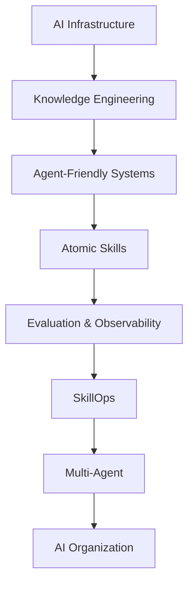

For a while now we've been pushing AI-driven R&D transformation inside a financial business.

As Coding Agent, MCP, Skills, CLI, Agent Harness, and similar capabilities mature, a natural question arises:

> Once all these pieces are in place, will enterprise R&D efficiency quickly jump to a new level?

After really doing it, my feeling is:

**It's not that simple.**

AI's ability to write code is already very strong. But once you put AI into a complex enterprise — especially a financial R&D system — you find that coding is just one link in the whole chain.

When coding efficiency is massively improved, a lot of problems that were previously hidden in the R&D system start to surface:

How do you create a test account?

How do you prepare test data?

What upstream and downstream systems does a given system depend on?

Why can't a certain field be changed?

Why does a certain country have a completely different business logic?

When PRD, technical design, and live code conflict, which one should you trust?

How does the agent know whether a change will affect other systems?

These problems have always existed.

They were just absorbed by "people" before.

An experienced engineer knows who to ask, which Wiki to read, which internal tool to use, and which things "can be changed but must not be changed".

AI doesn't know any of that.

So after a while, I increasingly felt:

> **The real difficulty of enterprise AI transformation is no longer whether AI can write code, but whether the enterprise itself is ready to be understood and used by AI.**

Behind this is an engineering effort far bigger than a Coding Agent.

---

## 1. Stage one: make the whole R&D system AI-ready

### 1.1 After coding gets faster, the bottleneck migrates upstream and downstream

Coding Agents can now complete fairly complex code changes.

What used to take an engineer half a day, an agent can now finish in tens of minutes.

But if you look at the full R&D chain, delivery time hasn't dropped proportionally.

Before it might be:

```text
Requirement
 ↓
Design
 ↓
Coding          ← main bottleneck
 ↓
Testing
 ↓
Release
```

After AI enters, it gradually becomes:

```text
Requirement
 ↓
AI Coding
 ↓
Environment setup
 ↓
Test account prep   ← new bottleneck
 ↓
Test data prep      ← new bottleneck
 ↓
Test verification
 ↓
Risk judgment       ← new bottleneck
 ↓
Release
```

This is especially visible in financial business.

For example, AI might finish a code change in ten minutes, but to verify the requirement I need a test account meeting specific conditions.

And a financial "test account" may involve:

* user status;
* account status;
* credit status;
* product status;
* risk-control status;
* transaction status;
* payment status;
* the data state of various upstream and downstream systems.

The result:

> **AI finishes the code in ten minutes; R&D spends hours preparing test data.**

So enterprise AI transformation can't just optimize Coding Efficiency.

What you really need to optimize is:

> **End-to-End Delivery Efficiency.**

The Coding Agent is just the entry point.

---

### 1.2 Stage one is about making internal systems callable by AI

So I think the first step of enterprise AI transformation is building infrastructure.

For example:

* Coding Agent;
* MCP;
* CLI;
* Skills;
* Agent Harness;
* DAG;
* Hooks;
* CI/CD;
* Observability;
* API/Tool-ifying the internal R&D platform;
* permission and security systems.

The problem this stage really solves is very plain:

> **Make an R&D system that used to be usable only by "people", usable by agents too.**

In the past, when designing an internal platform, we mainly considered the Human Interface.

Is the page easy to use?

Is the flow clear?

Where should the button go?

But an agent doesn't need any of that.

An agent needs to know:

```text
What capability does this system provide?
What's the input?
What's the output?
What are the preconditions?
What does failure mean?
What side effect does it produce?
What permission does it need?
How do you verify the execution result?
```

So in the future, internal enterprise systems actually need two interfaces at the same time:

```text
                 Enterprise System
                        │
             ┌──────────┴──────────┐
             ↓                     ↓
       Human Interface       Agent Interface
             │                     │
           GUI               MCP / CLI / API
```

This is the first step for an enterprise to truly become AI Native.

---

## 2. Stage two: enterprise knowledge engineering, so AI truly understands the business

After tool integration, you quickly hit the second problem:

> **The agent can operate the systems, but it doesn't really understand them.**

And I think this is a very important, yet often underestimated, layer of enterprise AI transformation:

**The enterprise knowledge base.**

---

### 2.1 An enterprise knowledge base can't just be "embedding documents"

Many people, when they hear "enterprise knowledge base", first think of RAG:

```text
Document
   ↓
Chunk
   ↓
Embedding
   ↓
Vector DB
   ↓
Top-K Retrieval
```

RAG is of course valuable.

But to truly build an enterprise knowledge system that supports R&D agents, I think RAG alone isn't enough.

Because enterprise knowledge isn't a pile of mutually independent documents.

It's essentially a **complete cognitive model of the business domain**.

For example, to build a knowledge base for a financial domain, you first need to figure out all the systems involved:

```text
                    Domain
                      │
       ┌──────────────┼──────────────┐
       ↓              ↓              ↓
   Application A  Application B  Application C
       │              │              │
       └──────────────┼──────────────┘
                      ↓
               Upstream / Downstream
```

Then understand:

What are the core functions of this domain?

Which systems does each function involve?

How do different countries implement it?

What differences exist across markets?

What special logic exists in different business scenarios?

Which configurations determine live behavior?

That's the knowledge base an enterprise really needs.

---

### 2.2 Knowledge sources should at least include code, PRD, technical design, and live config

In our practice, building a knowledge base uses at least several kinds of data sources.

#### First: code

Code is the most important source of facts.

Because code ultimately decides what the system actually does.

#### Second: PRD

The PRD describes:

> Why the business was designed this way at the time.

It supplements the business intent that code can't express.

#### Third: technical design

The technical design describes:

> How this requirement was systematically implemented.

It usually contains architecture choices, upstream/downstream relationships, data flow, and technical constraints.

#### Fourth: live configuration

This is especially important in large financial systems.

Because a lot of real live behavior doesn't fully live in the code.

Different countries, markets, and products may be decided by live configuration.

So in the end it may be:

```text
Code
 +
Online Configuration
 +
PRD
 +
Technical Design
        ↓
   Knowledge Skills
        ↓
 Enterprise Knowledge Base
```

There's another very important question here:

**What happens when knowledge conflicts?**

For example:

The PRD says A.

The technical design says B.

But the code has already become C.

My principle is clear:

> **Treat the actually running code and live configuration as the ultimate source of truth.**

PRD and technical design provide background, intent, and design rationale.

But how the system actually runs today must ultimately go back to Code + Runtime Configuration.

Otherwise the knowledge base easily becomes a place describing "how the system was supposed to be in the past", not "how the system actually is today".

---

### 2.3 The knowledge base should be organized by domain, not by document source

Another important design is how knowledge is organized.

I lean toward:

> **Domain-Oriented Knowledge Base.**

not:

```text
PRD/
TechnicalDesign/
CodeDocs/
MeetingNotes/
```

Because the questions an agent actually asks usually aren't:

> "Help me find a PRD."

but:

> "How is this business implemented in the Thailand market?"

or:

> "Which systems will this feature change affect?"

So knowledge should ultimately be reorganized into something like:

```text
Domain
│
├── Overview
│
├── Architecture
│
├── Core Concepts
│
├── Feature A
│   ├── Business Logic
│   ├── Application A
│   ├── Application B
│   ├── Thailand
│   ├── Indonesia
│   └── Configuration
│
├── Feature B
│
├── Data Flow
│
├── Upstream Systems
│
├── Downstream Systems
│
└── FAQ / Known Issues
```

That is:

**Raw material can be stored in an engineering way, but the knowledge given to agents should be reorganized by business cognition.**

---

### 2.4 Why I lean toward LLM Wiki instead of traditional RAG

As solutions like LLM Wiki develop, I increasingly lean toward making the enterprise R&D knowledge base:

> **A structured Wiki + agent-local retrieval.**

rather than chopping all knowledge into chunks and fully relying on vector recall.

One of RAG's biggest problems is that it's more like:

> "When a question comes, fish a few relevant fragments out of the knowledge ocean."

But for complex R&D problems, what we really want the agent to get is:

> **A relatively complete understanding of a domain.**

For example:

"I want to modify a credit-approval flow in Cash Loan."

What the agent really needs to understand isn't three Top-K chunks.

It needs to know:

```text
Business background
 ↓
Core concepts
 ↓
System boundary
 ↓
Upstream / downstream
 ↓
Current implementation
 ↓
Country differences
 ↓
Live configuration
 ↓
Historical design
```

This is also why a structured LLM Wiki is so attractive for these scenarios.

The knowledge has already been organized, cleaned, and distilled once.

The agent doesn't need to reassemble answers from a mass of raw documents every time.

---

## 3. The knowledge base can't be a "central server"; it should enter the Git engineering system

Once the knowledge is organized, the next very real engineering problem appears:

> **Where does this knowledge live?**

This is actually more important than you'd think.

---

### 3.1 Spec Driven Development produces a lot of R&D knowledge

More and more teams are now adopting Spec-driven development.

A single requirement produces a lot of content:

```text
Requirement
   ↓
PRD
   ↓
Spec
   ↓
Technical Design
   ↓
Implementation
   ↓
Test
```

For a small project, putting all of it in the business Git repository is fine.

Code and docs evolve together.

But large enterprises quickly hit a problem.

Because one business often spans multiple applications.

So knowledge becomes:

```text
Repo A
 └── Docs

Repo B
 └── Docs

Repo C
 └── Docs

Repo D
 └── Docs
```

Now, for an agent to understand the whole business, it must actively discover docs scattered across multiple repositories.

The cost of knowledge discovery rises fast.

---

### 3.2 If knowledge is scattered across business repos, update hooks get very complex

There's a second problem.

If knowledge lives in each code repo, then after every code release we want to synchronously update the knowledge.

That means:

```text
Repo A Release → Knowledge Hook
Repo B Release → Knowledge Hook
Repo C Release → Knowledge Hook
Repo D Release → Knowledge Hook
...
```

As systems grow, the hooks to integrate and maintain also grow.

This creates new infrastructure cost.

And in the AI era I'm increasingly wary of one thing:

> **Any central node or complex infrastructure that needs a dedicated person to maintain long-term may become a bottleneck for a team's individual combat efficiency.**

---

### 3.3 Use an independent Knowledge Repository

So you can think differently.

The knowledge base itself is a Git repository.

For example:

```text
Business Domain
│
├── application-a/
├── application-b/
├── application-c/
├── skills/
└── knowledge/
```

The Knowledge Repository and the business code repository are parallel.

The knowledge base is essentially a series of well-structured Markdown files.

This has one big benefit:

**Knowledge itself regains a complete software-engineering lifecycle.**

It can:

* Branch;
* Commit;
* CR / PR;
* Review;
* Merge;
* Tag;
* Release;
* Rollback.

Knowledge is no longer an "external Wiki".

It becomes part of the engineering.

---

### 3.4 Feature Branch keeps code and knowledge naturally version-aligned

There's another design here I find very valuable.

For example, developing a requirement:

```text
A.123
```

The business code creates:

```text
feature/A.123
```

Then the Knowledge Repository creates the same:

```text
feature/A.123
```

During development:

```text
Business Repo
feature/A.123
      │
      │  evolve in sync
      ↓
Knowledge Repo
feature/A.123
```

Everything produced during requirement development:

* new business logic;
* new system relationships;
* new configuration;
* new country differences;
* new technical design;

can sync into this knowledge branch.

Finally the application releases:

```text
Application Release
        +
Knowledge Merge
        ↓
Knowledge Release
```

This solves a classic problem of enterprise knowledge bases:

> **Knowledge version and code version drift.**

---

### 3.5 After release, only trigger one round of knowledge distillation and cleanup

After code goes live, a Release Hook can trigger a new round of processing on the knowledge base:

```text
Application Release
        ↓
Knowledge Hook
        ↓
Collect Changes
        ↓
Compare Code / Config / Docs
        ↓
Conflict Resolution
        ↓
Knowledge Distillation
        ↓
Knowledge Cleanup
        ↓
Generate / Update Wiki
        ↓
Review
        ↓
Publish
```

This way the knowledge base isn't a "big cleanup" every six months.

It evolves continuously with the R&D lifecycle.

I think a truly good enterprise knowledge base should be:

> **A Living Knowledge Base.**

It should breathe together with the code.

---

## 4. Centralized knowledge governance, but not necessarily centralized serving

This is another important judgment from our practice.

Knowledge itself needs to be centralized.

Because one domain must have a unified cognition.

Otherwise Application A thinks a concept is X and Application B thinks it's Y, and knowledge conflicts soon appear.

So:

> **Knowledge Governance should be centralized.**

But:

> **Knowledge Serving doesn't have to be centralized.**

These two concepts need to be separated.

---

### 4.1 Why I don't want every agent calling a central knowledge service

A very natural architecture is:

```text
Coding Agent
      ↓
Knowledge API
      ↓
Knowledge Server
      ↓
Knowledge DB
```

But that means maintaining:

* services;
* machines;
* APIs;
* traffic;
* SLA;
* permissions;
* cache;
* scaling;
* failure recovery.

In the end the knowledge service itself becomes a central node that needs long-term maintenance.

For a large infrastructure team this is doable.

But if the goal is to let every AI team have strong individual combat ability, I think you should minimize this central dependency.

---

### 4.2 A simpler way: the agent pulls knowledge locally

Because the knowledge is already in a Git repository.

So when a Coding Agent starts, its Skill can automatically pull the relevant Knowledge Repository based on the current business.

For example:

```text
Developer Workspace
│
├── Application A
├── Application B
├── Skills
└── Knowledge
```

When the agent queries knowledge:

```text
Coding Agent
      ↓
Local Knowledge
      ↓
Markdown / Search / LLM Wiki
```

No need for:

```text
Coding Agent
      ↓
Network
      ↓
Central Knowledge Service
      ↓
Database
```

This brings several very direct benefits:

**Fast.**

**No network dependency.**

**No extra service SLA.**

**No central service ops cost.**

**The Coding Agent can directly use its own file-retrieval ability.**

Even the Knowledge Skill itself can decide:

> Which domain does the current requirement belong to, and which knowledge should I pull.

This actually fits the agent's way of working very well.

---

### 4.3 Decentralized serving doesn't mean each domain does its own thing

Of course there's risk here.

If each domain maintains its own Knowledge Repository, it's easy to get:

* duplicated concepts;
* inconsistent terminology;
* cross-domain definition conflicts;
* unclear domain boundaries.

So you still need a very lightweight global layer.

For example:

```text
Enterprise Knowledge
│
├── Domain Registry
├── Glossary
├── Domain Boundary
├── Shared Concepts
└── Knowledge Index
```

This layer doesn't need to hold all the business details.

It's responsible for:

**Defining the language, domains, and entries.**

Specific business knowledge still belongs to the domain.

So in the end:

```text
          Central Governance
                 │
        ┌────────┼────────┐
        ↓        ↓        ↓
     Domain A Domain B Domain C
        │        │        │
        ↓        ↓        ↓
      Git Repo  Git Repo  Git Repo
        │        │        │
        └────────┼────────┘
                 ↓
          Local Agent Serving
```

So I lean toward:

> **Centralized governance + distributed storage/distribution + local consumption.**

---

## 5. From Knowledge to Skills: let AI go from "understanding the enterprise" to "operating the enterprise"

With knowledge in place, the next step is Skills.

I think the relationship between Knowledge and Skills is very important.

Simply:

```text
Knowledge = what the enterprise knows
Skill     = what the enterprise can do
```

With only Knowledge and no Skill, the agent is smart but can't act.

With only Skill and no Knowledge, the agent can act but doesn't know when to, or what impact it will have.

So a truly complete enterprise AI capability is:

```text
Knowledge
    +
Skills
    +
Tools
    ↓
Agent
```

---

### 5.1 Start from real business Skills, not a big platform first

For example, the test-data problem mentioned earlier.

What we do now is first distill the test-data preparation process of a single business into a Skill.

Not designing a "big and complete" Enterprise Skill Platform up front.

Instead:

```text
Real problem
 ↓
Solve the problem
 ↓
Form a business Skill
 ↓
Real usage
 ↓
Discover reusable capability
 ↓
Keep abstracting
```

I quite believe in this path.

**Good abstraction should grow out of the business.**

---

### 5.2 Then break business Skills into atomic capabilities

For example:

```text
Business Test Data Skill
       │
       ├── User Creation Skill
       ├── Account Query Skill
       ├── Credit State Skill
       ├── Environment Check Skill
       ├── Data Validation Skill
       └── Transaction Setup Skill
```

Then gradually form:

```text
Atomic Skills
     ↓
Domain Skills
     ↓
Scenario Skills
     ↓
Agent Workflow
```

This way a new business doesn't need to be developed from scratch later.

You just combine existing capabilities.

---

### 5.3 The most important thing for an atomic Skill is reducing implicit dependencies

Whether a Skill is "atomic" enough can't just be judged by code size.

What you should really care about is:

```text
Input
↓
Precondition
↓
Execution
↓
Output
↓
Failure
↓
Side Effect
```

Especially in financial business:

**Failure and Side Effect must be explicit.**

Because what the enterprise really worries about is never:

> Will AI call it?

but:

> **What happens after AI calls it wrong.**

---

## 6. At scale: SkillOps, quality, and token must all enter the governance system

When the enterprise has tens or even hundreds of Skills, the problem changes again.

Now it's no longer:

> How to make a Skill?

but:

> How to let the whole organization maintain Skills together?

---

### 6.1 Skills should evolve through CR, just like code

For example, a developer finds a Bad Case while using a Skill.

It shouldn't be:

```text
Find a problem
 ↓
DM the Skill author
 ↓
Wait for the author to have time
```

It should be:

```text
Use
 ↓
Bad Case
 ↓
Improve
 ↓
CR
 ↓
Owner / Expert Review
 ↓
Evaluation
 ↓
Merge
 ↓
Release
```

Every Skill should ultimately have:

* Owner;
* Version;
* CR;
* Review;
* Evaluation;
* Changelog;
* Usage;
* Success Rate;
* Bad Case;
* Rollback.

I call this system:

> **SkillOps.**

What SkillOps really solves isn't Skill management.

It solves:

> **How to continuously turn one person's experience into the whole organization's capability.**

---

### 6.2 Test engineers can transform a bit slower

AI transformation also affects organizational roles.

Many teams are now pushing:

```text
Frontend → full-stack
Test → full-stack
```

Frontend-to-full-stack, I think the direction is fine.

But for test engineers, I think they can actually go a bit slower in the business.

Because AI brings:

* larger change volume;
* faster code output;
* wider modification scope;
* more agent autonomy;
* more new kinds of quality problems that never existed before.

So early in AI transformation, the importance of quality assurance may not drop.

It may even rise.

Testing should of course gradually gain development ability.

But it doesn't need to finish in half a year.

You can give it a one- or even two-year evolution cycle.

Because:

> **What I want is business stability, not a change of title.**

---

### 6.3 Token should also become an organization-level resource

Another very real problem is Token.

If you distribute purely per head:

```text
Engineer A → X Token
Engineer B → X Token
Engineer C → X Token
```

it's easy to end up with:

A only uses 20%.

B, because of heavy agent use, runs out within a week.

The whole team still has resources, but the people actually creating value are capped.

So Token should exist in both:

**individual dimension + organizational dimension.**

```text
                Team Token Pool
                       │
          ┌────────────┼────────────┐
          ↓            ↓            ↓
      Base Quota  Project Quota  Dynamic Pool
```

Token is essentially becoming:

> **The means of production for R&D in the AI era.**

---

### 6.4 DAG + Hooks turn Token into a truly governable metric

We've started doing this with DAG + Hooks.

Because the whole Agent Workflow is a DAG.

So every Node can record:

```text
Planning
Token: 8K
Time: 20s

Coding
Token: 72K
Time: 6min

Testing
Token: 31K
Time: 4min

Fix
Token: 46K
Time: 5min
```

In the end, one requirement can tell you:

* Total Token;
* Node Token;
* Delivery Time;
* Retry;
* Tool Calls;
* Success Rate;
* Human Intervention.

So Token is no longer just a bill.

It becomes an R&D engineering metric.

Because:

> **What you can't see, you can't control.**

If you find Retry is consuming 30% of the Token, then what you really need to optimize may not be the model price.

Instead:

Is the Tool Description wrong?

Is the Skill poorly designed?

Is the Context missing?

Is the Knowledge recall wrong?

Is the Planning unstable?

Is the internal system just not Agent Friendly?

So Token Governance ultimately becomes part of the whole Agent Observability.

---

## 7. The last step is Multi-Agent and the AI Organization

After completing the previous building, Multi-Agent is finally meaningful.

In the future it may be:

```text
                    Requirement
                         ↓
                     Planner
                         ↓
        ┌────────────────┼────────────────┐
        ↓                ↓                ↓
   Coding Agent      Test Agent      Review Agent
        │                │                │
        └────────────────┼────────────────┘
                         ↓
                    Release Agent
                         ↓
                   Observability
```

But Multi-Agent is not the starting point.

If:

knowledge isn't accumulated;

test data can't be prepared;

tools can't be called stably;

Skills are full of implicit dependencies;

systems have no observability;

the quality system hasn't kept up;

then ten agents are just:

> **Ten agents hitting the wall together.**

So the true evolution order of enterprise AI transformation should be:



---

## 8. The endgame of enterprise AI transformation: building a self-evolving organization

When all of this is strung together, I increasingly feel:

What's truly valuable about enterprise AI transformation isn't:

> "We gave everyone a Coding Agent."

nor:

> "How many MCPs and Skills we built."

What really matters is that a new closed loop starts to appear:

```text
Human
  ↓
find a business problem
  ↓
Knowledge
  ↓
Skill
  ↓
Agent
  ↓
real business runs
  ↓
Observability / Bad Case
  ↓
CR / Review
  ↓
Knowledge & Skill Evolution
  ↓
Organization
```

Before, a Senior Engineer stepped on a pit.

That experience might live in their head for five years.

If they later leave, the knowledge may disappear.

In the AI era, we have a chance to change this.

An engineer steps on a pit once.

It gets distilled into Knowledge.

Then abstracted into a Skill.

Others find new Bad Cases while using the Skill.

Submit a CR.

Domain experts review.

Evaluation verifies.

Then the new version enters the whole organization.

So:

```text
Personal experience
   ↓
Organizational knowledge
   ↓
Organizational capability
   ↓
AI execution
   ↓
New experience
   ↓
Enters the organization again
```

Once this Flywheel really spins, what the enterprise accumulates is no longer just code.

It's a continuously growing:

> **AI Engineering Capability.**

---

## In closing: AI is forcing enterprises to redesign themselves

For many years, we've been making "people" adapt to enterprise systems.

Can't find a document?

Ask someone.

Don't know the process?

Ask in the group.

Can't prepare a test account?

Find the tester.

Don't know what a config means?

Find the old-timer.

The system is hard to use?

Everyone just gets used to it.

Human adaptability is so strong that a huge amount of organizational cost stayed hidden for a long time.

But AI is different.

AI exposes all these problems.

It doesn't know the implicit rules only old employees know.

It doesn't know a certain Wiki is outdated.

It doesn't know a certain config "can be changed but must not be changed".

So in this sense, what AI transformation really brings isn't just Coding Efficiency.

It actually forces enterprises to re-answer many questions they never seriously answered before:

**Where is our knowledge?**

**What is the source of truth?**

**What exactly is the relationship between systems?**

**Which capabilities can be standardized?**

**How does one person's experience become the whole organization's capability?**

**How is AI's behavior observed and governed?**

**How do you guarantee the stability of financial business while improving efficiency?**

When Code, PRD, Technical Design, and Online Configuration can be continuously distilled into Knowledge;

when the Knowledge Repository syncs with the business Git lifecycle;

when agents can consume domain knowledge locally;

when Knowledge is further distilled into Atomic Skills;

when Skills evolve continuously through CR, Review, and Evaluation;

when DAG + Hooks can observe the cost and effect of every Agent Node;

when the whole R&D flow can finally be executed by multiple agents in coordination……

only then does AI truly move from a "tool" into the enterprise's production system.

So I now increasingly believe:

> **The endpoint of enterprise AI transformation is not making everyone able to use AI.**
>
> **It's turning the whole organization into a system that AI can understand, call, observe — and that can keep self-evolving through Human + Agent.**

And what truly forms an enterprise's AI moat may not be a certain model, a certain agent, or even a certain platform.

It's what the organization has accumulated after several years:

**Knowledge + Skills + Workflow + Evaluation + Observability + Governance.**

That's the part of an AI Native Organization that's truly hard to replicate.
