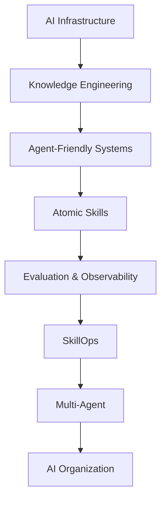

过去一段时间，我们一直在推进金融业务内部的 AI 研发转型。

随着 Coding Agent、MCP、Skills、CLI、Agent Harness 等能力逐渐成熟，一个很自然的问题是：

> 当这些东西都具备以后，企业的研发效率是不是就会迅速发生质变？

真正做下来以后，我的感受是：

**没有这么简单。**

AI 写代码的能力已经非常强，但真正把 AI 放进一个复杂企业，尤其是金融业务的研发体系以后，会发现 Coding 只是整个链路中的一个环节。

当 Coding 的效率被大幅提升以后，原来隐藏在研发体系里的大量问题反而开始暴露：

测试账号怎么创建？

测试数据怎么准备？

一个系统到底依赖哪些上下游？

某个字段为什么不能修改？

某个国家为什么有一套完全不同的业务逻辑？

PRD、技术方案和线上代码冲突时，到底应该相信谁？

Agent 怎么知道一次修改会不会影响其他系统？

这些问题过去一直存在。

只是以前由“人”消化掉了。

一个有经验的工程师知道应该找谁、看哪个 Wiki、使用哪个内部工具，也知道哪些东西“虽然能改，但不能改”。

AI 不知道。

所以做了一段时间以后，我越来越觉得：

> **企业 AI 转型真正的难点，已经不是 AI 能不能写代码，而是企业本身是否已经准备好被 AI 理解和使用。**

这背后其实是一场比 Coding Agent 更大的工程。

---

## 一、第一阶段：先让整个研发体系 AI Ready

### 1. Coding 提效以后，瓶颈开始向上下游迁移

现在 Coding Agent 已经可以完成相当复杂的代码修改。

以前工程师可能需要半天完成的工作，现在 Agent 可能几十分钟就能完成。

但是如果观察完整的研发链路，会发现需求交付时间并没有同比下降。

过去可能是：

```text
需求
 ↓
设计
 ↓
编码          ← 主要瓶颈
 ↓
测试
 ↓
发布
```

而 AI 进入以后逐渐变成：

```text
需求
 ↓
AI Coding
 ↓
环境准备
 ↓
测试账号准备   ← 新瓶颈
 ↓
测试数据准备   ← 新瓶颈
 ↓
测试验证
 ↓
风险判断       ← 新瓶颈
 ↓
发布
```

尤其在金融业务里，这种现象非常明显。

例如 AI 可能十几分钟把代码修改完成，但为了验证这个需求，我需要准备一个满足特定条件的测试账号。

而一个金融业务的“测试账号”，背后可能涉及：

* 用户状态；
* 账户状态；
* 授信状态；
* 产品状态；
* 风控状态；
* 交易状态；
* 支付状态；
* 不同上下游系统的数据状态。

结果就是：

> **AI 十几分钟把代码写完，研发花几个小时准备测试数据。**

所以企业 AI 转型不能只优化 Coding Efficiency。

真正需要优化的是：

> **End-to-End Delivery Efficiency。**

Coding Agent 只是入口。

---

### 2. 第一阶段要做的，是让企业内部系统能够被 AI 调用

所以我认为企业 AI 转型首先要建设基础设施。

例如：

* Coding Agent；
* MCP；
* CLI；
* Skills；
* Agent Harness；
* DAG；
* Hooks；
* CI/CD；
* Observability；
* 内部研发平台的 API / Tool 化；
* 权限和安全体系。

这个阶段真正解决的问题其实非常朴素：

> **让原来只能被“人”使用的研发体系，也能够被 Agent 使用。**

过去设计一个内部平台，我们主要考虑 Human Interface。

页面是不是好用？

流程是不是清晰？

按钮放在哪里？

但 Agent 不需要这些东西。

Agent 需要知道：

```text
这个系统提供什么能力？
输入是什么？
输出是什么？
前置条件是什么？
失败意味着什么？
会产生什么 Side Effect？
需要什么权限？
执行结果如何验证？
```

所以未来企业内部系统实际上需要同时存在两套 Interface：

```text
                 Enterprise System
                        │
             ┌──────────┴──────────┐
             ↓                     ↓
       Human Interface       Agent Interface
             │                     │
           GUI               MCP / CLI / API
```

这是企业真正走向 AI Native 的第一步。

---

## 二、第二阶段：建立企业级知识工程，让 AI 真正理解业务

完成工具接入以后，很快会遇到第二个问题：

> **Agent 可以操作系统了，但它并不真正理解这个系统。**

而我认为，这是企业 AI 转型过程中非常重要、同时又经常被低估的一层：

**企业级知识库。**

---

### 1. 企业知识库不能只是“把文档做 Embedding”

很多人一提企业知识库，第一反应还是 RAG：

```text
Document
   ↓
Chunk
   ↓
Embedding
   ↓
Vector DB
   ↓
Top-K Retrieval
```

RAG 当然有价值。

但如果真正要建立一个支撑研发 Agent 的企业知识体系，我认为仅仅做 RAG 是不够的。

因为企业知识并不是一堆互相独立的文档。

它本质上是一个**业务领域的完整认知模型**。

比如我们要构建某一个金融领域的知识库，首先需要把这个领域涉及的系统全部搞清楚：

```text
                    Domain
                      │
       ┌──────────────┼──────────────┐
       ↓              ↓              ↓
   Application A  Application B  Application C
       │              │              │
       └──────────────┼──────────────┘
                      ↓
               Upstream / Downstream
```

然后再理解：

这个领域有哪些核心功能？

每个功能涉及哪些系统？

不同国家怎么实现？

不同市场有什么差异？

不同业务场景有什么特殊逻辑？

哪些配置决定了线上行为？

这才是企业真正需要的知识库。

---

### 2. 知识来源至少应该包括代码、PRD、技术方案和线上配置

在我们的实践里，构建知识库至少会使用几类数据源。

#### 第一类：代码

代码是最重要的事实来源。

因为代码最终决定系统真正做了什么。

#### 第二类：PRD

PRD 描述的是：

> 业务当时为什么这么设计。

它能够补充代码无法表达的业务意图。

#### 第三类：技术方案

技术方案描述：

> 这个需求当时是如何被系统化实现的。

它通常包含架构选择、上下游关系、数据流和技术约束。

#### 第四类：线上配置

这一点在大型金融系统里尤其重要。

因为很多真正的线上行为并不完全存在于代码里。

不同国家、不同市场、不同产品可能由线上配置决定。

所以最终可能是：

```text
Code
 +
Online Configuration
 +
PRD
 +
Technical Design
        ↓
   Knowledge Skills
        ↓
 Enterprise Knowledge Base
```

这里还有一个非常重要的问题：

**知识冲突怎么办？**

比如：

PRD 写的是 A。

技术方案写的是 B。

但代码已经变成 C。

我的原则很明确：

> **一切以真实运行的代码和线上配置为最终事实来源。**

PRD 和技术方案提供背景、意图和设计依据。

但系统今天真正怎么运行，最终必须回到 Code + Runtime Configuration。

否则知识库很容易变成一个描述“过去系统应该是什么样”的地方，而不是描述“今天系统实际上是什么样”的地方。

---

### 3. 知识库应该按领域组织，而不是按文档来源组织

另一个很重要的设计，是知识应该怎么组织。

我更倾向于：

> **Domain-Oriented Knowledge Base。**

而不是：

```text
PRD/
TechnicalDesign/
CodeDocs/
MeetingNotes/
```

因为 Agent 真正提出的问题通常不是：

> “帮我找一篇 PRD。”

而是：

> “这个业务在泰国市场是怎么实现的？”

或者：

> “这个功能修改以后会影响哪些系统？”

所以知识最终应该被重新组织成类似：

```text
Domain
│
├── Overview
│
├── Architecture
│
├── Core Concepts
│
├── Feature A
│   ├── Business Logic
│   ├── Application A
│   ├── Application B
│   ├── Thailand
│   ├── Indonesia
│   └── Configuration
│
├── Feature B
│
├── Data Flow
│
├── Upstream Systems
│
├── Downstream Systems
│
└── FAQ / Known Issues
```

也就是说：

**原始资料可以按照工程方式存在，但最终给 Agent 使用的知识应该按照业务认知重新组织。**

---

### 4. 为什么我更倾向于 LLM Wiki，而不是传统 RAG

随着 LLM Wiki 这类方案的发展，我越来越倾向于把企业研发知识库做成：

> **结构化 Wiki + Agent 本地检索。**

而不是把所有知识切成 Chunk，然后完全依赖向量召回。

RAG 最大的问题之一，是它更像：

> “问题来了以后，从知识海洋里捞几个相关片段。”

但对于复杂研发问题，我们真正希望 Agent 获得的是：

> **对一个领域相对完整的理解。**

比如：

“我要修改 Cash Loan 的某个授信流程。”

Agent 真正需要理解的可能不是三个 Top-K Chunk。

它需要知道：

```text
业务背景
 ↓
核心概念
 ↓
系统边界
 ↓
上下游
 ↓
当前实现
 ↓
国家差异
 ↓
线上配置
 ↓
历史设计
```

这也是为什么结构化的 LLM Wiki 对这类场景非常有吸引力。

知识本身已经经过一次组织、清洗和蒸馏。

Agent 不需要每次从大量原始文档中重新拼答案。

---

## 三、知识库不能是一个“中央服务器”，而应该进入 Git 工程体系

知识整理好以后，紧接着会出现另一个非常现实的工程问题：

> **这些知识到底放在哪里？**

这件事情其实比想象中重要。

---

### 1. Spec Driven Development 会产生大量研发知识

现在越来越多团队开始采用 Spec 的方式研发。

一个需求背后会产生大量内容：

```text
Requirement
   ↓
PRD
   ↓
Spec
   ↓
Technical Design
   ↓
Implementation
   ↓
Test
```

对于一个小型项目，这些东西全部放在业务 Git Repository 里没有什么问题。

代码和文档一起演进。

但是大型企业很快会遇到问题。

因为一个业务往往跨多个 Application。

于是知识会变成：

```text
Repo A
 └── Docs

Repo B
 └── Docs

Repo C
 └── Docs

Repo D
 └── Docs
```

这时候 Agent 如果要理解完整业务，就必须主动发现散落在多个 Repository 中的文档。

知识发现成本迅速增加。

---

### 2. 如果知识分散在业务仓库，更新 Hooks 也会变得非常复杂

还有第二个问题。

如果知识跟着每个代码仓库存在，那么每次代码发布以后，我们都希望同步更新知识。

那就意味着：

```text
Repo A Release → Knowledge Hook
Repo B Release → Knowledge Hook
Repo C Release → Knowledge Hook
Repo D Release → Knowledge Hook
...
```

随着系统越来越多，需要接入和维护的 Hooks 也越来越多。

这会形成新的基础设施成本。

而 AI 时代我越来越警惕一件事情：

> **任何需要专人长期维护的中心节点或者复杂基础设施，都可能成为团队单兵作战效率的瓶颈。**

---

### 3. 采用的是独立 Knowledge Repository

所以可以换一个思路。

知识库本身就是一个 Git Repository。

例如：

```text
Business Domain
│
├── application-a/
├── application-b/
├── application-c/
├── skills/
└── knowledge/
```

其中 Knowledge Repository 和业务代码 Repository 是平行关系。

知识库里面本质上就是一系列结构良好的 Markdown。

这样做有一个很大的好处：

**知识本身重新拥有了完整的软件工程生命周期。**

它可以：

* Branch；
* Commit；
* CR / PR；
* Review；
* Merge；
* Tag；
* Release；
* Rollback。

知识不再是一个“外部 Wiki”。

它成为工程的一部分。

---

### 4. Feature Branch 可以让代码和知识天然保持版本一致

这里还有一个我觉得非常有价值的设计。

比如现在开发一个需求：

```text
A.123
```

业务代码创建：

```text
feature/A.123
```

那么 Knowledge Repository 同样创建：

```text
feature/A.123
```

研发过程中：

```text
Business Repo
feature/A.123
      │
      │ 同步演进
      ↓
Knowledge Repo
feature/A.123
```

需求开发过程中产生的：

* 新业务逻辑；
* 新系统关系；
* 新配置；
* 新国家差异；
* 新技术设计；

都可以同步进入这个知识 Branch。

最终应用发布：

```text
Application Release
        +
Knowledge Merge
        ↓
Knowledge Release
```

这样就解决了一个企业知识库非常经典的问题：

> **知识版本和代码版本漂移。**

---

### 5. 发布之后，只需要触发一次知识蒸馏和清洗

代码上线以后，可以通过 Release Hook 触发知识库的新一轮处理：

```text
Application Release
        ↓
Knowledge Hook
        ↓
Collect Changes
        ↓
Compare Code / Config / Docs
        ↓
Conflict Resolution
        ↓
Knowledge Distillation
        ↓
Knowledge Cleanup
        ↓
Generate / Update Wiki
        ↓
Review
        ↓
Publish
```

这样知识库不是半年做一次“大扫除”。

而是跟着研发生命周期持续演进。

我认为真正好的企业知识库应该是：

> **Living Knowledge Base。**

它应该和代码一起呼吸。

---

## 四、知识中心化治理，但知识服务不一定中心化

这是我们在实践里另外一个比较重要的判断。

知识本身需要中心化。

因为一个 Domain 必须拥有统一认知。

否则 Application A 认为一个概念是 X，Application B 认为它是 Y，很快就会出现知识冲突。

所以：

> **Knowledge Governance 应该中心化。**

但是：

> **Knowledge Serving 不一定需要中心化。**

这两个概念需要分开。

---

### 1. 为什么我不希望所有 Agent 都调用中央知识服务

一种很自然的架构是：

```text
Coding Agent
      ↓
Knowledge API
      ↓
Knowledge Server
      ↓
Knowledge DB
```

但这意味着需要维护：

* 服务；
* 机器；
* API；
* 流量；
* SLA；
* 权限；
* Cache；
* 扩容；
* 故障恢复。

最后知识服务本身变成了一个需要长期维护的中心节点。

对于大型基础设施团队这当然可以做。

但如果目标是让每一个 AI 团队都具备很强的单兵作战能力，我认为应该尽量减少这样的中心依赖。

---

### 2. 更简单的方法：Agent 直接把知识拉到本地

因为知识本身已经在 Git Repository 里。

那么 Coding Agent 启动时，Skill 可以根据当前业务自动把相关 Knowledge Repository 拉下来。

例如：

```text
Developer Workspace
│
├── Application A
├── Application B
├── Skills
└── Knowledge
```

Agent 查询知识的时候：

```text
Coding Agent
      ↓
Local Knowledge
      ↓
Markdown / Search / LLM Wiki
```

不需要：

```text
Coding Agent
      ↓
Network
      ↓
Central Knowledge Service
      ↓
Database
```

这带来几个非常直接的收益：

**速度快。**

**没有网络依赖。**

**没有额外服务 SLA。**

**没有中心服务运维成本。**

**Coding Agent 可以直接使用自己的文件检索能力。**

甚至 Knowledge Skill 本身就可以决定：

> 当前需求属于哪个 Domain，我应该拉哪些知识。

这其实非常符合 Agent 的工作方式。

---

### 3. 去中心化 Serving 不意味着知识各自为政

当然，这里也存在风险。

如果每个 Domain 都维护自己的 Knowledge Repository，很容易出现：

* 概念重复；
* 术语不一致；
* 跨领域定义冲突；
* Domain Boundary 不清晰。

所以仍然需要一个非常轻量的全局层。

比如：

```text
Enterprise Knowledge
│
├── Domain Registry
├── Glossary
├── Domain Boundary
├── Shared Concepts
└── Knowledge Index
```

这个层不需要保存所有业务细节。

它负责：

**定义语言、领域和入口。**

具体业务知识仍然属于 Domain。

于是最终形成：

```text
          Central Governance
                 │
        ┌────────┼────────┐
        ↓        ↓        ↓
     Domain A Domain B Domain C
        │        │        │
        ↓        ↓        ↓
      Git Repo  Git Repo  Git Repo
        │        │        │
        └────────┼────────┘
                 ↓
          Local Agent Serving
```

所以我更倾向于：

> **中心化治理 + 分布式存储/分发 + 本地化消费。**

---

## 五、从 Knowledge 到 Skills：让 AI 从“理解企业”走向“操作企业”

有了知识以后，下一步才是 Skills。

我认为 Knowledge 和 Skills 的关系非常重要。

可以简单理解成：

```text
Knowledge = 企业知道什么
Skill     = 企业会做什么
```

只有 Knowledge，没有 Skill，Agent 很聪明，但是不能行动。

只有 Skill，没有 Knowledge，Agent 可以行动，但不知道什么时候应该做，也不知道这么做会产生什么影响。

所以真正完整的企业 AI 能力应该是：

```text
Knowledge
    +
Skills
    +
Tools
    ↓
Agent
```

---

### 1. 从真实业务 Skill 开始，而不是先建设大平台

例如前面提到的测试数据问题。

我们现在做的就是先把单一业务里的测试数据准备过程沉淀成 Skill。

不是一开始设计一个“大而全”的 Enterprise Skill Platform。

而是：

```text
真实问题
 ↓
解决问题
 ↓
形成业务 Skill
 ↓
真实使用
 ↓
发现可复用能力
 ↓
继续抽象
```

我比较相信这种路径。

**好的抽象应该从业务里长出来。**

---

### 2. 再把业务 Skill 拆成原子能力

例如：

```text
Business Test Data Skill
       │
       ├── User Creation Skill
       ├── Account Query Skill
       ├── Credit State Skill
       ├── Environment Check Skill
       ├── Data Validation Skill
       └── Transaction Setup Skill
```

再逐渐形成：

```text
Atomic Skills
     ↓
Domain Skills
     ↓
Scenario Skills
     ↓
Agent Workflow
```

这样未来一个新业务进来，就不需要重新从零开发。

而是组合已有能力。

---

### 3. 原子 Skill 最重要的是减少隐式依赖

一个 Skill 是否足够“原子”，不能只看代码量。

真正应该关注的是：

```text
Input
↓
Precondition
↓
Execution
↓
Output
↓
Failure
↓
Side Effect
```

尤其金融业务里：

**Failure 和 Side Effect 必须明确。**

因为企业真正担心的从来不是：

> AI 会不会调用。

而是：

> **AI 调错以后会发生什么。**

---

## 六、规模化之后：SkillOps、质量和 Token 都必须进入治理体系

当企业已经拥有几十甚至几百个 Skills 以后，问题会再次变化。

这时候问题不再是：

> 怎么做 Skill？

而是：

> 怎么让整个组织共同维护 Skill？

---

### 1. Skill 应该像代码一样通过 CR 演进

比如一个研发使用 Skill 时发现 Bad Case。

不应该：

```text
发现问题
 ↓
私聊 Skill 作者
 ↓
等作者有时间
```

而应该：

```text
Use
 ↓
Bad Case
 ↓
Improve
 ↓
CR
 ↓
Owner / Expert Review
 ↓
Evaluation
 ↓
Merge
 ↓
Release
```

每一个 Skill 最终都应该拥有：

* Owner；
* Version；
* CR；
* Review；
* Evaluation；
* Changelog；
* Usage；
* Success Rate；
* Bad Case；
* Rollback。

我把这个体系称为：

> **SkillOps。**

SkillOps 真正解决的不是 Skill 管理。

它解决的是：

> **如何让一个人的经验持续转化成整个组织的能力。**

---

### 2. 测试工程师的转型反而可以慢一点

AI 转型还会影响组织角色。

现在很多团队都在推动：

```text
前端 → 全栈
测试 → 全栈
```

前端转全栈，我认为方向没有问题。

但是测试工程师，我认为在业务里反而可以慢一点。

因为 AI 会带来：

* 更大的 Change Volume；
* 更快的代码产出；
* 更广的修改范围；
* 更多 Agent 自主执行；
* 更多以前没有出现过的新型质量问题。

所以 AI 转型早期，质量保障的重要性未必下降。

甚至可能上升。

测试当然需要逐渐获得开发能力。

但没有必要半年完成。

可以给一年甚至两年的演进周期。

因为：

> **我要的是业务稳定，不是 Title 的变化。**

---

### 3. Token 也应该成为组织级资源

另一个非常现实的问题是 Token。

如果完全按人头发：

```text
Engineer A → X Token
Engineer B → X Token
Engineer C → X Token
```

很容易出现：

A 只用了 20%。

B 因为大量使用 Agent，一周已经用完。

整个团队其实还有资源，但真正创造价值的人却被限制住了。

所以 Token 应该同时存在：

**个人维度 + 组织维度。**

```text
                Team Token Pool
                       │
          ┌────────────┼────────────┐
          ↓            ↓            ↓
      Base Quota  Project Quota  Dynamic Pool
```

Token 本质上正在成为：

> **AI 时代的研发生产资料。**

---

### 4. DAG + Hooks 让 Token 真正变成可治理指标

我们现在已经开始通过 DAG + Hooks 做这件事情。

因为整个 Agent Workflow 是 DAG。

那么每一个 Node 都可以记录：

```text
Planning
Token: 8K
Time: 20s

Coding
Token: 72K
Time: 6min

Testing
Token: 31K
Time: 4min

Fix
Token: 46K
Time: 5min
```

最终一次需求可以知道：

* Total Token；
* Node Token；
* Delivery Time；
* Retry；
* Tool Calls；
* Success Rate；
* Human Intervention。

于是 Token 不再只是一张账单。

它成为一个研发工程指标。

因为：

> **看不见，就意味着没有抓手。**

如果发现 Retry 消耗了 30% Token，那么真正需要优化的可能不是模型价格。

而是：

Tool Description 是否有问题？

Skill 是否设计不好？

Context 是否缺失？

Knowledge 是否召回错误？

Planning 是否不稳定？

内部系统是不是根本不 Agent Friendly？

于是 Token Governance 最终会成为整个 Agent Observability 的一部分。

---

## 七、最后一步，才是 Multi-Agent 和 AI Organization

完成前面的建设以后，Multi-Agent 才真正有意义。

未来可能是：

```text
                    Requirement
                         ↓
                     Planner
                         ↓
        ┌────────────────┼────────────────┐
        ↓                ↓                ↓
   Coding Agent      Test Agent      Review Agent
        │                │                │
        └────────────────┼────────────────┘
                         ↓
                    Release Agent
                         ↓
                   Observability
```

但 Multi-Agent 不是起点。

如果：

知识没有沉淀；

测试数据准备不了；

工具不能稳定调用；

Skill 充满隐式依赖；

系统没有可观测能力；

质量体系没有跟上；

那么十个 Agent 只不过是：

> **十个 Agent 一起撞墙。**

所以企业 AI 转型真正的演进顺序应该是：



---

## 八、企业 AI 转型的终局：构建一个能够自我进化的组织

把这些事情全部串起来以后，我越来越觉得：

企业 AI 转型真正有价值的地方，并不是：

> “我们给每个人配了一个 Coding Agent。”

也不是：

> “我们建设了多少个 MCP 和 Skills。”

真正重要的是一个新的闭环开始出现：

```text
Human
  ↓
发现业务问题
  ↓
Knowledge
  ↓
Skill
  ↓
Agent
  ↓
真实业务运行
  ↓
Observability / Bad Case
  ↓
CR / Review
  ↓
Knowledge & Skill Evolution
  ↓
Organization
```

以前，一个 Senior Engineer 踩过一个坑。

这个经验可能存在他的脑子里五年。

以后他离职了，这个知识可能就消失了。

AI 时代，我们有机会改变这件事情。

一个工程师踩过一次坑。

它被沉淀进 Knowledge。

再被抽象成 Skill。

其他人使用 Skill 时发现新的 Bad Case。

提交 CR。

领域专家 Review。

Evaluation 验证。

然后新版本进入整个组织。

于是：

```text
个人经验
   ↓
组织知识
   ↓
组织能力
   ↓
AI 执行
   ↓
新的经验
   ↓
再次进入组织
```

这个 Flywheel 一旦真正跑起来，企业积累的就不再只是代码。

而是一套持续增长的：

> **AI Engineering Capability。**

---

## 写在最后：AI 正在迫使企业重新设计自己

过去很多年，我们其实一直在让“人”适应企业系统。

文档找不到？

问人。

流程不知道？

问群。

测试账号不会准备？

找测试。

某个配置不知道什么意思？

找老员工。

系统不好用？

大家习惯一下。

人的适应能力太强，以至于大量组织成本长期被隐藏了。

但 AI 不一样。

AI 会把这些问题全部暴露出来。

它不知道那个只有老员工才知道的隐含规则。

它不知道某个 Wiki 已经过期。

它不知道某个配置“虽然能改，但不能改”。

所以从这个意义上说，AI 转型真正带来的，不只是 Coding Efficiency。

它实际上逼着企业重新回答很多过去没有认真回答的问题：

**我们的知识在哪里？**

**什么才是事实来源？**

**系统之间到底是什么关系？**

**哪些能力可以被标准化？**

**一个人的经验怎么变成整个组织的能力？**

**AI 的行为怎么被观测和治理？**

**如何在效率提升的同时保证金融业务的稳定性？**

当 Code、PRD、Technical Design 和 Online Configuration 可以持续蒸馏成 Knowledge；

当 Knowledge Repository 和业务 Git 生命周期同步；

当 Agent 可以在本地直接消费领域知识；

当 Knowledge 进一步沉淀成 Atomic Skills；

当 Skills 可以通过 CR、Review、Evaluation 持续演进；

当 DAG + Hooks 可以观测每一个 Agent Node 的成本和效果；

当整个研发流程最终能够被多个 Agent 协同执行……

这时候 AI 才真正从一个“工具”，进入企业的生产体系。

所以我现在越来越相信：

> **企业 AI 转型的终点，不是让每一个人都会使用 AI。**
>
> **而是让整个组织变成一个能够被 AI 理解、调用、观测，并且能够通过 Human + Agent 持续自我进化的系统。**

而真正形成企业 AI 壁垒的，可能也不是某一个模型、某一个 Agent，甚至不是某一个平台。

而是经过几年以后，这个组织所沉淀下来的：

**Knowledge + Skills + Workflow + Evaluation + Observability + Governance。**

这才是一个 AI Native Organization 真正难以复制的部分。

