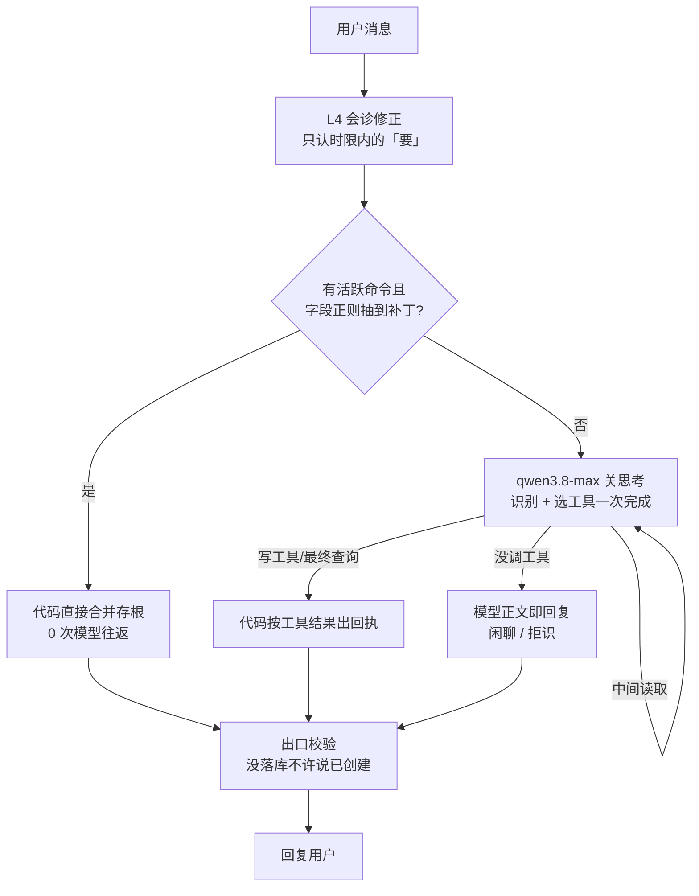

做日历 Agent 之前，我以为意图识别是一个**分类问题**：用户说一句话，系统把它归到「创建日程」「查询日程」「闲聊」中的某一类，再提取参数。听起来像标准 NLP 流水线。

真正做起来，麻烦来自三句长得很像的话：

- 「明天下午三点和张三开会」→ 要**写**日历
- 「明天下午有什么安排」→ 只**读**日历
- 「昨天下午开了个会，好累」→ 什么都**不能动**

三句都有「日期」，都有「会」，但判错的代价完全不同。查询判成闲聊，用户重问一遍就好；一句感慨判成创建，日历里会**悄悄多一条脏数据**——用户当时发现不了，发现时也想不起是哪句话造成的。

所以真正的难点不是「把意图猜得更准」，而是**当模型猜错时，系统怎样避免造成破坏**。这句话改变了整套架构。这篇文章讲这套架构怎么一步步长出来，最后收敛成一句原则：**无界问题给模型，有界问题给代码**。

## 全貌：从分类流水线到执行链

系统一开始是四层分类流水线，最后变成「一次大模型 + 代码收口」的执行链。演进史：

| 版本 | 识别链路 | 每次创建的模型往返 |
|------|----------|-------------------|
| v0.1–v0.3 | L1 正则分类（主）→ L2 槽位小模型 → L3 意图小模型 → L4 会诊 | 0–2 次小模型 + 视情况大模型 |
| v0.5 | 删 L1 正则；L2 → L3 → L4，低置信升级大模型 | 2 次小模型 + 几乎必然 1 次大模型 |
| **v0.6** | **一次大模型（识别 + 选工具合并）+ 代码出回执** | **1 次大模型** |

当前热路径长这样：



下面按「核心原则 → 为什么删层 → 各环节 → 守住安全」展开。

## 核心原则：无界给模型，有界给代码

这套系统曾以正则规则为主。正则处理自然语言，本质是在**枚举人类的说法**：你写了「周日」，用户说「周天」；补上「周天」，他说「这个周末」。说法枚举不完，每补一条，必然还有下一条漏网。

本项目真实踩过的三个坑全是这个成因：

- 「这个周末去修汽车轮毂」——「周末」不在日期规则名单里，整句判成 `ambiguous`
- 「周日下午2点」——规则认识「周日」也认识「下午2点」，但没写过「连着说」的组合
- 单独一个「天」——字符类 `[一二三四五六日天]` 写宽了，把不成话的字当成有效日期

但不是所有代码都有这个毛病。关键看**输入空间有界还是无界**：

- **无界**：任意人类语句。「想干什么」「标题是哪几个字」——说法无穷多。**交给模型**。
- **有界**：几个明确参数。「『明天』是几月几号」「两个时间区间冲不冲突」「这轮有没有事件落库」。**留在代码**——可被单测穷举，永远给确定答案；模型做算术反而出错。

一句话分工：**模型负责「听懂」，代码负责「算准、守住」。**

这条原则还决定了「什么该删、什么该留」。删掉正则分类之后，字段级正则**保留**了——日期/时间解析（`ScheduleTimeService`）、澄清槽位抽取、回执检测，这些的输入是单个表达式或单个事实问题，有界，不属于「识别意图」。我们删的是「让正则替用户决定意图」，不是正则这个工具本身。

## 为什么删掉四层：前置分类器成了纯税

v0.5 的链路是 L2 槽位小模型 → L3 意图小模型，两轮 `qwen-turbo` 必须在首包 SSE 之前**串行**结束（各 1–2.5 秒）。更糟的是，L3 返回结果经常不带候选置信度，代码给它默认 0.8，而升级阈值是 0.85——这意味着很多创建请求跑完两个小模型后，仍会再调一次大模型。

一个「明天下午三点开会」可能付出**三次串行模型往返**，预发体感约 5 秒。

这时我们问了一个很直接的问题：前置分类器到底还在为谁服务？

它过去有两个作用：决定给模型哪些工具，以及决定能否走代码快路径。但如果为了做这个决定，要先串行调用两次模型，「快路径」已经不快了。既然最终的大模型本来就能选工具，独立的意图分类阶段开始变成一笔纯税。

所以 v0.6 做了最激进的一次改动：取消热路径上的 L2/L3，把识别和工具选择合并进**一次**大模型调用。这**不是换一个更快的小模型，是取消「识别」这个独立阶段**。

删层不删两个边界：

- **字段级正则工具保留**：日期解析、澄清抽取、回执检测——有界，不属于「识别意图」。
- **代码执行层不受影响**：命令合并、冲突检测、落库是「意图定了之后怎么执行」，不是「正则替模型定意图」。

## 各环节：槽位、澄清、会话、评测

意图判对不等于每个环节都对。剩下几个环节各有各的坑。

**槽位：模型只许给「表达式」，不许给「答案」**。「这个周末」原样传 `WE`，几月几号由代码算。这是原 L2 的铁律，v0.6 原样适用于写工具参数——模型算日期不可靠，算术永远留在 `ScheduleTimeService`。中文时间的歧义（「7点半」是早上还是晚上）也是这个环节的坑，详见那篇《中文时间解析》。

**澄清：消解到空，而不是穷举组合**。怎么判断「周日下午2点」是一句纯补槽的回答？旧办法写巨型正则枚举「日期/时段/钟点」的组合，两头出错。新办法换思路——不问「它长什么样」，改问「抠掉槽位词之后还剩什么」：

```ts
export function isScheduleClarificationReply(message: string): boolean {
  const text = String(message || '').trim();
  if (!text) return false;
  if (!text.match(CLARIFY_SLOT_PATTERN)) return false;   // 至少要有一个日期/时间词
  return (
    text
      .replace(CLARIFY_SLOT_PATTERN, '')     // 抠掉所有日期词、时间词
      .replace(CLARIFY_FILLER_PATTERN, '')   // 抠掉连接词和语气词
      === ''                                  // 什么都不剩 → 纯补槽
  );
}
```

好处：组合不用枚举；单字「天」自然被拒；槽位词定义复用解析器同一份正则源，新增日期写法只改一处。

**会话：旧上下文从「默认灌入」到「按需读取」**。旧 thread 里可能有用户想续聊的内容，也可能有已经失效的相对日期——「明天去开会」一个月后仍被原样塞进 prompt，模型看到的「明天」早已不是当时的明天。现在按静默间隔分段（`SESSION_GAP_MINUTES`，默认 120 分钟），当前 prompt 只注入最近片段；更早内容只留一行提示，用户提到「之前」时才调用归档检索工具读取。不确定的事实，读，不猜。

**评测：为什么门禁全绿，用户却一直发现问题**。架构改到 v0.6 后，离线评测仍然全绿，真实使用却不断冒出新问题。原因很尴尬：`eval:agent:live` 名字里有 `live`，实际只跑路由仿真，根本不调用真实模型——我们拥有的是一条「绿色的假证据」。后来把 live 评测接上真实执行器（真实 `streamChat` + 真实模型 + 工具后端打桩），模型行为第一次有了自动化证据。

## 守住安全：在出口验事实，不在入口猜措辞

模型会犯错，守的思路有两种：

- **入口枚举**（差）：预测模型会说错什么，写规则去拦——又回到枚举老路。
- **出口校验**（本方案）：不管模型说了什么，结果出门前核对一个客观事实。

最好的例子是真实故障：模型没调任何写入工具，却回复「已创建日程」，数据库里什么都没有。拦它的办法不是猜编法（无穷多），而是回复发出前问一个事实：**这一轮数据库里到底有没有新增事件？**

代码维护一个 `scheduleWritePersisted` 标志，只有数据库真写入才置 `true`。回复发出前，文本声称创建成功而标志为 `false` → 整段**替换**成诚实回答，记 `unverified_create_claim`。为什么替换不是追加？归档里追加会同时留假回执和真相，翻记录时要在矛盾里猜哪句可信。替换后归档里只有真话。

出口校验之外，还有一道结构性防线：**用户隔离**。所有工具在服务端创建时闭包绑定鉴权后的 `userId`，参数 schema 里**没有任何用户标识字段**——模型想读别人的数据，连表达这个意思的参数都不存在。提示词可以被绕过，参数空间里不存在的能力绕不过去。

## 总结：一条可观察、可校验的执行链

回头看，真正变化的是问题的切法。最开始把一句输入切成四层分类流水线，希望每层更简单，结果是层数多了、延迟升了、接缝处的错误更多。

后来换了切法，不是按「规则、小模型、大模型」分层，而是按问题性质分工：

```
开放语言由模型理解
封闭状态由代码判断
私有事实通过工具读取
写入结果由数据库证明
模型行为用真实模型评测
```

意图识别最后没有成为一个更大的分类器。它变成了一条**可观察、可校验、允许承认不确定**的执行链。

如果你的 Agent 也在做意图识别，先问一个问题：**你是在「把意图猜得更准」，还是在「猜错时不造成破坏」？** 前者是无限的军备竞赛，后者才是能落地成代码的设计。把无界的交给模型，把有界的留在代码，把安全押在「数据库发生了什么」而不是「模型说了什么」——这三条，是这套系统最重要的东西。
