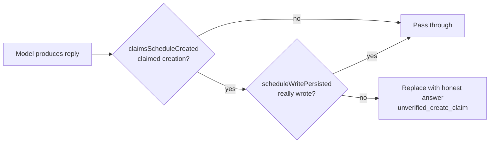

Our calendar agent hit a dangerous bug once: the model replied **"schedule created" without calling any write tool**, and the database was empty.

That's a fabricated success receipt. Blocking phrases like "created" or "I've added it" at the entrance doesn't work, because the model rewords endlessly. This post is about moving the defense from "guessing what the model said" to "checking what the database did" — exit validation.

## Why entrance blocking fails

The first instinct for LLM app safety is to block at the entrance: write regexes matching "created", "added successfully", "I've scheduled it", and flag any match.

This falls apart fast.

The model doesn't output from a fixed template. Block "created the schedule" and it says "the schedule is in your calendar now"; block that and it says "all set, just waiting on you". **Entrance blocking enumerates wording; the model generates wording. You can't win that fight.**

Entrance blocking has a subtler problem too: it checks what the model *said*, not what the system *did*. "Created" is wording. Whether a new event actually landed in the database is fact. Pinning safety on wording hands the definition of fact to a model that hallucinates.

## Exit invariant: check the fact, not the wording

Our fix introduces one objective flag: `scheduleWritePersisted`.

It flips to `true` in exactly one place — when code confirms the event **really hit the database**. Before the reply goes out, the system runs an exit check:

```ts
// 模型可能在没有写入工具、或工具返回 needs_date/conflict 时凭空写出创建回执。
// 日历里没有事件却告知用户已创建是静默失败，必须在回答里纠正。
const unverifiedCreateClaim =
  !scheduleWritePersisted &&
  claimsScheduleCreated(finalText || accumulatedText);
if (unverifiedCreateClaim) {
  finalOutcome = 'unverified_create_claim';
}
```

`claimsScheduleCreated` does one thing: uses a deliberately narrow regex to decide whether the model *claimed* a successful creation:

```ts
const CREATE_CLAIM_PATTERN =
  /已创建「|创建成功|已(?:经)?(?:成功)?(?:帮你|为你|替你)?(?:创建|新建|加入|添加|录入)(?:好)?(?:了)?\s*(?:一条|一个|这条|该)?\s*(?:日程|提醒|事件|日历)|已(?:经)?(?:添加|加入)到(?:你的)?日历/;
```

There's a counterintuitive detail: the regex **intentionally only matches explicit creation receipts** — it would rather miss one than misflag the "already arranged" in a query summary as a fake. Misflagging is worse than missing, because then a genuinely successful creation gets its receipt replaced with "not created yet".

## Replace, don't append

The natural move after catching a fake receipt is to append a correction. We deliberately didn't.

`message_done` overwrites the bubble text anyway, but the deeper reason: **appending leaves both the fake receipt and the truth in the conversation archive**, and later reads of that history would have to decide which one to trust. So we replace instead:

```ts
// message_done 会覆盖气泡文本，所以这里直接给出诚实答复，而不是在假回执后面追加更正。
const honestText = lastScheduleCommandDetails
  ? this.formatScheduleCommandAnswer(lastScheduleCommandDetails)
  : MISSING_WRITE_ABILITY_ANSWER;
const responseText = unverifiedCreateClaim ? honestText : modelText;
```

`MISSING_WRITE_ABILITY_ANSWER` is one explicit sentence (in Chinese, since the product speaks Chinese):

> 这条日程还没有创建。请把事项、日期和时间写在一句话里，例如「帮我创建周日下午两点修汽车轮毂」，我就能直接建好并给你确认。

After replacement, only the fact-checked version remains in the archive. We call this principle the **exit invariant**:

```
What the model said is not a safety fact
Whether the tool succeeded is not quite a safety fact either
Whether the database actually wrote what was expected is
```

## How this fits the other defenses

Exit validation isn't the only defense, but it covers the most important gap: entrance blocking, tool-schema constraints, and prompt rules all live on the *model's* side; exit validation lives on the *system's* side and checks objective state.

- Entrance regex: blocks obvious wording, easy to bypass
- Tool schema: limits what parameters the model can pass, but not what it claims
- Exit validation: checks whether the database actually wrote — model can't dodge it



## Summary

The biggest trap in LLM app safety is treating "what the model says" as "what the system did".

- Entrance blocking pits finite regex against infinite wording — it loses
- Exit validation moves the defense to an objective fact — whether the database wrote — which the model can't dodge
- Catch a fake receipt and *replace* it, not append, so the archive keeps only the trusted version

If your agent also "writes data" — schedules, emails, orders, charges — ask one question first: **when the model lies and says "done", what in your system proves it didn't happen?** If the answer is "look at what the model says", you need an exit check.
