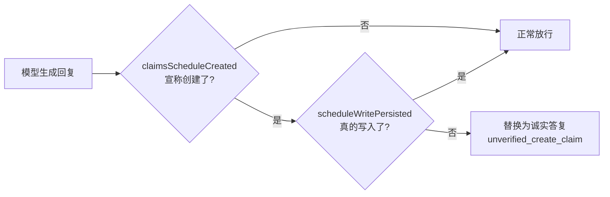

我们的日历 Agent 出过一次很危险的故障：模型**没有调用任何写入工具，却回复「已创建日程」**，数据库里什么都没有。

这是一条凭空生成的成功回执。如果继续在入口拦「已创建」「已经帮你安排」这些措辞，模型总能换一种说法绕过去。这篇文章讲我们怎么把防线从「猜模型说了什么」挪到「查数据库发生了什么」——也就是出口校验。

## 入口治理为什么拦不住

给 LLM 应用做安全，第一反应是在入口拦：写一串正则，匹配「已创建」「创建成功」「已经帮你安排」，命中了就当异常。

这套逻辑很快就失效了。

模型不是照着固定模板输出的。你拦住「已创建日程」，它下次说「日程已经加进去了」；你拦住「已经加进去」，它下次说「安排好了，就等你确认」。**入口在枚举措辞，模型在无限生成措辞，这场仗打不赢。**

入口治理还有一个更隐蔽的问题：它拦的是「模型说了什么」，而不是「系统发生了什么」。模型说「已创建」是措辞，数据库有没有真的多一条事件才是事实。把安全押在措辞上，等于把事实交给一个会幻觉的模型去定义。

## 换成出口不变量：查事实，不猜措辞

我们的改法是引入一个客观标志：`scheduleWritePersisted`。

它只在一个地方变成 `true`——代码确认事件**真的写进了数据库**。回复发给用户之前，系统做一次出口检查：

```ts
// 模型可能在没有写入工具、或工具返回 needs_date/conflict 时凭空写出创建回执。
// 日历里没有事件却告知用户已创建是静默失败，必须在回答里纠正。
const unverifiedCreateClaim =
  !scheduleWritePersisted &&
  claimsScheduleCreated(finalText || accumulatedText);
if (unverifiedCreateClaim) {
  finalOutcome = 'unverified_create_claim';
}
```

`claimsScheduleCreated` 只做一件事：用一串刻意收窄的正则，判断模型是不是「宣称创建成功」了：

```ts
const CREATE_CLAIM_PATTERN =
  /已创建「|创建成功|已(?:经)?(?:成功)?(?:帮你|为你|替你)?(?:创建|新建|加入|添加|录入)(?:好)?(?:了)?\s*(?:一条|一个|这条|该)?\s*(?:日程|提醒|事件|日历)|已(?:经)?(?:添加|加入)到(?:你的)?日历/;
```

这里有个反直觉的细节：正则**故意只匹配明确的创建回执**，宁可漏判，也不把「查询摘要里的『已安排』」误判成假回执。因为误判的代价是——用户真的创建成功了，系统却把正常回执替换成「还没创建」，那比漏判更糟。

## 替换，不是追加更正

抓到假回执之后，最自然的做法是「在假话后面补一句更正」。我们特意没这么做。

因为 `message_done` 会覆盖气泡文本，更关键的是——**如果只是追加更正，对话归档里会同时留着假回执和真相**，未来读取历史时，模型又要判断哪句可信。所以我们直接替换：

```ts
// message_done 会覆盖气泡文本，所以这里直接给出诚实答复，而不是在假回执后面追加更正。
const honestText = lastScheduleCommandDetails
  ? this.formatScheduleCommandAnswer(lastScheduleCommandDetails)
  : MISSING_WRITE_ABILITY_ANSWER;
const responseText = unverifiedCreateClaim ? honestText : modelText;
```

`MISSING_WRITE_ABILITY_ANSWER` 是一句明确的话：

> 这条日程还没有创建。请把事项、日期和时间写在一句话里，例如「帮我创建周日下午两点修汽车轮毂」，我就能直接建好并给你确认。

替换之后，归档里只留下经过事实校验的版本。这条原则我们叫它「出口不变量」：

```
模型说了什么，不是安全事实
工具是否成功，也不完全是安全事实
数据库是否真的发生了预期写入，才是
```

## 这和其他防线是什么关系

出口校验不是唯一的防线，但它补的是最关键的一块：**入口拦措辞、工具加 schema 约束、prompt 写规则，这些都在「模型这一侧」；出口校验在「系统这一侧」，查的是客观事实。**

- 入口正则：拦明显措辞，容易被绕过
- 工具 schema：限制模型能传什么参数，但管不了模型「说不说」
- 出口校验：查数据库到底有没有写入，管的是「系统状态」，模型绕不过去



## 总结

给 LLM 应用做安全，最大的陷阱是把「模型的话」当成「系统的事实」。

- 入口拦措辞，是拿有限正则对抗无限措辞，必败
- 出口校验，是把防线挪到「数据库是否真的写入」这个客观事实上，模型绕不过去
- 抓到假回执要「替换」而不是「追加」，归档里只留可信版本

如果你的 Agent 也会「写数据」（建日程、发邮件、下单、扣费），先问自己一个问题：**当模型谎称「已完成」的时候，你的系统拿什么证明它没完成？** 如果答案是「看模型怎么说」，那就该加一道出口校验了。
