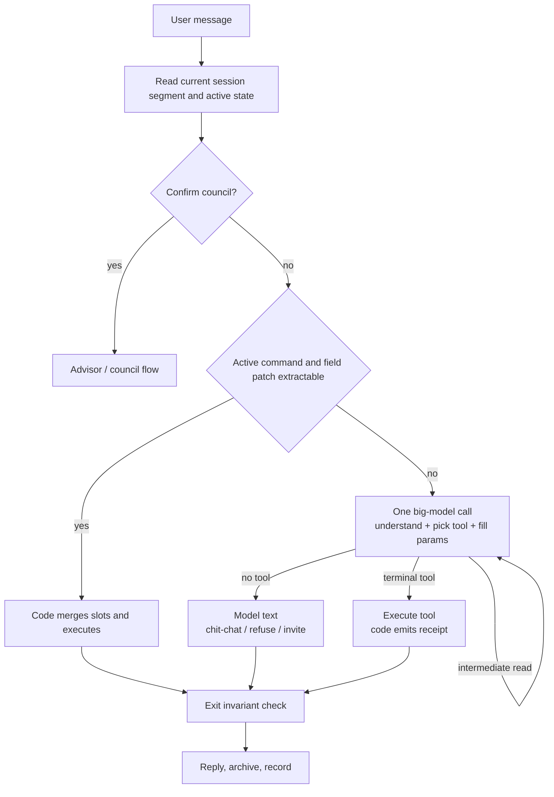

## 0. Document note

| Version | Date | Content | Reason |
|---------|------|---------|--------|
| v0.1 | 2026-08-24 | Summarize the design, implementation, evaluation, and pitfalls of the intent-recognition project | Provide a reusable engineering method for future agent projects |

This document answers one question: for an agent that can call tools and read/write user data, how should intent recognition actually work?

The conclusion first: **intent recognition shouldn't just label a sentence. It's a control system that decides whether the agent should call a tool, which tool, whether side effects are allowed, how to continue when information is missing, and whether the last sentence can be trusted.**

This project started from a regex classifier, went through "small model slot extraction + small model classification + big model execution", and finally converged to "one big-model call completes understanding and tool selection; code handles state, validation, and persistence". The functional chain works in preprod, but the performance target isn't met: schedule creation on a hot instance is about P50 14.3s, against a 2.5s target. This also reminds us that fewer model calls doesn't mean latency drops proportionally.

---

## 1. Define the problem first: you're recognizing the next action, not a sentence

Look at three similar sentences:

| User input | Agent should do | Side effect |
|------------|-----------------|-------------|
| 今天有什么安排 | query schedule | read-only |
| 明天下午三点安排开会 | create schedule | write |
| 昨天下午开了个会，好累 | normal chat | none |

They all contain time and "安排/开会", but the execution results differ completely. A traditional classifier describes the problem as:

```text
message -> intent label
```

The real agent chain should be described as:

```text
message + current state + historical facts
  -> is a tool needed
  -> which tool
  -> which parameters to extract
  -> are execution conditions met
  -> how to reply from the tool result
  -> did a side effect really happen
```

There are four kinds of information:

1. **Intent**: what the user wants, e.g. query, create, cancel, chit-chat.
2. **Slot**: the parameters needed, e.g. title, date, time.
3. **State**: is there a pending command, did the last round send a council invitation.
4. **Authorization & side effect**: whether this round can write, whether the write really succeeded.

Intent is just one link. Optimizing classification accuracy alone can't guarantee the whole agent does the right thing.

### 1.1 Rank by failure cost first

Different misjudgments cost differently:

- Query judged as chit-chat: the user asks again.
- Chit-chat judged as query: reply is unnatural, but usually no data loss.
- Query judged as create: writes dirty data, the user may not find out for a long time.
- No write but replied "created": chat history conflicts with database facts.

So evaluation can't just look at overall accuracy. Define high-cost errors separately and give them structural defenses. For a schedule agent, the most important thing isn't "all intents guessed right", it's:

```text
When it shouldn't write, it must not silently write;
When it didn't write, it must not claim success.
```

---

## 2. The most important split: model understands, code computes and guards

This project repeatedly verified one boundary:

- Give unbounded-input-space problems to the model.
- Give bounded-input-space problems to code.

### 2.1 Problems for the model

These can't be enumerated with finite rules:

- Is "安排" a noun or a verb in this sentence?
- Is the user describing the past or giving a new instruction?
- "我最近太累了，帮我找个时间休息" — chat, recommend free time, or create a schedule?
- Which part of the natural language should be the title?
- Does "算了" cancel the current command, or talk about something else?

Regex covers some high-frequency phrasings, but natural-language combinations are unbounded. Rules pile up until you've built a second, fragile language model.

### 2.2 Problems for code

These have clear boundaries and can be tested stably:

- What date is `D+1`?
- What exact date is `W3+1` (next Wednesday)?
- `WE` maps to this Saturday and Sunday.
- Do two ranges conflict?
- Is the create command missing a date or a time?
- Did the current user actually add an event?
- Was the last council invitation within 30 minutes?

The model shouldn't do calendar arithmetic, permission judgments, or database-fact confirmation. It provides expressions and action choices; code computes the final result.

This project summarizes the principle as:

> The model "understands", the code "computes and guards".

---

## 3. Current implementation: recognition and tool selection merged into one model call

Early versions split intent recognition into multiple layers:

```text
regex classify -> small model slot extraction -> small model classify -> big model execute
```

The problem was these calls ran serially. A create in preprod was about 5s, and low-confidence classification often escalated to the big model anyway. The front classifier was meant to save big-model calls, but became fixed latency instead.

Current v0.6 removes L2/L3 from the hot path. The agent completes language understanding, intent judgment, slot extraction, and tool selection in one `qwen3.8-max` call, thinking off, `tool_choice=auto`.



### 3.1 Actual dispatch order

The entry is `PiAgentChatService.streamChat`, and the order can't be swapped arbitrarily:

1. Load the current session segment from the server archive.
2. Judge council confirmation by objective state.
3. If an active schedule command exists, first try the field-level clarification fast path.
4. Advisor role or confirmed council enters the advisor flow.
5. Other messages uniformly enter the main agent.
6. After tool execution, code generates the receipt.
7. Before the reply goes out, run the exit check, then archive and record the eval event.

Only "active command + field patch" is a 0-model round-trip. All other ordinary messages go through the main model once.

### 3.2 Why `tool_choice` stays `auto`

The project once considered forcing tool calls and adding a `respond` tool for ordinary chat. It wasn't adopted.

Forcing tools brings several problems:

- Chit-chat wrapped as a tool call is semantically awkward.
- Text stuffed into JSON parameters is harder to stream.
- "Speaking" disguised as a tool doesn't add real safety.

So tools are only called when needed:

- Create, query, and free-time recommendation should call tools.
- Chit-chat, refusal, and council invitation output text directly.

The cost is that the protocol layer can't guarantee "it calls the tool when it should". That gap is filled by prompts, live eval, and exit validation.

---

## 4. Tool design is intent-recognition interface design

After recognition and tool selection merge, the tool definition itself is the classification boundary. If tool names, descriptions, parameters, and return states are written poorly, the model picks the wrong action.

### 4.1 Tools split by terminal semantics

After a terminal tool executes, this round no longer asks the model for a second generation:

- `prepare_or_create_schedule`
- `query_schedule_range`
- `suggest_schedule_slots`
- `cancel_schedule_command`

The tool result is formatted by code into the final reply. Three benefits:

- One fewer model round-trip.
- The reply only quotes real tool results.
- Create/conflict/missing-slot copy can be tested stably.

Intermediate tools supplement facts; after execution the model must continue:

- `search_memory`
- `search_chat_archive`

For example, "妈妈生日那天安排聚餐" — the model can't guess the date. It first queries memory, gets the date, then calls the create tool; if not found, ask the user.

### 4.2 Tool parameters must be closed and verifiable

The model can't directly output a final computed date; it outputs canonical symbols:

| Symbol | Meaning |
|--------|---------|
| `D+n` | today offset n days |
| `Wd` / `Wd+k` | weekday d, with week offset |
| `WE` / `WE+k` | weekend, keeps the two-day ambiguity |
| `MM-DD` / `YYYY-MM-DD` | explicit date |
| `HH:mm` | 24-hour time |

The tool's JSON Schema uses `pattern` to constrain the format, and the execution entry runs the same validation. Illegal expressions return `invalid_expression` for the model to fix, never entering the command layer.

This is more reliable than just writing "output in this format" in the prompt, because the constraint exists at both the generation interface and the execution interface.

### 4.3 User isolation must not live in the prompt

All user-facing tools bind the authenticated `request.userId` in a server-side closure at creation. The parameter schema contains no `userId`, `email`, or other user identifier.

This means the model has no ability to express "read another user's data". Safety comes from the interface structure, not a prompt line saying "don't read others' data".

---

## 5. Multi-turn intent continues via state, not re-guessing

"这个周末修汽车轮毂" is missing a specific date. The right flow isn't having the model re-understand the whole history every round, but establishing an active command stub:

```text
title = 修汽车轮毂
dateExpression = WE
missing = date
status = pending
expiresAt = ...
```

The command layer parses `WE` into Saturday and Sunday candidates, returns `needs_date`. Code asks the user which day.

The user's next round only says "周六下午三点". Detached from context this has no complete intent, but the request carries `activeScheduleCommandId`. Code first extracts the date/time patch, merges the stub, and executes — no classifier guessing "is this a create schedule".

The principle here:

> Existing business state takes priority over re-classification.

The state machine must also have clear exits:

- Slots filled and created successfully.
- User calls `cancel_schedule_command` to give up.
- Stub timeout.
- Change time after conflict.

Without a cancel exit, the active command pollutes later conversation, and the model sees "still missing date" and keeps asking.

---

## 6. Context management is itself intent recognition

The "tomorrow" and "yes" in an old session may both be invalid. The client-passed `history` has no authoritative timestamp and can't be the basis for state judgment.

The current approach:

1. Server reads recent archived messages by `threadId + userId`.
2. Uses message timestamps, cuts session segments by silence gap.
3. By default only puts the current segment in the prompt.
4. Older history is read on demand via `search_chat_archive`.
5. Council confirmation only recognizes a fixed invitation marker in the last assistant message, default no more than 30 minutes.

`SESSION_GAP_MINUTES` defaults to 120 minutes. Older messages beyond the gap no longer auto-participate in this round's reasoning.

This solves two common problems:

- "Tomorrow's meeting" from a month ago won't pollute today.
- A council invitation sent long ago, with the user saying "yes" alone today, won't wrongly trigger the council.

More context isn't better. Stale context changes how the model understands the current utterance; it should go from "default pour-in" to "read on demand".

---

## 7. Safety design: entrance prompt, command layer, exit facts

The current architecture exposes write tools to the main agent every round, so the isolation of "a read-only intent physically can't see write tools" is lost. The safety latch moved back to execution and exit.

### 7.1 Layer 1: prompt constraints

The system prompt tells the model:

- Queries must call the query tool.
- Creates must call the write tool.
- Questions, capability inquiries, and past-tense statements must not create.
- Only a tool returning `created` counts as creation success.

Prompts reduce errors, but can't be the safety boundary.

### 7.2 Layer 2: command-layer validation

After the write tool is called, the command layer still checks:

- Is there a title.
- Are date and time legal.
- Is a slot missing.
- Does it conflict with an existing schedule.
- Is it continuing a valid stub.
- Is the idempotency condition met.

Only when the command layer really persists does `scheduleWritePersisted` become true.

### 7.3 Layer 3: exit invariant

Before the reply goes out, the system checks:

```text
If the text claims "created", did this round actually persist?
```

If not, the whole fake receipt is replaced with an honest answer and recorded as `unverified_create_claim`.

This is the most reusable safety lesson of the project: **don't try to enumerate how the model will lie — check whether the objective fact it claims actually holds.**

### 7.4 The safety gap that still exists

Exit validation blocks fake creation, but not "didn't query when it should":

```text
User: what's on tomorrow?
Model doesn't call the query tool, directly answers: nothing tomorrow.
```

It didn't claim creation success, so the creation exit check can't catch it. Judging whether a text statement is asserting schedule facts is again an unbounded semantic problem.

Currently the only reliance is:

- Tool descriptions and system prompt.
- Live model eval.
- Online sampling and error feedback.
- Later adding fact citations or a query-type exit contract.

This risk must be explicitly recorded — don't treat it as nonexistent just because offline tests are all green.

---

## 8. How to write the prompt

A longer prompt isn't safer. The current structure is "static rules first, dynamic context after".

### 8.1 What the system prompt keeps

- The agent's responsibility boundary.
- A few high-value ambiguity cases.
- Tool discipline.
- Date symbol conventions.
- Private facts must be read before write.
- Creation success must be based on tool results.
- The council invitation's fixed marker.

The noun/verb ambiguity of "安排", past tense, and capability inquiry are worth keeping because they come from real failures:

```text
今天有什么安排       -> query
明天安排开会         -> create
昨天安排了一个会     -> past statement
你能安排日程吗       -> capability inquiry
```

### 8.2 Details sink into tool descriptions

Query rules go in the query tool; create-parameter rules go in the create tool. Don't maintain two identical copies in the system prompt and tool descriptions — they'll drift.

### 8.3 Dynamic content goes into the user prompt

- Current Beijing time.
- Current session segment.
- Missing slots of the active command.
- User profile, goals, and readable context.

This keeps the system-prompt prefix stable, theoretically making it easier to hit the model service's context cache. Note that preprod performance hasn't proven the cache actually works yet.

---

## 9. Evaluation: classification accuracy is far from enough

This project built four layers of assurance:

| Layer | Proves |
|-------|--------|
| Unit tests | bounded logic: date parsing, slot merge, format validation, receipt generation |
| Offline route eval | dispatch structure, state gates, tool exposure, and code-path invariants |
| Drift tests | the simulator matches the real `streamChat`'s key branches |
| Live / preprod verify | whether the real model picks the right tool, produces wrong side effects, actual latency |

The current offline dataset has 115 routing cases covering create, query, clarification, council, memory, refusal, and prompt-injection groups; plus 14 fake-creation-receipt detections.

### 9.1 Cases write product expectation, not current behavior

If the current system misjudges "这个周末修轮毂" as a query, you can't change the expectation to query just to make the test pass. The right way:

- The expectation still writes create or `needs_date`.
- The current defect is marked a known issue.
- After the defect is fixed, the stale known-issue marker blocks the gate, forcing cleanup.

Otherwise tests become a snapshot of the status quo and can't drive quality improvement.

### 9.2 Be honest about the offline test's boundary

After v0.6, the offline simulator doesn't call a real big model. It can prove:

- The dispatch order didn't change unexpectedly.
- The active-command fast path still requires commandId.
- Code won't directly write in some hidden branch.
- User identifiers don't appear in tool parameters.
- Fake creation receipts are intercepted.

It can't prove the model picks the right tool. Query-miscreated, didn't-query-when-it-should, and language-understanding drift must be verified by live tests and preprod observation.

### 9.3 The simulator's most dangerous thing is the "green lie"

`agent-routing.sim.ts` is a replica of the real dispatch, not a reuse. If the real code changes and the simulator doesn't, offline eval can still all pass.

So the repo sets a mandatory rule: when changing `streamChat`'s dispatch order, gating conditions, or slot priority, you must sync the simulator and the drift spec.

---

## 10. Pitfalls this project hit

### 10.1 A regex classifier becomes a bottomless pit

"周日", "周天", "周末", "这个休息日" — the phrasings can't all be enumerated. Regex is good for extracting closed formats, not for natural-language intent judgment.

The right places to keep regex:

- Date and time expression parsing.
- Active-command short-reply slot filling.
- Creation-receipt fact-claim detection.

### 10.2 More model layers aren't more stable, just slower

After L2 slot extraction, L3 classification, and big-model execution run serially, every layer adds latency and an error interface. A slight deviation in L3's return structure triggers escalation.

Before splitting layers, ask: does the next layer really need the previous layer's independent conclusion? If the final big model has to pick tools anyway, the extra classifier may just be making the same decision twice.

### 10.3 Missing model config must not silently degrade

In the project, L2 once returned null because the model-name fallback chain was missing an entry. No error, but the whole layer's capability quietly disappeared.

The lessons:

- API key, base URL, and model fallback chains must be maintained as a group.
- When adding a new model call, copy the full chain — don't pick entries from memory.
- A key layer being unavailable must alert or fail explicitly, not quietly get dumber.

### 10.4 Model output correct, chain still wrong

The model once turned "周六" into a symbol with the wrong offset, but the command layer placed the result on the correct date using the existing candidates. This shows correctness comes from the whole chain, not from one layer looking reasonable.

The reverse is also true: every module's unit test passes, yet the seams can still fail. You must have chain-level cases.

### 10.5 Deleting two model calls didn't buy 2 seconds

v0.6's functional rework succeeded, but preprod hot-instance creation was still about 14s, query about 13.5s, chit-chat about 11.9s. The original performance assumption was incomplete.

The possible time costs need segmented measurement, not more guessing:

```text
archive/database read
-> prompt construction
-> model request queuing
-> model TTFT
-> tool parameter generation done
-> tool execution
-> SSE complete
```

Also verify:

- The actual preprod model and base URL.
- Whether `thinkingLevel: off` is really recognized by the provider.
- Whether the context cache hits.
- Whether the agent runtime still generates secretly after a terminal tool.
- Vercel function cold start and database connection time.
- Prompt token count and tool schema size.

So performance design must first have observable segmentation, then set optimization goals. Counting "how many model calls" isn't enough.

### 10.6 Preprod release must isolate unrelated changes

At release time the workspace still had calendar-image widget changes. This time we stashed them separately, restored after the intent-recognition commit, to avoid unrelated code shipping with preprod.

Long projects especially hit this. Release candidates must come from clean, traceable commits, and record deployment, source commit, and rollback point.

---

## 11. Implementing an agent intent system from scratch

A reusable implementation order.

### Step 1: list actions, don't rush to list labels

First list the actions the agent can do and their side effects:

```text
query_schedule       read-only
create_schedule      write
cancel_command       state change
search_memory        read-only
remember             write
chat                 no tool
```

For each action, write clearly:

- Required slots.
- Whether it reads user data.
- Whether it writes data.
- Whether it's reversible.
- The objective evidence of success.
- What state to return on missing slot, conflict, and failure.

### Step 2: design latches by failure cost

For every write action, define the invariant:

```text
create success <=> a new event exists in the database and belongs to the current user
delete success <=> the target exists and the delete result is confirmed
payment success <=> server-side order status is success, not the model's wording
email sent <=> provider returns sent success and messageId is recorded
```

The model can only initiate actions, not announce facts.

### Step 3: design the tool contract

Parameters should be structured, closed, and verifiable:

- Use enum, pattern, required, additionalProperties=false.
- User identity is server-bound, not filled by the model.
- Return values use explicit state enums, like `created`, `needs_date`, `conflict`, `invalid_expression`.
- Distinguish terminal tools from intermediate read tools.

### Step 4: design the state machine

Build server-side state for multi-turn tasks:

- commandId
- known slots
- missing slots
- status
- expiresAt
- idempotency key
- cancel path

Don't require the model to maintain transactional state from chat history alone.

### Step 5: design the context boundary

- Use server-authoritative history.
- Messages carry timestamps.
- Slice by session gap.
- Old history read on demand.
- Any short reply like "要/继续/还是那个" must bind to an objective prior state within a time limit.

### Step 6: then write the prompt

The prompt only carries the judgments the model can make:

- Action choice.
- Natural-language slot extraction.
- Key ambiguity cases.
- Tool discipline.

Permissions, arithmetic, user isolation, and success facts must not live only in the prompt.

### Step 7: build the evaluation matrix

At minimum cover:

- Explicit create.
- Missing-slot create and continuous slot filling.
- Query must not write.
- Past-tense statement must not write.
- Capability inquiry must not write.
- Chit-chat must not write.
- Prompt injection.
- Cancel and expiry.
- Cross-session stale context.
- Model didn't call tool but claimed success.
- Tool parameter privilege-escalation fields.

Offline tests guard structure, live tests guard model behavior, preprod tests real side effects and latency.

### Step 8: optimize performance last

Record each segment's time:

```text
archive_ms
prompt_tokens
llm_ttft_ms
llm_tool_complete_ms
tool_execute_ms
response_complete_ms
```

First find the dominant cost, then decide to shrink prompt, switch model, enable cache, change runtime, or add a deterministic fast path.

---

## 12. Final judgment

Whether an agent's intent recognition is done well shouldn't be measured only by "classification accuracy". Better questions:

- Does it give natural-language understanding to the model and deterministic computation to code?
- Does it continue multi-turn tasks with server-side state?
- When a write tool is mis-called, can the command layer fail safely?
- When the model says success, can the system produce objective evidence?
- Will stale context pollute today's intent?
- What does an offline green light prove, and what doesn't it?
- Can every segment of latency be measured separately?

If these questions have clear answers, intent recognition has grown from "a classification prompt" into a long-term maintainable agent control system.
