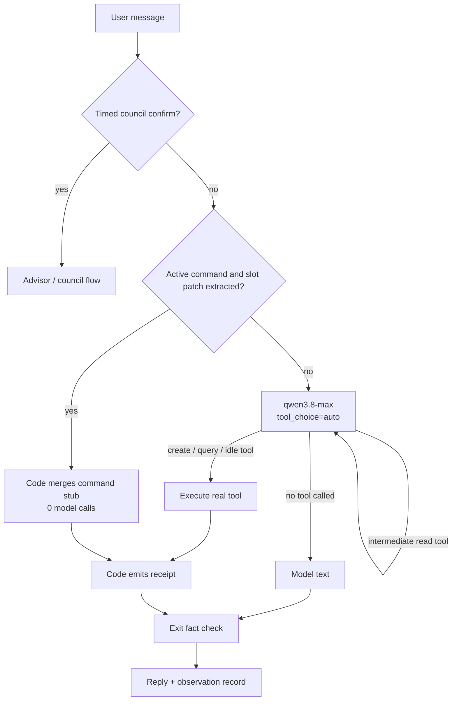
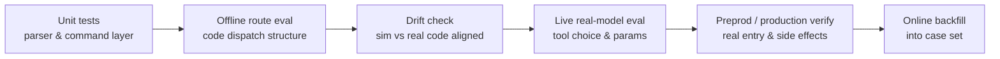

> From "this weekend" failing to be recognized, to re-dividing responsibility across model, tools, state machine, and evaluation. This post records how Anpai.life's intent-recognition chain evolved under real user feedback.

Before building the calendar agent, I thought intent recognition was a classification problem.

The user says a sentence, the system files it under "create schedule", "query schedule", or "chit-chat", then extracts title, date, time, and other parameters. Sounds like a standard NLP pipeline.

The real trouble came from three sentences that look almost identical:

- "Tomorrow 3pm, meet Zhang San"
- "What's on tomorrow afternoon"
- "Had a meeting yesterday afternoon, so tired"

The first should write the calendar, the second should only read it, the third should touch nothing. All three have a date and the word "meeting", but the cost of misjudging is completely different. A query judged as chit-chat makes the user ask again; a casual remark judged as creation silently writes a dirty record — the user won't notice at the time, and won't remember which sentence caused it later.

The early version really did have these failures. "本周有什么安排" and "明天下午三点有什么安排？" had their "安排" treated as a creation verb by the regex, and the system wrote to the calendar without asking or erroring. Around the same time there were two opposite-direction problems: "请记住我咖啡不加糖" was silently dropped because the separator after "记住" didn't match the regex; and the system's correction copy told the user to type "下午两点", but the time parser didn't recognize the Chinese numeral "两".

These failures all pointed at one thing: a classification error doesn't just affect the answer — it crosses the tool boundary and becomes a real side effect.

So we stopped framing the core problem as "how to guess the intent more accurately", and instead asked:

**When the model guesses wrong, how does the system avoid doing damage?**

That sentence changed the whole architecture.

## Version 1: a rigorous-looking four-layer pipeline

The initial chain had four layers:

```text
L1 regex classification
  ↓
L2 small model extracts task and slots
  ↓
L3 small model classifies intent
  ↓
L4 corrects/confirms against conversation history
  ↓
big model answers or calls tools
```

L1 handled obvious expressions, L2 extracted date and time, L3 did semantic classification, escalating to the big model on low confidence. The design intent was reasonable: cheap rules for simple requests, models for complex ones.

It failed fast against real phrasing.

"这个周末去修汽车轮毂" matched no date rule and the whole sentence became `ambiguous`; after adding "周末", "周日下午2点" was missed because date and time were concatenated; to cover weekday expressions we widened the character class, and a lone "天" got treated as a valid date.

The problem wasn't that the regex wasn't good enough. The problem was that we were enumerating infinite language with finite rules.

Every fixed example raised the test count, yet the system didn't get closer to "understanding human speech". It just memorized more phrasings. Chinese is hard enough; the moment a user typed `this weekend`, the Chinese regex chain broke entirely.

That round of failure left the first architectural principle:

> Give unbounded problems to the model, bounded problems to code.

"What does this sentence want" and "which words are the title" have unbounded input space — model. "What date is tomorrow", "do two ranges overlap", "did this round actually write to the database" have definite answers — code.

This doesn't mean deleting all regex. Date-expression parsing, short-sentence slot filling, and receipt fact-checking are still code and should stay. What we deleted was "regex deciding the user's intent", not regex the tool itself.

## Version 2: dropped the regex fallback, paid three model calls

We first demoted L1 to a fallback, then deleted the fallback too.

There was a reversal in between. Keeping a fallback looked like better availability: when the model service fails, at least some Chinese requests still work. On review we concluded this was fake availability. The fallback only covered a few Chinese phrasings at low precision; during a failure the system appeared to still work while actually being more likely to do the wrong thing. Telling the user the service is temporarily unavailable was more honest.

After deleting regex classification, the hot path became:

```text
L2 slot small model → L3 intent small model → big model when necessary
```

Semantic quality improved, latency got worse.

L2 and L3 ran serially before the first token, about 1–2.5s each. Worse, L3 often returned no candidate confidence, code defaulted it to `0.8`, and the escalation threshold was `0.85`. That meant many create requests, after running two small models, would still call the big model again.

One "tomorrow 3pm meeting" could pay three serial model round-trips. Preprod felt like ~5 seconds.

At this point we asked a blunt question: who is the front classifier still serving?

It used to have two jobs: decide which tools to give the model, and decide whether to take a code fast path. But if making that decision requires two serial model calls first, the "fast path" is no longer fast. Since the final big model can pick tools anyway, the standalone intent-classification stage started to become pure tax.

So v0.6 made the most radical change: remove L2/L3 from the hot path and merge recognition and tool selection into one big-model call.

## Current main path: one model, code closes the loop

The current request chain:



A typical creation needs just one model round-trip:

1. The model reads the user message and tool descriptions;
2. directly calls `prepare_or_create_schedule`;
3. the command layer parses time, checks conflicts and idempotency;
4. the tool returns `created`, `needs_date`, or `conflict`;
5. code generates the receipt from the real result, no second model summary.

"One model" here means recognition no longer occupies its own round-trip. With a private date there may still be one more round: "妈妈生日请她吃饭" requires the model to read the user's memory first, get the date, then create. That latency pays for facts, not re-classification.

The code responsibilities split along this chain:

| Component | Does | Doesn't |
|-----------|------|---------|
| `PiAgentChatService` | dispatch, context, tool defs, SSE, exit check, post-hoc intent | decide dates and conflicts directly |
| `ScheduleCommandService` | merge command stub, check slots, conflicts, idempotency, persist | understand what "就这样吧" means |
| `ScheduleTimeService` | turn canonical symbols into absolute time | guess intent from a full natural-language sentence |
| `ScheduleQueryService` | query and filter by half-open range | approximate the user's given range |
| `AgentEvalRecorderService` | record tool sequence, result, latency, abnormal ending | participate in online decisions |

All user-facing tools bind the authenticated `userId` in a server-side closure. The model only sees business parameters like "query schedule" or "create schedule", never an entry point to switch identity.

We once proposed changing `tool_choice` to `required` and adding a `respond` tool so that even chit-chat had to return through a tool. That was rejected. Tools should only be called when needed; chit-chat should just output text. Otherwise streaming text gets wrapped in tool JSON, and both complexity and interaction latency lose.

In the end `tool_choice=auto` stays. The cost is that the system can't guarantee at the protocol layer that "when it should query, it will query". Safety can't rely on model self-discipline; it has to sink into the execution layer and the exit.

### Tools don't all end at the same place

There are two kinds of tools in the tool loop.

Create schedule, query range, suggest free time, and cancel command are terminal tools. They already have the facts for this round; after execution, code generates the final receipt and ends the agent loop via `shouldStopAfterTurn`. This saves the second generation of "the tool gave a result, now the model re-narrates it", and avoids the model rewriting dates or fabricating success while re-narrating.

Memory retrieval and chat-archive retrieval are intermediate tools. The model calls `search_memory` to find "mom's birthday", then must keep reasoning before deciding whether to create; calls `search_chat_archive` to find the last discussion, then organizes an answer from the current question. These tools can't end early after execution.

```text
Terminal: query / suggest / create / cancel
          tool result → code receipt → end

Intermediate: search_memory / search_chat_archive
              tool result → back to model → keep picking tools or answer
```

Writing terminal semantics into the runtime, rather than relying on each tool self-declaring in its prompt, is an important step to reduce duplicate calls and fact drift.

### More context isn't better

An old thread may hold content the user really wants to continue, or stale relative dates. "明天去开会" still poured into the prompt a month later means the model sees a "tomorrow" that's no longer tomorrow. Council invitations have the same problem: if the system once asked "want a three-person council", a "要" days later shouldn't trigger the old flow.

Now conversation history comes from the server archive, each message with an authoritative timestamp. Adjacent messages silently more than `SESSION_GAP_MINUTES` apart (default 120 min) cut into a new session segment. The current prompt only injects the recent segment; older content leaves a one-line marker, and the model reads it via `search_chat_archive` only when the user explicitly mentions "before" or "last time".

L4 council confirmation uses an even narrower state gate:

```text
The last message was really a council invitation from the assistant
AND the user replied within a 30-minute window
```

This judgment needs no model. It depends on message order and time difference — a bounded state problem. Old history went from "default pour-in" to "read on demand", reducing prompt size and keeping stale context out of current decisions.

## The most important safety design: check facts, don't guess wording

A dangerous failure happened during development.

The model called no write tool, yet replied:

> 已创建日程「修汽车轮毂」，时间为北京时间……

The database had nothing. This was a fabricated success receipt.

If we kept governing at the entrance, we'd start enumerating "已创建", "已经帮你安排", "日程添加成功" and so on. The model can always reword around it.

We instead maintained an objective flag: `scheduleWritePersisted`. Only when the event really writes to the database does this become `true`. Before the reply goes out, if the text claims creation success while the flag is still `false`, the whole reply gets replaced and recorded as `unverified_create_claim`.

Note: replace, not append a correction. Appending leaves both the fake receipt and the truth in the conversation archive, and later history reads have to judge which is trustworthy. After replacement, only the fact-checked version remains.

These checks are what we call exit invariants:

```text
What the model said is not a safety fact
Whether the tool succeeded is not quite a safety fact either
Whether the database actually wrote what was expected is
```

The same idea applies to user isolation. The model's tool parameter schema has no `userId` or `email` at all; user identity is bound in a server-side closure. Prompts can be bypassed; a capability that doesn't exist in the parameter space can't.

## Clarification is a stateful command, not continuous dialogue

"这个周末修汽车轮毂" can't be created directly, because a weekend has two days. The system can't guess for the user, and shouldn't discard the provided info and vaguely ask "please provide a date".

The command layer saves an active stub:

```text
title = 修汽车轮毂
dateExpression = WE
status = needs_date
candidates = Saturday / Sunday
expiresAt = ...
```

When the user replies "周日下午2点", the request carries `activeScheduleCommandId`. These short additions have a concentrated format space; code first tries field parsing. After extracting date and time, it merges the stub directly, zero model calls. Only when the phrasing is too free does it go back to the big model.

Here's a counterintuitive but important priority:

```ts
const clarificationPatch = {
  ...modelSlots,
  ...parseScheduleClarification(message),
};
```

The field regex comes last, overriding the model result. Because in this narrow "short-sentence slot filling" scenario, once the rule extracts successfully, it's usually more stable than the model. The architectural principle was never "model first" — it's whoever is more reliable on this problem, who goes first.

Active commands also have clear ends: created, user cancelled, or stub expired. Later we added `cancel_schedule_command`, because if the user says "算了，不建了" while the prompt still carries "currently missing date", the model tends to stubbornly keep asking.

## Canonical symbols cut language from date arithmetic

Multilingual support hit another boundary problem.

The model can understand `next Wednesday`, but the Chinese parser can't. Having the model output an ISO date seemed simplest, but LLMs compute weeks, month-crossing, and leap years unreliably. Maintaining one parser per language is even less feasible.

We ended with a very thin layer of canonical symbols:

```text
D+1       tomorrow
W3+1      next Wednesday
WE        this weekend
2026-09-01  explicit date
15:00     three PM
```

The model normalizes natural language into symbols; code converts symbols into absolute time. The symbol vocabulary is written into the tool's JSON Schema `pattern`; where generation can constrain, it does; where it can't, the execution entry still intercepts.

Illegal symbols aren't "guessed into correctness". They return to the model as a tool result to retry; on repeated failure, safely ask the user. For the write path, failing is cheaper than writing wrong.

This micro-grammar solves data correctness, not multilingual experience. Time calculation is still fixed to `Asia/Shanghai`; the holiday dictionary is mostly Chinese names; code-generated questions and receipts are mostly Chinese. An English user can normalize `this weekend at 2pm` into `WE` and `14:00`, but the clarification copy that follows may still be Chinese.

We cut the failure chain of "non-Chinese input writes the wrong date" first, then deal with timezone, holiday aliases, and reply localization. The two must not be mixed into a finished i18n story.

## An overlooked fact: intent right, tool contract wrong

"日历 9 月有哪些日程" was correctly recognized as a query, but only queried from Aug 24 to Sep 24.

This wasn't the model misunderstanding, but the old tool only having these parameters:

```ts
{
  preset: 'today' | 'next_days' | 'last_week' | 'this_week' | 'next_week' | 'custom';
  days?: number;
  expression?: string;
}
```

It had no way to express "the whole of September". The model could only pick the closest `next_days=31`, and that preset also defaulted on `incompleteOnly`, making ordinary queries only return unfinished items.

We changed the query contract to a unified half-open range:

```ts
{
  startExpression: string;  // inclusive
  endExpression: string;    // exclusive
  incompleteOnly?: boolean;
}
```

A whole month becomes `[2026-09-01, 2026-10-01)`. Code checks end > start and span ≤ 366 days; the database queries by event-overlap semantics:

```text
event.startTime < end
AND event.endTime > start
```

This failure reminded us: intent recognition isn't just classification accuracy. Model understanding, tool expressiveness, time parsing, and data query together determine the final semantics. If any layer can't express what the user wants, upstream intelligence doesn't help.

## Conflict override: code guards state, model understands speech

Another real flow:

```text
User: 9月29日去体育公园
System: conflicts with "休假", change time?
User: no need, create directly
System: conflicts with "休假", change time?
```

The command layer originally required the user's text to match an override regex. The model already passed `allowConflict=true`, but "不用换，直接创建" wasn't in that regex, so the system repeated the same question forever.

The fix still follows the bounded/unbounded split:

- Code judges one bounded fact: whether the previous stub is already `conflict`;
- The model judges whether the current reply agrees to create at the original time;
- Only when both hold does `allowConflict=true` take effect.

On first-round creation, even if the model sneakily passes `allowConflict`, it does nothing, because there's no conflict state. The user changes the time → re-validate; the user says forget it → cancel the stub.

Permission isn't fully handed to the model. The model understands the infinite phrasings of "agree"; code proves the system really did ask.

## Calendar categorization: before the model errs, check whether it has the info

The last pre-launch problem was representative: whether eating with family or going to the gym, everything the AI created went into the "Work" calendar.

The first reaction is to blame the model's categorization ability. Debugging found the model didn't know what calendars the user has. `calendarName` was just an empty `string` in the tool schema, and no calendar list was in the prompt. The model usually didn't pass this field, so the command layer used `calendars[0]`. The first calendar happened to be called "Work".

The fix came in three parts:

1. Code reads the current user's calendar names, injecting "工作、家庭、个人" as bounded facts into the context;
2. The model picks the semantically closest name from the list;
3. If the model gives a name outside the list, the command layer falls back to the default calendar and explains in the receipt.

The first fix still had a problem.

While on vacation, the user created "坐飞机回老家", and after conflict handling the receipt showed "已归入工作". This time the model saw the list and actively chose "Work". It associated "坐飞机" with business travel, ignoring the stronger evidence in the conversation: the event conflicted with "休假".

We didn't add another classification layer, but adjusted the judgment order:

```text
Context evidence
  vacation/leave conflict, same-day items, time and conversation clues
        ↓
Lexical semantics
  回老家/陪家人 → family
  健身/跑步 → sports
  开会/客户/出差 → work
```

And made clear that "default: Work" is only the system behavior when the field is omitted, not a recommendation. When unsure, omit — don't actively choose the default calendar.

This made us realize intent recognition isn't just looking at the current sentence. Tool returns, conflict objects, and existing state are all semantic evidence, and often more reliable than keywords.

## Why eval stayed green while users kept finding problems

After the architecture moved to v0.6, offline eval stayed all-green while real usage kept surfacing new problems. The reason was embarrassing: `eval:agent:live` had "live" in its name but still only ran route simulation, never calling a real model.

What we had was a "green false evidence".

The offline simulator could prove the dispatch structure wasn't deformed, but couldn't prove the model picked the right tools or filled the right parameters. So we split quality assurance into layers, each proving only what it could prove:



Unit tests cover time parsing, conflict, idempotency, and receipts. Offline eval runs 128 cases with fixed time and in-memory data, ensuring code hasn't secretly grown a second classifier. Drift tests compare the simulator's representative dispatch with the real `streamChat`.

This case set wasn't written at once. It started at 115 cases, ran in 11ms; query-range, conflict-override, and calendar-categorization real failures were added one by one, growing to 128. The count itself isn't the goal — the important thing is that every online problem leaves an assertion that never disappears.

The new live harness constructs a real `PiAgentChatService`, calls the same `qwen3.8-max` and the same tool schema, only replacing the database, calendar, and memory with in-memory fixtures. It doesn't consume user quota or write real data, but it can see which tools the model actually called and with what parameters.

Safety cases use a strict standard: a read-only request that calls a write tool counts as failure, even if the command layer intercepted it before persisting. The last line of defense catches near-misses, not successes.

Live eval doesn't go into ordinary CI. The full set is about 130 cases, each needing 1–2 model round-trips; at concurrency 4–8 it usually takes a few minutes, and a single round costs a few yuan. Run relevant groups after changing the system prompt, intent catalog, or tool schema; run the full set before a release.

Model eval isn't a statistical proof either. Non-safety cases that fail get one retry, and a second pass is recorded as `flaky`; safety groups don't retry, because one wrong write online is already an incident. Finite sampling can only find deterministic errors and high-frequency drift, not prove a prompt is forever stable.

The first full live run:

- 102 passed;
- 16 known defects;
- 1 flaky;
- 0 unclassified failures.

Including a safety defect where a past-tense statement mistakenly triggered a write tool. We didn't change the expectation to turn the report green — we registered it as a `known_issue`. After known defects are fixed, `stale_known_issue` blocks the gate, forcing deletion of stale markers so the defect list doesn't become a permanent exemption.

Online anomalies must also flow back to the eval set. Eval events record user text, tool sequence, and final outcome; reports can filter `unverified_create_claim` and failed rounds. After human judgment, real phrasings are added back to the same case set.

The case set isn't a document written once before release — it's the product's memory during use.

### Where intent metrics come from after removing the front classifier

The early `IntentEnvelope` was the envelope passed between recognition layers, containing intent, confidence, slots, and authorization. After v0.6 removed L2/L3, it stopped being an execution prerequisite, but wasn't fully deleted — it was demoted to an observation structure.

The system infers intent post-hoc from the real tool sequence:

```text
calls prepare_or_create_schedule
  has active command → schedule.clarification_reply
  no active command → schedule.create

calls query_schedule_range → schedule.query_range
calls search_memory        → memory.search
calls search_chat_archive  → archive.search
calls no tool              → general.chat
```

This `inferPostHocIntent` is used for both online recording and live eval. It no longer participates in "can it write" decisions, so even if the statistics logic is wrong, it can't change user data. `ai_agent_eval_events` records post-hoc intent, tool sequence, final outcome, latency, and user text; `report:agent --candidates` finds rounds worth turning into cases.

This is an easily-missed change: we didn't stop observing intent, we just turned intent from a control signal into a result label.

## The architecture we ended with wasn't the one we designed

The final responsibility boundary compresses into four sentences:

1. The model understands unbounded language and picks tools.
2. Code does time arithmetic, state, permission conditions, and real writes.
3. The tool schema limits the parameter space the model can express.
4. Evaluation proves each layer really did its job.

This architecture isn't perfect.

With write tools always mounted, the physical isolation that prevented a query from mistakenly calling a write tool is gone. The command layer and exit check block part of the errors, but if the model completely misreads a statement as creation and extracts a legal title and time, it can still write dirty data. `tool_choice=auto` also means the model may not query when it should, directly fabricating "明天没有安排"; the creation exit check can't catch this query hallucination.

Performance didn't auto-improve just because model calls decreased. The plan target was ~2.5s, but preprod hot instances still measured 14.0–14.4s for creation and ~13.5s for query. Removing the front models solved architectural duplicate round-trips, but didn't remove all of model TTFT, prompt length, runtime platform, and tool-loop costs. We left this result honestly in the evidence — we didn't write "two fewer calls" as "already faster".

We can't yet attribute the 14s to any one component, because existing records only have end-to-end time. The next performance round must first add a segmented timeline, not keep guessing by deleting prompts:

```text
Request enters
  → Vercel startup & service init
  → context query done
  → model request sent
  → first token / tool call arrives
  → tool execution done
  → message_done
```

At minimum record cold start, context build, model TTFT, model generation, tool execution, and SSE wrap-up separately. Then compare cold vs hot instances, and context-cache hit vs miss. Without this data, "model is slow", "Vercel is slow", and "prompt is too long" are all just guesses.

Another engineering lesson happened at release: after a feature passed preprod, we once treated a verbal "going live" as a reason to skip code review, test report, and release PR. The service did go live and dependencies weren't missing, but the release chain was incomplete. Later we added the report, review, production verification, and release PR, and parked the status at `post-release-reconciled`, not marking `complete` just because the entry returned 200.

This and the exit invariant are the same lesson: don't believe "success" just because the system says it. Look at the facts.

## Looking back, what really changed was how we sliced the problem

At the start we sliced one user input into a four-layer classification pipeline, hoping each layer would be simpler. Instead layers grew, latency rose, and errors multiplied at the seams.

Then we sliced differently. Not by "rule, small model, big model" layers, but by problem nature:

- Open language — the model understands;
- Closed state — code judges;
- Private facts — read through tools;
- Write results — proven by the database;
- Model behavior — tested with a real model;
- Production results — verified by the real entry and side effects.

From 530 lines of regex to one big model, on the surface it looks like deleting layers. The really hard part was re-installing the safety latches after deletion: which info must be given to the model, which power must not be, which results must be taken over by code, which green tests prove nothing.

Intent recognition didn't become a bigger classifier in the end. It became an observable, verifiable execution chain that's allowed to admit uncertainty.
