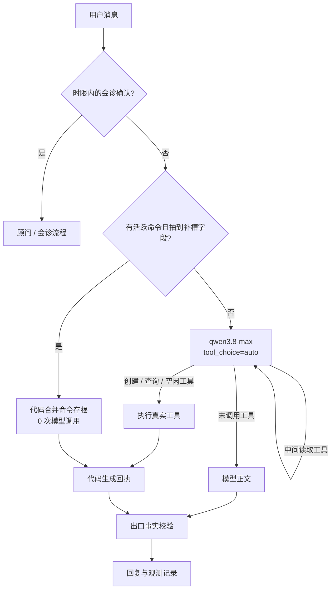

> 从「这个周末」识别失败，到模型、工具、状态机和评测体系重新分工。这篇文章记录 Anpai.life 意图识别链路在真实用户反馈中演进的过程。

做日历 Agent 之前，我以为意图识别是一个分类问题。

用户说一句话，系统把它归到「创建日程」「查询日程」「闲聊」中的某一类，再提取标题、日期、时间等参数。这听起来像一个很标准的 NLP 流水线。

真正做起来，麻烦来自三句很像的话：

- 「明天下午三点和张三开会」
- 「明天下午有什么安排」
- 「昨天下午开了个会，好累」

第一句要写日历，第二句只读日历，第三句什么都不能动。它们都有日期，也都有「会」，但判错的代价完全不同。查询被当成闲聊，用户最多再问一次；一段感慨被当成创建，日历里会悄悄多出一条脏数据。

早期版本真的发生过这种事。「本周有什么安排」「明天下午三点有什么安排？」里的「安排」被正则当成创建动词，系统没有追问，也没有明显报错，而是直接写入日历。同期还有两个方向相反的问题：「请记住我咖啡不加糖」因为「记住」后的分隔符不符合正则而静默丢失；系统纠错文案让用户输入「下午两点」，时间解析器却不认识中文数字「两」。

这些故障共同指向一个问题：分类错误不只影响回答，它会穿过工具边界，变成真实副作用。

所以我们后来不再把核心问题表述成「怎样把意图猜得更准」，而是：

**当模型猜错时，系统怎样避免造成破坏？**

这句话改变了整套架构。

## 第一版：看起来严谨的四层流水线

最初的链路有四层：

```text
L1 正则分类
  ↓
L2 小模型抽取任务和槽位
  ↓
L3 小模型分类意图
  ↓
L4 根据对话历史修正会诊确认
  ↓
大模型回答或调用工具
```

L1 负责处理明显表达，L2 抽日期和时间，L3 做语义分类，低置信度时再升级到大模型。设计初衷很合理：简单请求用便宜规则解决，复杂请求再交给模型。

它很快在真实说法面前失效了。

「这个周末去修汽车轮毂」没有命中日期规则，整句被判成 `ambiguous`；补上「周末」后，「周日下午2点」又因为日期和钟点连在一起而漏判；为了覆盖星期表达，我们把字符类写宽，结果单独一个「天」也被当成有效日期。

问题不是正则写得不够好。问题是我们在用有限规则枚举无限语言。

每修一个例子，测试数字会上升，系统却没有更接近「听懂人话」。它只是记住了更多说法。中文尚且如此，一旦用户输入 `this weekend`，中文正则解析链会直接断掉。

这轮失败留下了第一个架构原则：

> 无界问题交给模型，有界问题交给代码。

「这句话想做什么」「标题是哪几个字」的输入空间没有边界，适合模型。「明天是哪一天」「两个时间段是否重叠」「这一轮有没有真的写入数据库」有确定答案，应该由代码处理。

这不等于把所有正则删掉。日期表达解析、短句补槽、回执事实检查仍然是代码，而且应该保留。我们删的是「让正则替用户决定意图」，不是正则这种工具本身。

## 第二版：删掉正则兜底，却付出了三次模型调用

我们先把 L1 降级成兜底，后来连兜底也删了。

这中间有过一次反复。保留兜底看起来能提高可用性：模型服务故障时，至少一部分中文请求还能工作。复盘后我们认为这是假的可用性。兜底只覆盖少量中文表达，精度又低，故障时系统表面还能回答，实际上更容易做错事。相比之下，明确告诉用户服务暂时不可用更诚实。

删掉正则分类后，热路径变成：

```text
L2 槽位小模型 → L3 意图小模型 → 必要时升级大模型
```

语义质量变好了，延迟却坏了。

L2 和 L3 在首包之前串行执行，每轮各需要约 1～2.5 秒。更糟的是，L3 返回结果经常不带候选置信度，代码会给它默认分 `0.8`，而升级阈值是 `0.85`。这意味着很多创建请求在跑完两个小模型后，仍会再调一次大模型。

一个「明天下午三点开会」可能付出三次串行模型往返。预发体感约 5 秒。

这时我们问了一个很直接的问题：前置分类器到底还在为谁服务？

过去它有两个作用：决定给模型哪些工具，以及决定能否走代码快路径。但如果为了做这个决定，要先串行调用两次模型，「快路径」已经不快了。既然最终的大模型本来就能选工具，独立的意图分类阶段开始变成一笔纯税。

于是 v0.6 做了最激进的一次改动：取消热路径上的 L2/L3，把识别和工具选择合并进一次大模型调用。

## 当前主链路：一次模型，代码负责收口

现在的请求链路是：



典型创建只需要一次模型往返：

1. 模型读到用户消息和工具说明；
2. 直接调用 `prepare_or_create_schedule`；
3. 命令层解析时间、检查冲突和幂等性；
4. 工具返回 `created`、`needs_date` 或 `conflict`；
5. 代码根据真实结果生成回执，不再让模型二次总结。

这里的「一次模型」指识别不再单独占用往返。遇到私有日期时仍可能多一轮：例如「妈妈生日请她吃饭」，模型必须先读用户记忆，拿到日期后再创建。这笔延迟是为了获取事实，不是重复分类。

代码里的职责也按这条链拆开：


| 组件                       | 做什么                                          | 不做什么                     |
| -------------------------- | ----------------------------------------------- | ---------------------------- |
| `PiAgentChatService`       | 分派、上下文、工具定义、SSE、出口校验、事后意图 | 不直接决定日期和冲突         |
| `ScheduleCommandService`   | 合并命令存根、检查槽位、冲突、幂等、落库        | 不理解「就这样吧」是什么意思 |
| `ScheduleTimeService`      | 把规范符号换成绝对时间                          | 不从整句自然语言猜意图       |
| `ScheduleQueryService`     | 按半开区间查询和过滤                            | 不近似用户给出的范围         |
| `AgentEvalRecorderService` | 记录工具序列、结果、延迟和异常结局              | 不参与在线决策               |

所有用户态工具都在服务端闭包里绑定已鉴权的 `userId`。模型只看得到「查日程」「创建日程」这样的业务参数，看不到可以切换身份的入口。

我们曾提议把 `tool_choice` 改成 `required`，再造一个 `respond` 工具，让闲聊也必须通过工具返回。这个方案最后被否决。工具只在需要时调用，闲聊就应该直接输出正文；否则流式文本要被包进工具 JSON，架构复杂度和交互延迟都不划算。

最终保留 `tool_choice=auto`。代价是系统不能从协议层保证「该查的时候一定会查」。安全不能依赖模型自觉，只能下沉到执行层和出口。

### 工具不是都在同一个位置结束

工具循环里有两种工具。

创建日程、查询范围、推荐空闲时间和取消命令属于终结型工具。它们已经拿到本轮所需事实，执行后由代码生成最终回执，并通过 `shouldStopAfterTurn` 结束 Agent 循环。这样可以省掉「工具已经给出结果，再让模型复述一遍」的第二次生成，也避免模型在复述时改写日期或虚构成功状态。

记忆检索和对话归档检索属于中间型工具。模型调 `search_memory` 找到「妈妈生日」后，必须继续推理，再决定是否创建日程；调 `search_chat_archive` 找到上次讨论后，也需要根据当前问题组织答案。这类工具执行后不能提前结束。

```text
终结型：query / suggest / create / cancel
        工具结果 → 代码回执 → 结束

中间型：search_memory / search_chat_archive
        工具结果 → 回到模型 → 继续选工具或回答
```

把终结语义写进运行时，而不是依赖每个工具在提示词里自我声明，是减少重复调用和事实漂移的重要一步。

### 上下文不是越多越好

旧 thread 里可能有用户真正想续聊的内容，也可能有已经失效的相对日期。「明天去开会」一个月后仍被原样塞进 prompt，模型看到的「明天」早已不是当时的明天。会诊邀约也有同样的问题：如果系统曾经问过一次「要不要开三人会诊」，几天后用户单独回复一个「要」，不应该触发旧流程。

现在对话历史以服务端归档为准，每条消息带权威时间戳。相邻消息静默超过 `SESSION_GAP_MINUTES`，默认 120 分钟，就切成新的会话片段。当前 prompt 只注入最近片段；更早内容只留一行提示，用户明确提到「之前」或「上次」时，模型再调用 `search_chat_archive` 读取。

L4 会诊确认则用更窄的状态门：

```text
上一条消息确实是助手发出的会诊邀约
AND 用户在 30 分钟窗口内回复确认
```

这个判断不需要模型。它依赖消息顺序和时间差，是一个有界状态问题。旧历史从「默认全部灌入」改成「需要时读取」，既减少 prompt，也避免陈旧上下文参与当前决策。

## 最重要的安全设计：检查事实，不猜措辞

开发中发生过一次很危险的故障。

模型没有调用任何写入工具，却回复：

> 已创建日程「修汽车轮毂」，时间为北京时间……

数据库里什么都没有。这是一条凭空生成的成功回执。

如果继续用入口规则治理，我们会开始枚举「已创建」「已经帮你安排」「日程添加成功」等措辞。模型总能换一种说法绕过去。

我们改为维护一个客观标志：`scheduleWritePersisted`。只有事件真实写入数据库后，这个值才会变成 `true`。回复发出前，如果文本声称创建成功，而该标志仍是 `false`，整段回复会被替换，并记录 `unverified_create_claim`。

注意是替换，不是追加一句更正。追加会让对话归档里同时保留假回执和真相，未来读取历史时又要判断哪句可信。替换后，归档里只留下经过事实校验的版本。

这类检查被我们称为出口不变量：

```text
模型说了什么，不是安全事实
工具是否成功，也不完全是安全事实
数据库是否真的发生了预期写入，才是
```

同样的思想也用于用户隔离。模型工具的参数 schema 里根本没有 `userId` 和 `email`，用户身份由服务端闭包绑定。提示词可以被绕过，参数空间里不存在的能力绕不过去。

## 澄清不是连续对话，而是一条有状态命令

「这个周末修汽车轮毂」无法直接创建，因为周末有两天。系统不能替用户猜，也不应该把已经提供的信息丢掉后笼统追问「请提供日期」。

命令层会保存一条活跃存根：

```text
title = 修汽车轮毂
dateExpression = WE
status = needs_date
候选 = 周六 / 周日
expiresAt = ...
```

用户回复「周日下午2点」时，请求携带 `activeScheduleCommandId`。这类短补充的格式空间比较集中，代码先尝试字段解析；抽到日期和时间后直接合并存根，零次模型调用。说法太自由时才回到大模型。

这里有一个看似反常、实际很重要的优先级：

```ts
const clarificationPatch = {
  ...modelSlots,
  ...parseScheduleClarification(message),
};
```

字段正则写在后面，覆盖模型结果。因为在「短句补槽」这个狭窄场景里，规则一旦成功抽取，通常比模型稳定。架构原则从来不是「模型优先」，而是谁在当前问题上更可靠，谁优先。

活跃命令还有明确的终点：创建成功、用户取消或存根过期。后来我们专门增加 `cancel_schedule_command`，因为如果用户说「算了，不建了」，而提示词里还带着「当前缺日期」，模型很容易执着地继续追问。

## 用规范符号切断语言和日期算术

多语言让我们遇到另一个边界问题。

模型可以听懂 `next Wednesday`，但中文解析器不认识。让模型直接输出 ISO 日期似乎最简单，可 LLM 做周历、跨月和闰年计算并不稳定。为每种语言维护一套解析器更不可行。

最后选了一层很薄的规范符号：

```text
D+1       明天
W3+1      下周三
WE        本周末
2026-09-01 明确日期
15:00     下午三点
```

模型负责把自然语言归一为符号，代码负责把符号换算成绝对时间。符号词汇表写进工具 JSON Schema 的 `pattern`，生成端能约束就约束，不能约束也会在执行入口拦截。

非法符号不会被「猜着修好」。它会作为工具结果返回模型重试，仍然失败就安全地追问用户。对写路径来说，失败比写错更便宜。

这层微语法解决的是数据正确性，不代表多语言体验已经完成。当前时间计算仍固定在 `Asia/Shanghai`；节假日词典以中文名称为主；代码生成的追问和回执也主要是中文。英文用户可以把 `this weekend at 2pm` 归一成 `WE` 和 `14:00`，但接下来看到的澄清文案可能仍是中文。

我们先切断「非中文输入会写错日期」这条故障链，再处理时区、节假日别名和回复本地化。两者不能混写成一个已经完成的国际化方案。

## 一个被忽略的事实：意图对了，工具契约也可能错

「日历 9 月有哪些日程」曾被正确识别成查询，但最终只查了从 8 月 24 日到 9 月 24 日。

这次不是模型没听懂，而是旧工具只有这些参数：

```ts
{
  preset: 'today' | 'next_days' | 'last_week' | 'this_week' | 'next_week' | 'custom';
  days?: number;
  expression?: string;
}
```

它没有办法表达「完整的 9 月」。模型只能选最接近的 `next_days=31`，而这个 preset 还会默认打开 `incompleteOnly`，让普通查询只返回未完成事项。

我们把查询契约改成统一的半开区间：

```ts
{
  startExpression: string;  // 包含
  endExpression: string;    // 不包含
  incompleteOnly?: boolean;
}
```

整月变成 `[2026-09-01, 2026-10-01)`。代码检查结束时间必须大于开始时间，跨度不能超过 366 天；数据库按事件重叠语义查询：

```text
event.startTime < end
AND event.endTime > start
```

这次故障提醒我们：意图识别不止是分类准确率。模型理解、工具表达能力、时间解析和数据查询共同决定最终语义。任何一层表达不出用户要的东西，上游再聪明也没用。

## 冲突覆盖：代码守状态，模型听人话

另一个真实流程是：

```text
用户：9月29日去体育公园
系统：和「休假」冲突，要换时间吗？
用户：不用换，直接创建
系统：和「休假」冲突，要换时间吗？
```

命令层原本要求用户原文匹配一条覆盖正则。模型已经传了 `allowConflict=true`，但「不用换，直接创建」不在那条正则里，于是系统永远重复同一个问题。

修法仍然遵守有界与无界的分工：

- 代码只判断一个有限事实：上一轮存根是否已经处于 `conflict`；
- 模型判断当前回复是否同意按原时间创建；
- 两者同时成立，`allowConflict=true` 才生效。

首轮创建时模型即使偷传 `allowConflict` 也没用，因为没有冲突状态。用户换了新时间，就重新校验；用户说算了，则取消存根。

权限不是全交给模型。模型负责理解「同意」的无限说法，代码负责证明系统确实问过。

## 日历归类：模型犯错之前，先检查它有没有信息

上线前最后一个问题很有代表性：不管是陪家人吃饭还是去健身，AI 创建的事件全部进入「工作」日历。

第一反应很容易归咎于模型分类能力。排查后发现，模型根本不知道用户有哪些日历。`calendarName` 在工具 schema 里只有一个空泛的 `string`，提示词里没有日历列表。模型通常不传这个字段，命令层便使用 `calendars[0]`。第一个日历恰好叫「工作」。

修复分成三段：

1. 代码读取当前用户的日历名称，把「工作、家庭、个人」作为有界事实注入上下文；
2. 模型在列表中选择语义最接近的名字；
3. 如果模型给出列表外名称，命令层回退默认日历，并在回执中说明。

第一次修完仍然出了问题。

用户在休假期间创建「坐飞机回老家」，冲突处理后回执显示「已归入工作」。这次模型看见了列表，也确实主动选了「工作」。它被「坐飞机」联想到出差，忽略了对话里更强的证据：事件和「休假」冲突。

我们没有再加一层分类模型，而是调整判断顺序：

```text
上下文证据
  休假/请假冲突、当天事项、时间和对话线索
        ↓
词面语义
  回老家/陪家人 → 家庭
  健身/跑步 → 运动
  开会/客户/出差 → 工作
```

同时明确「默认：工作」只是省略字段后的系统行为，不是推荐。拿不准时应该省略，不能因为它是默认日历就主动选择它。

这件事让我们意识到，所谓意图识别并不只看当前一句话。工具返回、冲突对象和已有状态都是语义证据，而且往往比关键词更可靠。

## 评测为什么一直是绿的，用户却一直能发现问题

架构改到 v0.6 后，离线评测仍然全绿，真实使用却不断冒出新问题。原因后来很尴尬：`eval:agent:live` 名字里有 `live`，实际仍然只跑路由仿真，根本不调用真实模型。

我们当时拥有的是一条「绿色的假证据」。

离线仿真器能证明分派结构没有变形，却不能证明模型会选对工具、填对参数。于是我们把质量保障拆成几层，各自只证明自己能证明的事：


单元测试覆盖时间解析、冲突、幂等和回执。离线评测用固定时间和内存数据跑 128 条用例，确保代码没有偷偷长出第二套分类器。防漂移测试比较仿真器与真实 `streamChat` 的代表性分派。

这套用例不是一次写出来的。最初是 115 条，11 毫秒内跑完；查询范围、冲突覆盖和日历归类的真实故障随后被逐条加入，最终增长到 128 条。数量本身不是目标，重要的是每次线上问题都能留下一个以后不会消失的断言。

新的 live harness 则直接构造真实 `PiAgentChatService`，调用同一个 `qwen3.8-max` 和同一份工具 schema，只把数据库、日历和记忆换成内存 fixture。它不消耗用户配额，也不写真实数据，但能看到模型到底调用了什么工具、传了什么参数。

写安全用例采用从严口径：只读请求只要调用了写工具就算失败，即使命令层最后拦住没有落库。最后防线拦住的是 near-miss，不是成功。

live 评测不放进普通 CI。全量大约 130 条，每条需要 1～2 次模型往返，并发 4～8 时通常要跑几分钟，单轮成本在数元以内。改系统提示、意图目录或工具 schema 后跑相关分组；准备发版时再跑全量。

模型评测也不是统计证明。非安全用例失败后允许重跑一次，第二次通过会记为 `flaky`；安全组不重跑，因为线上一次误写就已经构成事故。有限采样只能发现确定性错误和高频漂移，不能证明某条提示在长期分布上永远稳定。

首轮全量 live 的结果是：

- 102 条通过；
- 16 条已知缺陷；
- 1 条 flaky；
- 0 条未归类失败。

其中包括一条过去式陈述误触发写工具的安全缺陷。我们没有修改期望值让报告变绿，而是把它登记为 `known_issue`。已知缺陷修好后，`stale_known_issue` 会反过来阻塞门禁，强制删除过期标记，避免缺陷清单变成永久豁免名单。

线上异常也要能回到评测集。评测事件记录用户原文、工具序列和最终结局；报表可以筛出 `unverified_create_claim` 和失败轮次。人工判断后，把真实说法补进同一份用例集。

用例不是发布前写完的一份文档，而是产品使用过程中的记忆。

### 取消前置分类后，意图指标从哪里来

早期的 `IntentEnvelope` 是各识别层之间传递的信封，里面有意图、置信度、槽位和授权。v0.6 取消 L2/L3 后，它不再是执行前提，但没有被完全删除，而是降级为观测结构。

系统根据真实工具序列事后推断意图：

```text
调用 prepare_or_create_schedule
  有活跃命令 → schedule.clarification_reply
  无活跃命令 → schedule.create

调用 query_schedule_range → schedule.query_range
调用 search_memory        → memory.search
调用 search_chat_archive  → archive.search
没有调用工具              → general.chat
```

这套 `inferPostHocIntent` 同时用于线上录制和 live 评测。它不再参与「能不能写」的决策，所以统计逻辑即使出错，也不会改变用户数据。`ai_agent_eval_events` 记录事后意图、工具序列、最终结局、延迟和用户原文；`report:agent --candidates` 从中找出值得补成用例的轮次。

这是一个容易被忽略的变化：我们没有停止观测意图，只是把意图从控制信号改成了结果标签。

## 我们得到的架构，不是我们最初设计出来的

最终职责边界可以压缩成四句话：

1. 模型负责理解无界语言和选择工具。
2. 代码负责时间算术、状态、权限条件和真实写入。
3. 工具 schema 负责限制模型可以表达的参数空间。
4. 评测负责证明每一层真的完成了自己的职责。

这套架构并不完美。

写工具常挂后，查询误调用写工具的物理隔离消失了。命令层和出口校验能挡住一部分错误，但如果模型把一句陈述完整地误解成创建，并抽出合法标题和时间，仍可能写入脏数据。`tool_choice=auto` 也意味着模型可能该查不查，直接编造「明天没有安排」；创建出口校验拦不到这种查询幻觉。

性能也没有因为模型调用次数减少就自动达标。方案目标是 2.5 秒左右，预发热实例的创建实测仍在 14.0～14.4 秒，查询约 13.5 秒。取消前置模型解决了架构上的重复往返，却没有消掉模型 TTFT、提示词长度、运行平台和工具循环的全部成本。我们把这个结果如实留在证据里，没有把「少两次调用」写成「已经变快」。

目前还不能把这 14 秒归咎于某一个组件，因为现有记录只有端到端耗时。下一轮性能工作必须先补分段时间线，而不是继续凭感觉删 prompt：

```text
请求进入
  → Vercel 启动与服务初始化
  → 上下文查询完成
  → 模型请求发出
  → 首个 token / tool call 到达
  → 工具执行完成
  → message_done
```

至少要分别记录冷启动、上下文构建、模型 TTFT、模型生成、工具执行和 SSE 收尾。再把冷实例与热实例、上下文缓存命中与未命中分开比较。没有这组数据，「模型慢」「Vercel 慢」「prompt 太长」都只是猜测。

还有一个工程教训发生在发布阶段：功能通过预发后，我们一度把口头的「上线」误当成可以省略 Code Review、测试报告和 Release PR。服务确实上线了，依赖也没有漏发，但发布链路不完整。后来我们补了报告、Review、生产验证与 Release PR，并把状态停在 `post-release-reconciled`，没有因为入口返回 200 就标记 `complete`。

这和出口不变量其实是同一个教训：不要因为系统说「成功」就相信成功。看事实。

## 回头看，真正变化的是问题的切法

最开始，我们把一句用户输入切成四层分类流水线，希望每层都更简单。结果是层数多了，延迟上升了，接缝处的错误也更多。

后来我们换了切法。不是按「规则、小模型、大模型」分层，而是按问题性质分工：

- 开放语言由模型理解；
- 封闭状态由代码判断；
- 私有事实通过工具读取；
- 写入结果由数据库证明；
- 模型行为用真实模型评测；
- 生产结果由真实入口和副作用核销。

从 530 行正则到一次大模型，表面上像是删层。真正困难的部分却是删层之后把安全门闩重新安好：哪些信息必须给模型，哪些权力不能给模型，哪些结果必须由代码接管，哪些绿色测试其实什么也没证明。

意图识别最后没有成为一个更大的分类器。它变成了一条可观察、可校验、允许承认不确定的执行链。

