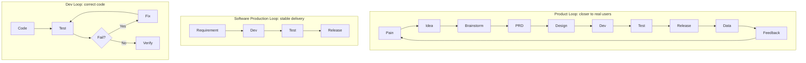

For a while now I've been building my own product — **Arrange Life**, a scheduling calendar.

From a very simple calendar requirement at the start, to gradually adding legends, an AI agent, and Skills, then Web, App, testing, release, and data analysis, one thing became clearer and clearer:

> **What AI really changes isn't just the speed of writing code — it's the possibility for one person to complete a full software production lifecycle.**

Before, shipping a truly production-ready product required many roles: product, design, frontend, backend, testing, ops, and so on.

Now, one person with a coding agent, Skills, and mature cloud services can already cover a large part of that work.

I understand this approach as **OPC (One Person Company) software development**.

This post isn't a theoretical framework — it's a set of experiences that settled out after I hit pitfalls building my own product.

---

## 1. The starting point of OPC: don't look for an idea first, look for your own pain point

The original reason I built Arrange Life was very simple:

**I was dissatisfied with the calendar products on the market.**

Even a very small feature — if existing products can't solve it, and it keeps bothering me, then it might be worth solving myself.

For example, I wanted:

* Month and year views to express schedules more intuitively;
* The calendar to support legends, so dates aren't just cold numbers;
* An agent that really understands schedules and life;
* In the future, even turning the calendar capability itself into Skills that other agents can call.

These requirements may not be what traditional calendar products care about most, but they are **my own real needs**.

This is especially important for OPC.

A company builds products pushed by KPIs, budgets, and organizational goals. But one person building a product often doesn't even know whether it will make money in the end.

What really keeps you going for a long time is often:

> **This problem really bothers me, so even with no users yet, I'm willing to keep making it better.**

Interest and real pain points are the cheapest and most durable fuel for OPC.

---

## 2. The first OPC, don't casually invent a brand-new market

After having a real pain point, I think one more business judgment is needed:

**Does anyone already pay for this need?**

For someone doing OPC for the first time, I'd suggest picking a **market-proven track**.

Calendars, todos, notes, and productivity tools all have mature products and stable paying users.

That means a very important fact:

**The demand itself doesn't need me to prove it.**

What I need to prove is:

> In an existing market, can I find a piece of demand nobody has solved well, and do it better?

That's a completely different risk from creating a new category from zero.

So my experience is:

**A mature market + verified willingness to pay + your own real pain point + clear differentiation is often a great OPC starting point.**

Of course, if you really find a great new demand, go for it.

This isn't a rule, just an experience from having built products:

**At the start, protect your creativity as much as possible — don't burn it too early on validating a market that may not exist.**

---

## 3. The scarcest resource of OPC isn't token

After deciding on the product, the first thing I considered wasn't how advanced the tech is, but:

**How to make the whole system as cheap, simple, and low-maintenance as possible.**

Because OPC's biggest problem isn't lack of technology, it's lack of time and energy.

So if mature infrastructure exists, don't build your own; use low-cost services from the community and cloud providers as much as possible.

For example, in my own practice, I use mature hosting, deployment, CDN, and domain infrastructure heavily, outsourcing as much DevOps as possible.

The same principle applies to the coding agent.

If conditions allow, I prefer using stronger, more stable models for the software tasks that really matter.

The reason isn't the model leaderboard, but a very practical problem:

> **If a problem can't be solved after struggling for half a day, what you lose isn't just a few hours — it may be your interest in continuing.**

OPC depends heavily on positive feedback:

**Requirement done → happy → want to optimize → user feedback good → keep going.**

Once this loop is interrupted by a lot of low-value debugging, it's easy to get tired.

So OPC's cost optimization doesn't mean picking the cheapest for everything.

What you should really optimize is:

> **The cost of getting a useful result per unit of time.**

---

## 4. Don't let the coding agent run naked: turn software development into Skills

After having an idea, a dev environment, and a coding agent, the thing that really separates people starts to appear:

**Skills.**

Don't tell the AI on the spot every time:

> Help me implement this requirement.

Instead, gradually distill your software-development method into a set of Skills, so the agent knows what a requirement should go through from appearance to launch.

The lifecycle I now recognize is roughly:

> **Idea → Brainstorm → PRD → UED → Technical design → Development → Test → Integration → Release → Data observation → Next iteration**

But just turning these steps into Skills isn't enough.

**What you ultimately need to achieve is Loop Engineering.**

That is, we don't let the agent execute a one-way pipeline from requirement to code — we give it:

> **Develop → test → find a problem → fix → re-test → verify**

a self-converging engineering loop.

If Skills answer:

**"How should the agent do software development?"**

then Loop Engineering answers:

**"How does the agent know it did the right thing, and fix itself after doing wrong?"**

This is the key step for a coding agent to go from "code generator" to "engineer".

---

## 5. Brainstorm: don't rush to code the moment a requirement arrives

This is a very important step in the whole flow.

When a requirement arrives, the first thing shouldn't be coding — it should be **Brainstorm**.

At least three things.

First, **research competitors**.

How do others solve this problem? Why do mature products design it this way?

Second, **search for open-source solutions**.

If the community already has a mature implementation, don't let the agent reinvent the wheel.

This saves time and, more importantly, improves stability.

Third, **let AI help expand the thinking**.

A human's idea is often just one sentence.

But a good model can expand that sentence:

Which scenarios are missed? What edge cases are there? Is there another interaction? How do mature products usually solve it?

So Brainstorm is essentially doing one thing:

> **Expose errors and omissions as much as possible at the cheapest stage.**

Finding out the direction is wrong after the code is written is the most expensive.

---

## 6. PRD: must have User Stories

After Brainstorm, enter the PRD.

Models writing a PRD is no longer hard; what really matters is:

**Don't let the PRD become a long essay written by AI for AI.**

AI especially likes generating documents with thousands of words and dozens of sections.

The content may all be correct, but after reading it you no longer know what you're actually supposed to do.

So I especially recommend keeping **User Stories** in the PRD.

For example:

> As someone who frequently checks the month view, I want to see the day's important schedules directly in the month view, instead of constantly entering the date detail page.

One sentence like this is sometimes worth more than hundreds of words of requirement description.

Because you know at a glance:

**Who are we solving what problem for.**

The User Story is my way of fighting the cognitive load of long AI documents.

---

## 7. UED: design seriously the first time, then let the system work

UED is a very interesting stage.

Whether a product "looks good" actually affects two people:

**The user, and the developer themselves.**

If you find your own creation ugly every time you open it, the desire to keep going drops over time.

So early in the product, I'm willing to spend some cost building my own design system.

You can use professional AI design tools, or mature UI/UX Skills and a Design System.

But what really matters isn't a specific tool — it's answering as early as possible:

> **What should my product actually look like?**

Including the primary color, font, corner radius, spacing, component style, and the feeling the product wants to convey.

For example, Arrange Life uses a teal-leaning visual system, hoping to feel relaxed and natural, not the pressure of "another pile of unfinished tasks" when you open a calendar.

Once this system is established, the App, PC, and website should stay consistent.

More importantly:

**Once the Design System is stable, every later requirement doesn't need to be redesigned.**

Let the agent extend within the existing design system.

This significantly lowers the long-term maintenance cost of OPC.

---

## 8. Don't prototype for the sake of prototyping: ASCII is often enough

There's a very easy trap here.

AI can now generate HTML prototypes very easily, so it's tempting to generate a very complete interactive page at the PRD stage.

I've increasingly felt:

**Most of the time it's unnecessary.**

Because high-fidelity prototypes easily drag you into details like color, animation, spacing, and button position too early.

The requirement itself loses focus.

For many requirements, a simple ASCII sketch is enough:

```text
┌──────────────────────────┐
│        September         │
├────┬────┬────┬────┬─────┤
│  1 │  2 │  3 │  4 │  5  │
│    │Meeting│  │Trip│    │
├────┴────┴────┴────┴─────┤
│ Today                     │
│ 10:00 Product discussion  │
│ 15:00 Gym                  │
└──────────────────────────┘
```

What I actually need to confirm is just:

**Where is the information? How does the user operate? How do pages navigate?**

After confirming these, jump straight into real page development, then adjust the interaction in the real environment — often faster.

This is an important OPC principle:

> **Use "just enough" expression precision at each stage.**

Don't pay unnecessary tokens, time, and attention in advance.

---

## 9. Technical design: let the agent think by your standard every time

Before development, I tend to produce a technical design.

Frontend and backend can be written together or separately.

For complex requirements, I prefer separating them, because the agent focuses better.

More importantly:

**Build your own technical-design template.**

At minimum make clear:

* What this change is;
* Which modules it involves;
* How the data structure changes;
* How the interfaces adjust;
* How exceptions are handled;
* How compatibility is ensured;
* What the risks are;
* How to test;
* How to release.

These gradually become your own Skills.

Also, the technical doc should be saved in the repository with the code.

Years later, what's really valuable isn't just the code, but:

**Why it was designed this way.**

Code tells a future agent "what it is now"; docs tell it "why it became this". This is the basis for knowledge passing on to the next agent session.

---

## 10. Testing isn't an afterthought — it's the core of Loop Engineering

This is a point I value more and more.

As coding agents get stronger, **writing code itself is gradually becoming the relatively cheap part of the whole process.**

What really consumes time is starting to be:

**Verification.**

Is the code right?

Did it break existing logic?

Do frontend and backend match?

Does the whole business chain still work?

So testing can no longer be understood as "check once after development".

It's actually **the infrastructure that makes Loop Engineering possible**.

The simplest loop:

```text
        ┌──────────────┐
        │  Requirement │
        └──────┬───────┘
               ↓
        ┌──────────────┐
        │ Implementation│
        └──────┬───────┘
               ↓
        ┌──────────────┐
        │     Test      │
        └──────┬───────┘
               ↓
           Pass ?
          ↙      ↘
        No        Yes
        ↓          ↓
      Fix       Verify
        │
        └──────────────→ Test
```

Before, the most expensive part of this loop was "the human".

After testing finds a problem, the engineer needs to read logs, locate the issue, change code, and re-run.

Now these steps can all start to be done by the agent.

So after a requirement is handed to the coding agent, it can:

**Implement → test → find failure → analyze the cause → change code → re-test → until passing.**

Then the value of automated testing isn't just "quality assurance".

It actually becomes:

> **The agent's feedback signal.**

Without tests, the agent can only think:

**"I finished the code."**

With tests, it can know:

**"I did the thing right."**

These two states are very different.

---

## 11. The more complete the loop runs, the faster OPC iterates

This is also why a mature OPC project should gradually fill in testing at different levels.

Including:

**Unit tests, API tests, UI automation, and finally end-to-end tests.**

They provide feedback to the agent at different levels.

Unit tests tell the agent:

> Is this function written correctly?

API tests tell the agent:

> Is the contract between services broken?

UI automation tells the agent:

> Can real user operations still complete?

End-to-end tests finally answer:

> **Does the whole user story still hold?**

Once these capabilities are gradually built, an interesting result appears:

### The more mature the project, the faster new requirements may get developed.

Because the agent no longer relies on "guessing" every time.

It can change boldly, and let the existing test system tell it:

**What broke.**

Then fix it itself.

So a good test system isn't a cost for OPC.

Quite the opposite:

> **It's one of the most important accelerators of late-stage OPC.**

---

## 12. But don't run the full test suite every time

Loop Engineering has a very real problem:

**Cost.**

If a project has accumulated thousands of tests, and every button change makes the agent re-run all of them, the loop gets very slow very fast.

So the agent also needs one capability:

**Impact Analysis.**

Based on this Change Set, judge:

**What did I change → which modules are affected → which tests relate to those modules → which tests should run this time.**

So the more reasonable flow is:

> **Change → Impact Analysis → Relevant Tests → Failure Analysis → Fix → Retest → Verify**

not:

> **Change → Run Everything**

This is also an important difference I see between Loop Engineering and traditional CI:

**Not simple automation, but letting the agent understand the change and dynamically decide the verification strategy.**

Only then can the loop be fast enough.

And only when the loop is fast enough does human creativity not get worn out by long waits.

---

## 13. Integration: hand Computer Use to the agent

As Browser Use and Computer Use get more mature, the integration phase — which used to consume people heavily — can also start to be handed to the agent.

My ideal state:

> **Local env → automated test → local integration → preprod env → full-chain integration**

The local environment gives the fastest feedback, so solve problems there first.

Once stable, deploy to preprod.

One more thing to watch:

**Modern products rarely have just one app.**

There may be Web, App, API, agent service, database, and other services at the same time.

So testing can't just ask:

> "Is the app I changed today normal?"

It should ask:

> **"Is the whole chain affected by this change normal?"**

This is still Impact Analysis.

The agent doesn't just execute tests — it gradually understands the dependencies between systems.

---

## 14. Release: don't tell the agent "ship it for me"

Release should also become a Skill.

I don't want the agent to receive:

> Ship it for me.

and start operating directly.

The right way is:

**First generate a Release Plan.**

Analyze which apps this Change Set involves, what the dependencies are, what the release order is, which services must upgrade together, and what to verify after release.

After confirmation, execute the automated release.

That is:

> **Plan → Review → Release → Verify**

not:

> **Release → Pray**

This matters especially as the system gets more complex.

Because what's truly dangerous often isn't the code being wrong, but:

A was released, B was forgotten; the database changed but the service didn't sync; the new API the client depends on isn't live yet.

OPC has no one to catch you, so:

> **The process itself must be your safety net.**

---

## 15. Launch isn't the end: bring real users into the loop

After launch, there's a part easily ignored by solo developers:

**Data.**

This doesn't need to be built very complex on Day 1.

But once the product has real users, you should gradually know:

How many users?

What's roughly the DAU?

Which pages are used?

Which features are untouched?

Where do users drop off?

Web, PC, and App can all gradually integrate a product analytics system.

Then when deciding requirements, you no longer only have:

> "I think this feature is nice."

but start to have:

> **Your own pain point + user feedback + behavior data.**

At this point, the loop we talked about earlier expands another layer.

First there was a **dev loop**:

> **Code → Test → Fix → Verify**

Then outward, a **software production loop**:

> **Requirement → Development → Test → Release**

Finally a real **product loop**:

> **Pain → Idea → Brainstorm → PRD → Design → Development → Test → Release → Data → Feedback → New pain**

These three layers of loops are a very important model for how I now understand OPC.



**The inner loop guarantees the code is correct.**

**The middle loop guarantees stable delivery.**

**The outer loop keeps the product moving toward real users.**

---

## 16. One piece I haven't finished: payment

The product ultimately can't dodge one question:

**How to make money.**

Subscription, one-time purchase, value-added services, AI token packages, or another business model?

How to design the payment system?

How to unify payment across platforms?

Where is the boundary between free and paid users?

I haven't fully explored these questions yet.

So this post won't give a seemingly correct answer just for the sake of "completeness".

This is also a feeling I've had as I go deeper into OPC:

**Launching a product isn't graduation — it may just be enrollment.**

After software production problems are greatly reduced by AI, there remain users, growth, commercialization, trust, compliance……

These may be the truly hard parts of OPC.

---

## In closing: what really matters is building your own loop

Working on Arrange Life this while, one thing became increasingly clear:

The biggest change AI brings isn't how much faster I write code.

It's that something that used to require many roles together, now one person has a real chance to string it all together for the first time.

I can have an idea.

Let AI brainstorm with me.

Turn it into a PRD and User Stories.

Design the UI.

Generate the technical design.

Write code.

Write tests.

Open the browser and integrate myself.

Find a problem and fix it myself.

Re-run tests.

Deploy preprod.

Analyze the impact.

Generate a Release Plan.

Ship to production.

Finally observe through real data whether users actually like it.

**AI didn't make the product itself simpler.**

It just let an ordinary person, for the first time, have a "virtual software team" that only companies could afford before.

But I now increasingly feel that what's truly worth accumulating in OPC isn't:

**"Which AI tools I used."**

Because tools will change, and models will change.

What's really worth accumulating is three things:

**Skills, Context, and Loop.**

Skills tell the agent:

> **How it should be done.**

Context tells the agent:

> **Why this product was built this way.**

Loop tells the agent:

> **How you know you did it right, and how to fix yourself after doing wrong.**

Once these three things gradually accumulate, what you have is no longer just a coding agent.

You have your own **software production system**.

And this system keeps getting stronger as you build more products, hit more pitfalls, and accumulate richer Skills.

**The first product may be slow.**

**The second will be much faster.**

**The third may no longer start from zero.**

Because what's truly reused was never just the code.

It's that all your past software-engineering experience has started to become capability that AI can execute.

I think this is what OPC is truly worth looking forward to in the AI era.
