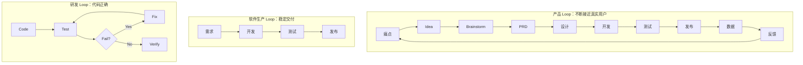

过去一段时间，我一直在做自己的产品——**安排日历（Arrange Life）**。

从最开始一个很简单的日历需求，到后来逐渐加入图例、AI Agent、Skills，再到 Web、App、测试、发布、数据分析，我越来越清晰地意识到一件事情：

> **AI 真正改变的，不只是写代码的效率，而是一个人完成完整软件生产生命周期的可能性。**

以前做一款真正能够上线的产品，需要产品、设计、前端、后端、测试、运维等很多角色。

现在，一个人借助 Coding Agent、Skills 和成熟的云服务，已经可以覆盖其中相当大的一部分工作。

我把这种方式理解为 **OPC（One Person Company）式的软件研发**。

这篇文章不是一套理论框架，而是我自己做产品过程中踩过坑之后，逐渐沉淀下来的一套经验。

---

## 一、OPC 的起点：不要先找 Idea，先找自己的痛点

我做安排日历，最初的原因其实很简单：

**我对市面上的日历产品不满意。**

哪怕只是一个很小的功能，如果现有产品解决不了，而这个问题又持续困扰着我，那么它就可能值得自己解决。

比如我希望：

* 月历、年历能够更直观地表达日程；
* 日历里可以加入图例，让日期不仅仅是冷冰冰的数字；
* 有一个真正理解日程和生活的 Agent；
* 未来甚至可以把日历能力本身做成 Skills，让其他 Agent 调用。

这些需求未必是传统日历产品最重视的，但它们是**我自己真实存在的需求**。

这一点对于 OPC 尤其重要。

公司做产品，可以依靠 KPI、预算和组织目标推动。但一个人做产品，很多时候甚至不知道最后能不能赚钱。

真正支撑你走很久的，往往是：

> **这个问题真的困扰着我，所以即使暂时没有用户，我也愿意继续把它做好。**

兴趣和真实痛点，是 OPC 最廉价、也是最持久的燃料。

---

## 二、第一次做 OPC，不要轻易发明一个全新的市场

有真实痛点以后，我认为还应该再做一次商业判断：

**这个需求，有没有人已经愿意付钱？**

对于第一次做 OPC 的人，我更建议选择一个**已经被市场验证的赛道**。

日历、Todo、笔记、效率工具，本身都有成熟产品，也已经存在稳定的付费用户。

这意味着一个非常重要的事实：

**需求本身不需要我再证明。**

我要证明的是：

> 在一个已经存在的市场里，我能不能找到一块别人没有解决好的需求，然后把它做得更好？

这和从零创造一个全新品类的风险完全不同。

所以我的经验是：

**成熟市场 + 已验证付费意愿 + 自己真实的痛点 + 明确的差异化，往往是 OPC 很好的起点。**

当然，如果你真的发现了一个非常好的全新需求，完全可以去做。

这不是规则，只是一条做过产品之后的经验：

**刚开始的时候，尽量保护自己的创造力，不要把它过早消耗在验证一个可能根本不存在的市场上。**

---

## 三、OPC 最稀缺的资源，不是 Token

确定产品以后，我首先考虑的不是技术有多先进，而是：

**怎么让整个系统尽可能便宜、简单、少维护。**

因为 OPC 最大的问题不是没有技术，而是没有那么多时间和精力。

所以能使用成熟基础设施的，就不要自己造；能使用社区和云厂商提供的低成本服务，就尽量使用。

例如我自己的实践里，会大量使用成熟的托管、部署、CDN、域名等基础设施，把 DevOps 工作尽可能交出去。

同样的原则也适用于 Coding Agent。

如果条件允许，我倾向于在真正重要的软件开发任务上使用能力更强、更稳定的模型。

原因不是模型排行榜，而是一个非常现实的问题：

> **一个问题如果折腾半天都解决不了，你损失的不只是几个小时，还可能是继续做这件事情的兴趣。**

OPC 非常依赖正反馈：

**需求做出来 → 很开心 → 想继续优化 → 用户反馈不错 → 再继续做。**

这个循环一旦被大量低价值 Debug 打断，人很容易疲惫。

所以 OPC 的成本优化，并不意味着所有东西都选最便宜的。

真正应该优化的是：

> **单位时间获得有效结果的成本。**

---

## 四、不要让 Coding Agent 裸奔：把软件研发 Skills 化

有了 Idea、开发环境和 Coding Agent 之后，我认为真正拉开差距的东西开始出现了：

**Skills。**

不要每次都临时告诉 AI：

> 帮我实现一下这个需求。

而应该逐渐把自己的软件研发方法沉淀成一套 Skills，让 Agent 知道一个需求从出现到上线，应该经历什么。

我现在比较认可的生命周期大致是：

> **Idea → Brainstorm → PRD → UED → 技术方案 → 开发 → 测试 → 联调 → 发布 → 数据观测 → 下一轮迭代**

但仅仅把这些步骤 Skills 化还不够。

**最终真正要实现的，是 Loop Engineering。**

也就是说，我们不是让 Agent 执行一条从需求到代码的单向流水线，而是让它具备：

> **开发 → 测试 → 发现问题 → 修复 → 再测试 → 验证**

这样一个能够自主收敛的工程闭环。

如果说 Skills 解决的是：

**“Agent 应该怎么做软件研发？”**

那么 Loop Engineering 解决的是：

**“Agent 怎么知道自己做对了，并且在做错以后自己修回来？”**

这是我认为 Coding Agent 从“代码生成器”真正走向“工程师”的关键一步。

---

## 五、Brainstorm：不要拿到需求马上写代码

这是我认为整个流程里非常重要的一步。

一个需求进来以后，第一件事情不应该是 Coding，而应该是 **Brainstorm**。

至少做三件事情。

第一，**调研竞品**。

别人是怎么解决这个问题的？成熟产品为什么这么设计？

第二，**搜索开源方案**。

如果社区已经有成熟实现，就尽量不要让 Agent 从零造轮子。

这不仅节省时间，更重要的是提高稳定性。

第三，**让 AI 帮助扩展思考**。

人的 Idea 很多时候只有一句话。

但好的模型可以帮助把这句话展开：

遗漏了哪些场景？有哪些边界条件？有没有另外一种交互方式？成熟产品通常怎么解决？

所以 Brainstorm 本质上是在做一件事情：

> **在最便宜的阶段，把错误和遗漏尽可能暴露出来。**

等代码已经写完，再发现方向错了，是最昂贵的。

---

## 六、PRD：一定要有 User Story

Brainstorm 完成之后，再进入 PRD。

现在的模型写 PRD 已经不是什么困难的事情，真正需要注意的是：

**不要让 PRD 变成一篇 AI 写给 AI 看的长文。**

AI 特别容易生成几千字、几十个章节的文档。

内容可能都对，但人看完已经不知道自己到底要做什么了。

所以我特别建议 PRD 里面保留 **User Story（用户故事）**。

例如：

> 作为一个经常查看月历的人，我希望直接在月视图看到当天的重要安排，而不是不断进入日期详情页。

这样一句话，有时候比几百字需求描述更有价值。

因为你一眼就知道：

**我们到底在替谁解决什么问题。**

User Story 是我用来对抗 AI 长文档认知负担的一种方式。

---

## 七、UED：第一次认真设计，以后尽量让体系工作

UED 是一个很有意思的阶段。

一个产品“好不好看”，其实会影响两个人：

**用户，以及开发者自己。**

如果每天打开自己做的东西都觉得不好看，长期做下去的欲望都会下降。

所以产品早期，我愿意花一些成本建立自己的设计体系。

可以使用专业的 AI 设计工具，也可以使用成熟的 UI/UX Skills 和 Design System。

但真正重要的不是某一个工具，而是尽早回答：

> **我的产品到底应该长什么样？**

包括主色、字体、圆角、间距、组件风格，以及产品希望传递出来的感觉。

例如安排日历整体使用偏青绿色的视觉体系，希望给人的感觉是轻松、自然，而不是打开一个日历就产生“又有一堆任务没完成”的压力。

当这个体系建立以后，App、PC、官网都应该尽可能保持一致。

更重要的是：

**Design System 一旦稳定，后面的每个需求就不需要重新设计一遍。**

让 Agent 在既有设计体系中扩展即可。

这会显著降低 OPC 长期维护的成本。

---

## 八、不要为了原型而做原型：ASCII 很多时候已经够了

这里还有一个很容易踩的坑。

现在 AI 可以非常轻松地生成 HTML Prototype，于是很容易在 PRD 阶段就生成一个非常完整的交互页面。

我后来越来越觉得：

**很多时候没有必要。**

因为高保真原型很容易让人过早陷入颜色、动画、间距、按钮位置这些细节。

需求本身反而失焦了。

对于大量需求，一个简单的 ASCII 草图已经够用：

```text
┌──────────────────────────┐
│        September         │
├────┬────┬────┬────┬─────┤
│  1 │  2 │  3 │  4 │  5  │
│    │会议│    │旅行│     │
├────┴────┴────┴────┴─────┤
│ 今日安排                 │
│ 10:00 产品讨论           │
│ 15:00 健身               │
└──────────────────────────┘
```

我要确认的其实只是：

**信息在哪里？用户怎么操作？页面之间怎么跳？**

确认这些以后，直接进入真实页面开发，再在真实环境里调整交互，很多时候反而更快。

这是一个很重要的 OPC 原则：

> **在不同阶段，使用“刚刚够用”的表达精度。**

不要提前支付不必要的 Token、时间和注意力。

---

## 九、技术方案：让 Agent 每次都按照你的标准思考

进入开发之前，我倾向于生成技术方案。

前端和后端可以写在一起，也可以拆开。

对于复杂需求，我个人更倾向于拆开，因为这样 Agent 更容易聚焦。

更重要的是：

**建立自己的技术方案模板。**

例如至少明确：

* 本次改动是什么；
* 涉及哪些模块；
* 数据结构怎么变化；
* 接口如何调整；
* 异常如何处理；
* 兼容性如何保证；
* 有哪些风险；
* 怎么测试；
* 怎么发布。

这些东西慢慢都会成为自己的 Skills。

同时，技术文档最好和代码一起保存在 Repository 中。

几年以后真正值钱的不只是代码，而是：

**为什么当时这么设计。**

代码告诉未来的 Agent“现在是什么”，文档告诉它“为什么变成这样”。

这也是知识能够不断传承给下一次 Agent Session 的基础。

---

## 十、测试不是收尾工作，而是 Loop Engineering 的核心

这是我现在越来越重视的一点。

随着 Coding Agent 越来越强，**写代码本身正在逐渐变成整个研发流程里成本相对较低的一部分。**

真正耗费时间的，反而开始变成：

**验证。**

代码到底对不对？

有没有破坏已有逻辑？

前端和后端是否匹配？

整个业务链路还能不能正常工作？

所以测试不能再被理解成“开发完成以后检查一下”。

它实际上是 **Loop Engineering 能成立的基础设施**。

一个最简单的 Loop 是：

```text
        ┌──────────────┐
        │  Requirement │
        └──────┬───────┘
               ↓
        ┌──────────────┐
        │ Implementation│
        └──────┬───────┘
               ↓
        ┌──────────────┐
        │     Test      │
        └──────┬───────┘
               ↓
           Pass ?
          ↙      ↘
        No        Yes
        ↓          ↓
      Fix       Verify
        │
        └──────────────→ Test
```

以前这个 Loop 里面最昂贵的是“人”。

测试发现问题以后，工程师需要看日志、定位问题、修改代码、重新运行。

而现在，这几个步骤开始可以全部由 Agent 完成。

于是一个需求交给 Coding Agent 之后，它可以：

**实现 → 测试 → 发现失败 → 分析失败原因 → 修改代码 → 重新测试 → 直到通过。**

这时候自动化测试带来的价值就不只是“质量保障”了。

它实际上变成了：

> **Agent 的反馈信号。**

没有测试，Agent 只能认为：

**“代码我写完了。”**

有了测试，它才有可能知道：

**“事情我做对了。”**

这两个状态之间有非常大的差别。

---

## 十一、Loop 跑得越完整，OPC 的迭代速度越快

这也是为什么我认为，一个成熟的 OPC 项目应该逐渐补齐不同层级的测试能力。

包括：

**单元测试、接口测试、UI 自动化测试，以及最终的端到端测试。**

它们实际上是在不同层级给 Agent 提供反馈。

单元测试告诉 Agent：

> 这个函数有没有写对？

接口测试告诉 Agent：

> 服务之间的契约有没有破坏？

UI 自动化告诉 Agent：

> 用户真实操作还能不能完成？

端到端测试最终回答：

> **整个用户故事还成立吗？**

当这些能力逐渐建立以后，就会出现一个很有意思的结果：

### 项目越成熟，开发新需求反而可能越来越快。

因为 Agent 不再需要每次都靠“猜”。

它可以大胆修改，然后让已有测试体系告诉它：

**哪里坏了。**

再自己修回来。

所以好的测试体系不是 OPC 的成本。

恰恰相反：

> **它是 OPC 后期最重要的研发加速器之一。**

---

## 十二、但不要每次跑全量测试

Loop Engineering 还有一个非常现实的问题：

**成本。**

如果一个项目已经积累了几千条测试，而每改一个按钮都让 Agent 把所有测试重新跑一遍，整个 Loop 很快就会变得非常慢。

所以 Agent 还应该具备一个能力：

**Impact Analysis。**

根据本次 Change Set 判断：

**我改了什么 → 影响哪些模块 → 哪些测试与这些模块相关 → 本次应该执行哪些测试。**

因此更合理的流程是：

> **Change → Impact Analysis → Relevant Tests → Failure Analysis → Fix → Retest → Verify**

而不是：

> **Change → Run Everything**

这也是我理解的 Loop Engineering 和传统 CI 的一个重要区别：

**不是简单自动化，而是让 Agent 理解变化，然后动态决定验证策略。**

只有这样，Loop 才能足够快。

而 Loop 足够快，人的创造欲才不会被漫长的等待消耗掉。

---

## 十三、联调：把 Computer Use 真正交给 Agent

随着 Browser Use、Computer Use 等能力越来越成熟，过去非常耗人的联调环节，也开始可以逐渐交给 Agent。

我的理想状态是：

> **本地环境 → 自动测试 → 本地联调 → 预发环境 → 全链路联调**

本地环境反馈最快，所以尽可能先在那里解决问题。

稳定以后，再部署到预发。

这里还要注意一个问题：

**现代产品很少只有一个应用。**

可能同时涉及 Web、App、API、Agent Service、数据库以及其他服务。

所以测试不能只问：

> “我今天改的这个应用正常吗？”

而应该问：

> **“这次变更影响的整条链路正常吗？”**

这实际上仍然属于 Impact Analysis。

Agent 不只是执行测试，还要逐渐理解系统之间的依赖关系。

---

## 十四、发布：不要告诉 Agent“帮我上线”

发布同样应该成为一个 Skill。

我不希望 Agent 收到一句：

> 帮我发布。

然后直接开始操作。

正确的方式应该是：

**先生成 Release Plan。**

分析本次 Change Set 涉及哪些应用、依赖关系是什么、发布顺序是什么、哪些服务必须一起升级、发布以后验证什么。

确认之后，再执行自动化发布。

也就是说：

> **Plan → Review → Release → Verify**

而不是：

> **Release → Pray**

这一点在系统越来越复杂以后尤其重要。

因为真正危险的往往不是代码写错，而是：

A 发布了，B 忘了发布；数据库变了，服务没同步；客户端依赖的新接口还没上线。

OPC 没有人帮你兜底，所以：

> **流程本身必须成为你的兜底机制。**

---

## 十五、上线不是结束：让真实用户进入 Loop

产品上线以后，还有一个很容易被个人开发者忽略的环节：

**数据。**

这一部分不需要 Day 1 就建设得特别复杂。

但产品开始有真实用户以后，至少应该逐渐知道：

有多少用户？

DAU 大概是多少？

哪些页面有人用？

哪些功能没人碰？

用户在哪里流失？

Web、PC、App 都可以逐渐接入产品分析体系。

这样以后决定需求时，就不再只有：

> “我觉得这个功能不错。”

而开始变成：

> **自己的痛点 + 用户反馈 + 行为数据。**

到这里，我们前面讲的 Loop 又扩大了一层。

最开始是一个**研发 Loop**：

> **Code → Test → Fix → Verify**

再往外是一层**软件生产 Loop**：

> **Requirement → Development → Test → Release**

最后又变成一个真正的**产品 Loop**：

> **痛点 → Idea → Brainstorm → PRD → Design → Development → Test → Release → Data → Feedback → 新的痛点**

这三层 Loop，其实就是我现在理解 OPC 的一个非常重要的模型。



**内层 Loop 保证代码正确。**

**中层 Loop 保证软件能够稳定交付。**

**外层 Loop 保证产品不断接近真实用户。**

---

## 十六、还有一块我没有走完：支付

产品最终还有一个绕不过去的问题：

**怎么赚钱。**

订阅、一次性付费、增值服务、AI Token 套餐，还是其他商业模式？

支付系统怎么设计？

不同平台的支付体系怎么统一？

免费用户和付费用户的边界在哪里？

这些问题我现在还没有完全探索清楚。

所以这篇文章不准备为了“完整”而给出一个看似正确的答案。

这也是我做 OPC 越来越深之后的一个感受：

**产品上线不是毕业，甚至可能只是刚刚入学。**

软件生产的问题被 AI 大幅降低以后，后面还有用户、增长、商业化、信任、合规……

这些可能才是 OPC 真正困难的部分。

---

## 写在最后：真正重要的是建立自己的 Loop

做安排日历这段时间，我越来越明确一件事情：

AI 带来的最大变化，并不是让我写代码快了多少。

而是以前需要很多角色共同完成的一件事情，现在一个人第一次有机会真正把它串起来。

我可以有一个想法。

让 AI 帮我 Brainstorm。

把它变成 PRD 和 User Story。

设计 UI。

生成技术方案。

写代码。

写测试。

自己打开浏览器联调。

发现问题以后自己修改。

重新执行测试。

部署预发。

分析影响范围。

生成 Release Plan。

发布线上。

最后再通过真实数据观察用户到底喜不喜欢。

**AI 没有让产品本身变简单。**

它只是第一次让一个普通人拥有了一支过去只有公司才能负担得起的“虚拟软件团队”。

但我现在越来越觉得，OPC 真正值得积累的，不是：

**“我用了哪些 AI 工具。”**

因为工具一定会变，模型也一定会变。

真正值得积累的是三个东西：

**Skills、Context 和 Loop。**

Skills 告诉 Agent：

> **应该怎么做。**

Context 告诉 Agent：

> **这个产品过去为什么这么做。**

Loop 告诉 Agent：

> **你怎么知道自己做对了，以及做错以后怎么自己修回来。**

当这三个东西逐渐积累起来以后，你拥有的就不再只是一个 Coding Agent。

你拥有的是一套属于自己的**软件生产系统**。

而这个系统会随着你做的产品越来越多、踩过的坑越来越多、沉淀的 Skills 越来越丰富，不断变强。

**第一款产品可能很慢。**

**第二款会快很多。**

**第三款可能已经不再是从零开始。**

因为真正被复用的，从来不只是代码。

而是你过去所有的软件工程经验，都已经开始变成 AI 可以执行的能力。

我认为，这才是 OPC 在 AI 时代真正值得期待的地方。

