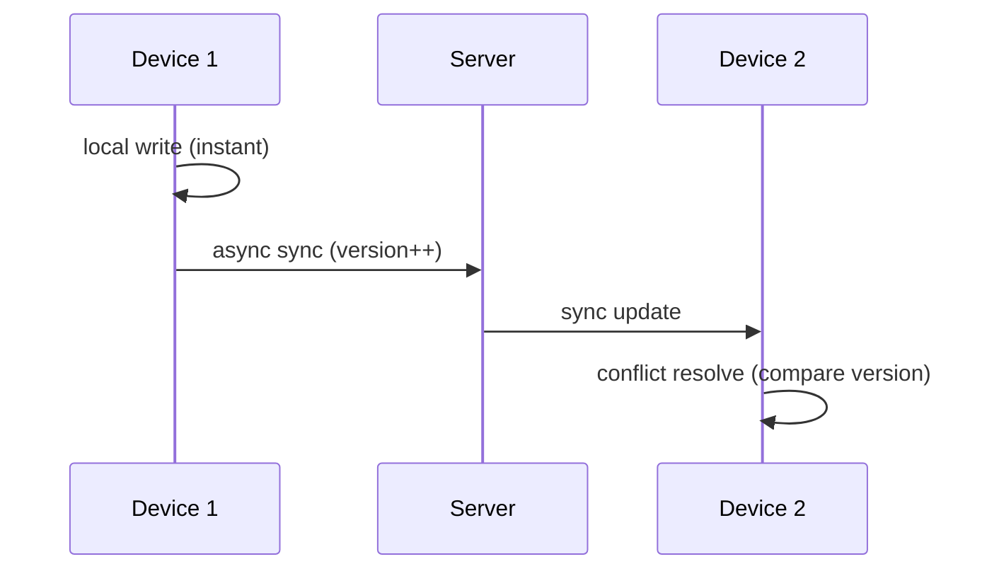

In a todo app, users don't care about button styles. They care about "did what I just changed actually sync". A task checked off on the phone that doesn't update on the PC makes the user think "this app lost my data" — even if it was just slow sync.

So multi-device sync isn't "moving data around"; it's making the user believe there's only one copy. This post covers the key designs of sync architecture, and the trap that breaks each one.

## Local-first: write locally, sync async

The first principle of sync architecture is **local-first** — a user action lands locally first, takes effect immediately, then syncs to the server asynchronously.

Why not "sync first, then land locally"? Because the network is unreliable. If the user taps "done" and the system waits for a successful sync before updating the UI, every action stalls for seconds on a weak network. Local-first decouples "take effect immediately" from "sync in the background" — the user never feels the network.

The cost of local-first is that **you must accept "local and server are temporarily out of sync"**. That's the core tension of sync architecture: how to handle this inconsistency before "eventually consistent" arrives.

## Version and timestamp: every record must be comparable

The essence of multi-device sync is deciding **which copy is newer**. That needs a reliable basis for comparison.

Every record needs at least two fields:

- `updated_at`: last modified time, deciding "who's newer" for display
- `version`: a version number that increments on every change, preventing "old data overwrites new"

The trap: **a timestamp alone isn't enough**. If two devices have different clocks, or both change something within the same millisecond, the timestamp is unreliable. So you also need `version` — increment on every change, compare on the server, so an older version's change never overwrites a newer one. The timestamp is "what you show the user"; the version is "what the system uses to settle conflicts".

## Conflict strategy: last-write-wins or field-level merge

Two devices change the same record at the same time. What now? This is the classic sync dilemma, with no silver bullet, only trade-offs:

- **Last-write-wins (LWW)**: whoever has the higher `version` wins. Simple, but can lose data — the user changed different fields on two devices, and only one copy survives.
- **Field-level merge**: merge the different fields from both ends, keeping each side's changes. Complex — you have to define how each field merges.

For most todo-app cases, LWW is enough — users rarely change the same field of the same task on two devices at once. But one exception needs special handling: **deletion**. Deletion can't simply be last-write-wins, because when "delete" and "edit" happen simultaneously, the user's intent is usually "the edit should win" — one device deleted it, another changed the title, and the user probably wants to keep the change.

## Failure retry: auto-retry on weak network, but tell the user

Networks drop, slow down, and fail mid-flight. Sync architecture has to handle failure:

- **Auto-retry**: retry on failure, with backoff, don't spam requests
- **Queue**: failed sync operations go into a queue, resume when the network recovers
- **Notification**: if it keeps failing to sync, explicitly tell the user "this isn't synced yet", rather than silently losing it

The trap: **silent failure is more dangerous than an error**. The user thinks it synced, but the data only lives locally — they find out it's gone on another device. That's worse than "sync failed, please retry". So key operations need an explicit "synced" vs "pending" state, so the user knows whether their data is actually safe.

## Soft delete: mark, don't physically delete

In a todo app, users delete tasks. But in a sync context, **physical deletion causes problems**:

- One device deletes, another hasn't synced yet; after physical deletion, the other device might "resurrect" the data (thinking it's just old offline data)
- Deletion needs to sync to all devices; physical deletion leaves nothing to trace

So use **soft delete**: add a `deleted_at` field, mark the time on delete, instead of physically removing the row. Then:

- `deleted_at` is itself a "modification" that flows through the normal sync process
- The not-yet-deleted device receives `deleted_at` and knows "this was deleted", marking it locally too
- Data stays traceable, and accidental deletion is recoverable

## A minimal data model

Put these designs into a minimal data model:

```text
task_id      -- globally unique ID (client-generated, not auto-increment)
user_id      -- owning user
title        -- title
status       -- status
updated_at   -- last modified time (for display)
version      -- version number (for conflict resolution)
deleted_at   -- soft-delete marker (NULL means not deleted)
```

Two key conventions: `task_id` uses a client-generated UUID (not server auto-increment), so offline devices can generate non-conflicting IDs; `version` increments on every change and is the sole basis for conflict resolution.



## Summary

Multi-device sync is the core asset of a productivity app. Without stable sync, even the best features get dragged down by "data inconsistency".

The key designs answer a few questions:

1. Local-first — **act first, sync after** (accept temporary inconsistency)
2. Version — **who's newer** (version settles, don't rely on timestamp alone)
3. Conflict — **what if both change** (LWW is enough, deletion handled separately)
4. Retry — **what on weak network** (auto-retry + explicit notice, don't lose silently)
5. Soft delete — **what on delete** (mark, don't physically remove; traceable and recoverable)

The difficulty of sync architecture was never "move the data over" — it's making the user believe, under any network condition, that their data is safe, consistent, and recoverable. Get these right and sync feels "as natural as local".
