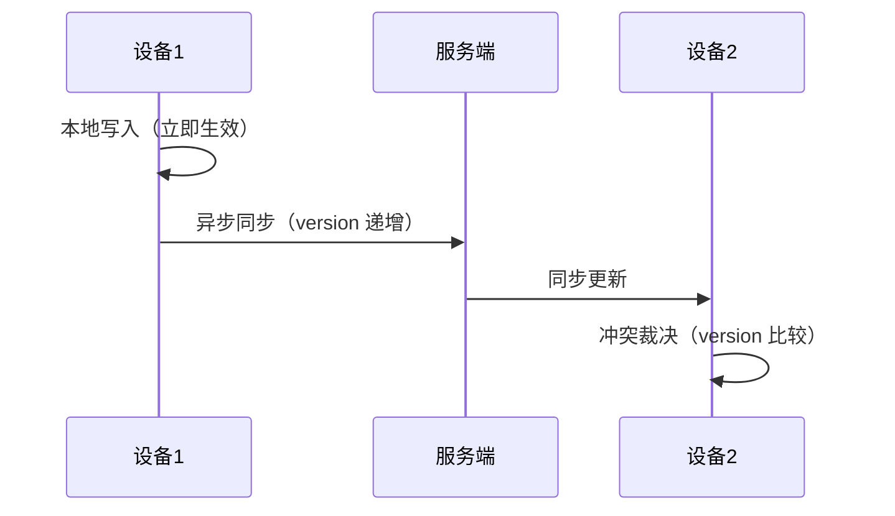

做清单类应用时，用户最敏感的不是按钮样式，而是「我刚改的内容到底有没有同步上去」。一个任务在手机上打勾，PC 上没更新，用户的第一反应是「这应用数据丢了」——哪怕其实只是同步慢了。

所以多端同步不是「把数据传来传去」，而是「让用户觉得数据只有一份」。这篇讲同步架构的几个关键设计，以及每个设计最容易翻车的坑。

## 本地优先：先写本地，再异步同步

同步架构的第一原则是**本地优先**——用户操作先落到本地，立即生效，再异步同步到服务端。

为什么不能「先同步再落本地」？因为网络不可靠。如果用户点「完成」，系统先等网络同步成功再更新界面，那弱网下每个操作都要卡几秒，体验直接崩。本地优先让「操作立即生效」和「后台慢慢同步」解耦——用户感觉不到网络的存在。

本地优先的代价是**你必须接受「本地和服务端暂时不一致」这个状态**。这是同步架构的核心矛盾：怎么在「最终一致」之前，处理好这个不一致。

## 版本号与时间戳：每条记录都要可比较

多端同步的本质，是**决定「哪份数据更新」**。这需要一个可靠的比较依据。

每条记录至少要有两个字段：

- `updated_at`：最后修改时间，决定「谁更新」
- `version`：版本号，每次修改递增，防止「用旧数据覆盖新数据」

坑在这里：**光有时间戳不够**。如果两台设备时间不同步，或者同一毫秒内两端都改了，时间戳就不可靠。所以还要有 `version`——每次修改递增，服务端比较 version，旧版本的新改动不会覆盖新版本。时间戳是「展示给用户看的」，version 是「系统用来裁决冲突的」。

## 冲突策略：明确「最后写入优先」还是字段级合并

两端同时改了同一条记录，怎么办？这是同步架构最经典的难题，没有银弹，只有取舍：

- **最后写入优先（LWW）**：谁的 `version` 高谁赢，简单，但可能丢数据——用户在两台设备改了不同字段，只保留一份。
- **字段级合并**：合并两端的不同字段，保留各自的改动，但复杂——要定义每个字段怎么合并。

清单应用大多数场景用 LWW 就够——用户很少同时在两台设备改同一条任务的同一个字段。但有一个例外要单独处理：**删除**。删除不能简单地「最后写入优先」，因为「删除」和「修改」同时发生时，用户的意图往往是「修改」优先（用户在两台设备，一台删了，一台改了标题，大概率想保留修改）。

## 失败重试：弱网下自动重试，但要给出提示

网络会断、会慢、会半途失败。同步架构要能处理失败：

- **自动重试**：失败后自动重试，带退避，别一股脑地狂发请求
- **队列**：失败的同步操作进队列，网络恢复后继续
- **提示**：如果一直同步不上，要明确告诉用户「这条还没同步」，而不是静默丢失

坑在于**「静默失败」比「报错」危险**。用户以为同步成功了，其实数据只存在本地，换台设备发现丢了——这比「同步失败请重试」的体验糟得多。所以关键操作要明确「已同步」和「待同步」的状态，让用户知道数据到底安不安全。

## 软删除：删除用标记，不用物理删除

清单应用里，用户会删任务。但同步场景下，**物理删除会带来问题**：

- 一端删了，另一端还没同步，物理删除后，另一端可能「复活」这条数据（以为它只是离线时的旧数据）
- 删除需要同步到所有端，物理删除后无法追溯

所以用**软删除**：加一个 `deleted_at` 字段，删除时标记时间，而不是物理删行。这样：

- 同步时，`deleted_at` 也是一条「修改」，正常走同步流程
- 未删除端收到 `deleted_at`，就知道「这条被删了」，本地也标记删除
- 数据可追溯，误删可恢复

## 一个最小数据模型

把这些设计落到一个最小数据模型上：

```text
task_id      -- 全局唯一 ID（客户端生成，别用自增）
user_id      -- 归属用户
title        -- 标题
status       -- 状态
updated_at   -- 最后修改时间（展示用）
version      -- 版本号（冲突裁决用）
deleted_at   -- 软删除标记（NULL 表示未删除）
```

两个关键约定：`task_id` 用客户端生成的 UUID（而不是服务端自增），这样离线时也能生成不冲突的 ID；`version` 每次修改递增，是冲突裁决的唯一依据。



## 总结

多端同步是效率应用的核心资产。如果没有稳定同步，再好的功能都会被「数据不一致」拖垮口碑。

几个关键设计，本质是回答几个问题：

1. 本地优先——**操作先生效，网络后同步**（接受暂时不一致）
2. 版本号——**谁更新**（version 裁决，别只靠时间戳）
3. 冲突策略——**同时改怎么办**（LWW 够用，删除单独处理）
4. 失败重试——**弱网怎么办**（自动重试 + 明确提示，别静默丢失）
5. 软删除——**删除怎么办**（标记不物理删，可追溯可恢复）

同步架构的难点从来不是「把数据传过去」，而是**在任何网络条件下，都让用户相信数据是安全、一致、可恢复的**。把这几件事设计对，同步体验才会「像本地一样自然」。
